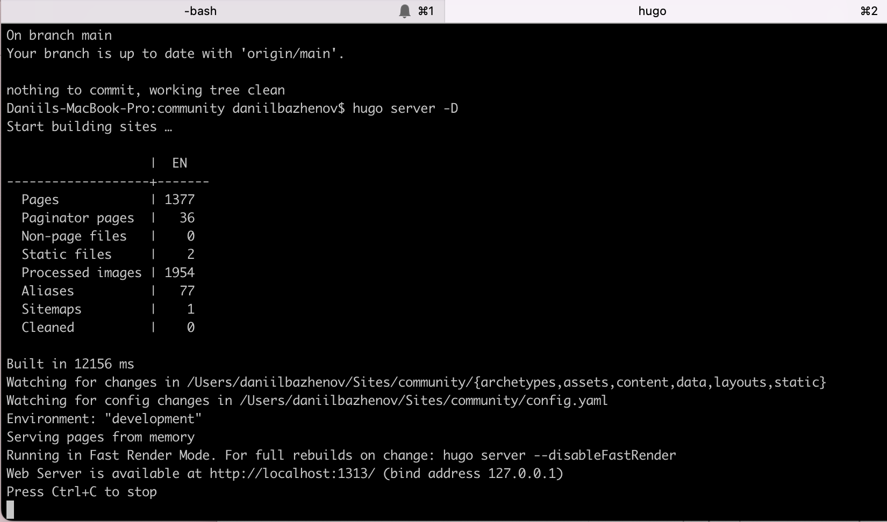
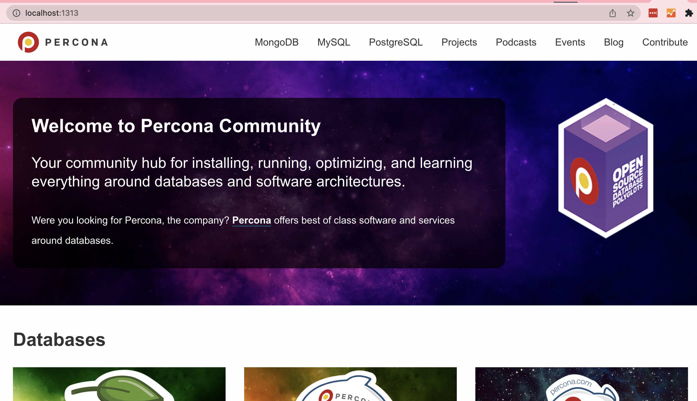
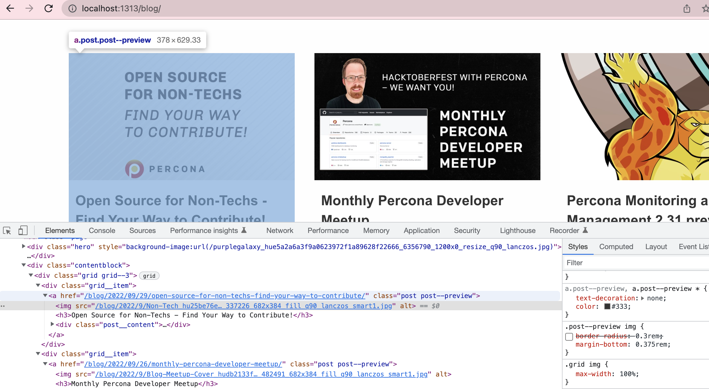
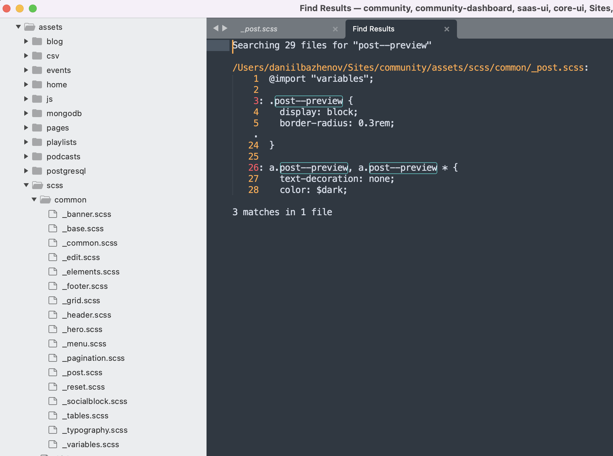
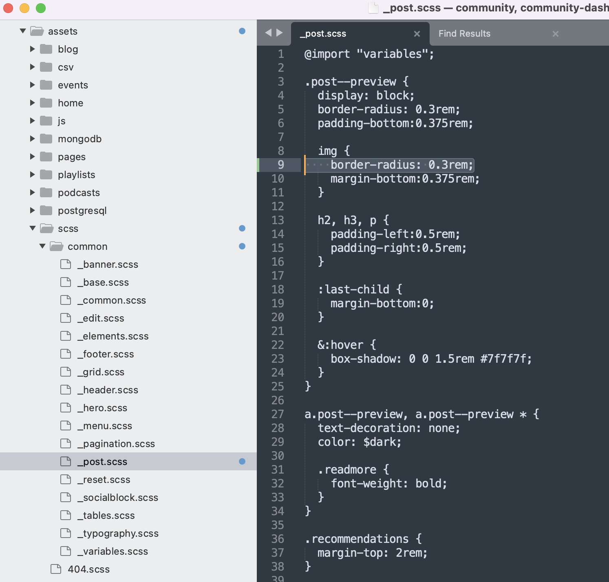
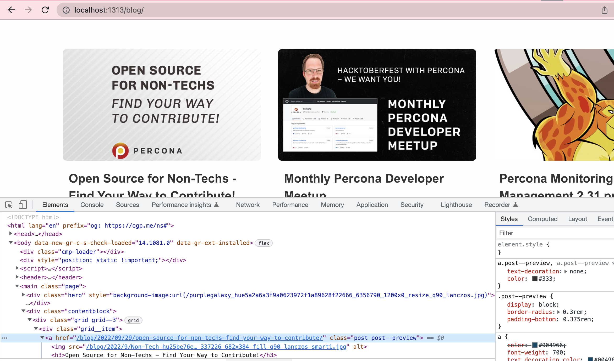

# Contributing

Are you looking to become a member of Percona Community? We have a site dedicated to [contributions](https://percona.community/contribute). For questions, you can best reach us on our [forums](https://forums.percona.com). By contributing, you become a Percona Community member and agree to our [Code of Conduct](content/contribute/coc.md).

If you've already looked at those and just want to get started, continue reading.

## Structure

We will highlight the folders that you will most likely touch if you are contributing to the [percona.community](https://percona.community) website with blog posts. The general directory structure follows the standard [Hugo](https://gohugo.io/) pattern. We are not using a theme and instead built the design based on this community's needs.

```
> .github
> archetypes
> assets              ## pictures and CSS
    > blog            ## add blog post pictures here
        ...           ## pick the right year
        > authors     ## add your author picture here
    ...
> content
    > authors         ## create new folder for yourself here
        > ...
        > <you>       ## folder with your name, add _index.md file
          _index.md   ## copy from other author, change to your details
    > blog            ## add your post here, follow naming pattern
    > contribute
        > articles.md ## add your article here
        > videos.md   ## add your video here
        > dev.md      ## add your custom dashboards, configuration files, etc.
    > ...
    ...
> layouts
> static
...
```

## How to Submit a Pull Request or Report a Bug/Issue

If you would like to report a bug/issue or add a suggestion for future consideration, let us know at community-team@percona.com or open an [issue](https://github.com/percona/community/issues).

Our mission is to keep open source open which is why we are dedicated to making contributions as free from barriers as possible.

#### I just want to add/edit one file (blog post, code, illustrations, and more)

That's great! Did you find a typo or would like to add/edit something? You can easily use GitHub's user interface to create a [pull request](https://docs.github.com/en/github/collaborating-with-issues-and-pull-requests/creating-a-pull-request) and submit your changes.

#### I want to add code, a blog post with pictures, or more

In this case, we presume you already have some knowledge about Git and that Git is already installed on your computer. If not, reach out to us and we might be able to help.

Assuming that Git is already installed on your computer, you will only need the static site generator Hugo to test any changes you make.

Download a `hugo_extended_` version release for your operating system from the [Hugo releases page](https://github.com/gohugoio/hugo/releases). You might have to scroll further down. Follow the [installation instructions](https://gohugo.io/getting-started/installing/) and you're all set to go.

Next, you can type this in your terminal:

```
hugo serve --disableFastRender
```

For more options on how to run Hugo, check out the official [Hugo documentation](https://gohugo.io/commands/hugo_server/). In your terminal, Hugo will point you to a URL, most likely `http://localhost:1313/`. You should be able to click on it or simply type the URL into your browser and see the built website. You can now add your contribution, test whether everything is working, and then submit a pull request that we will review within a few days.

## How to modify the design and theme

Here you will learn how to edit the HTML and CSS templates of the site to change the theme and appearance.

### Install Hugo and Dev Environment

- Install [Hugo engine](https://gohugo.io/getting-started/installing/)

- Run the Hugo server in the source code folder of the site with the command `hugo server -D` and open a local copy of the site in your browser at localhost:1313

- Create a separate branch for your changes.





### Editing CSS

- Find the CSS file you need. In the developer tools of your browser see the source code of the page you want to edit. Find the desired element and its CSS Class.



- Use the file search in `/assets/scss/` directory to find the right file that contains the CSS for the class you want. For example, the CSS of a post card on a blog page is edited in `/assets/scss/common/_post.scss` . SCSS files are grouped by logical meaning and application on pages.



- Edit the CSS and immediately see the changes on your local copy of the site (localhost:1313).





Test the results for Desktop and mobile devices. Make changes in a separate branch and send a Pull Request for review

### Editing HTML and theme templates

- Explore Hugo's documentation on creating and editing templates: [Templates](https://gohugo.io/templates/)

- All website templates are located in the 'layouts' folder
