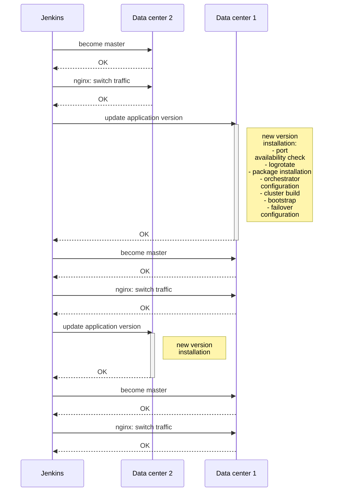

Hi, my name is Roman Proskin. I work at Mail.Ru Group and develop high-performance applications on Tarantool, which is an in-memory computing platform.

In this article, I will explain how we built the automated process of deploying Tarantool apps. It allows updating the codebase in production without any downtime or outages. I will describe the problems we faced and the solutions we found in the process. I hope that *our* experience will be useful for *your* deployments.

It's not that hard to deploy an application. Our **cartridge-cli** tool ([GitHub](https://github.com/tarantool/cartridge-cli)). lets you deploy cluster applications within a couple of minutes – for instance, in Docker. However, it is *much* harder to turn a small-scale solution into a full-fledged product, one that would handle hundreds of instances and be used by dozens of teams of various levels.

Our deployment is based on a simple idea: set up two hardware servers, run an instance on each server, join the instances in a single replica set, and update them one by one. However, when it comes to deploying a production system with terabytes of unique data — palms are sweaty, knees weak, arms are heavy, there's vomit on the sweater already, code's spaghetti. The database might be on the verge of collapse.

## Initial Conditions

There is a strict SLA for the project: 99% uptime is required, planned downtime included in the remaining 1%. This means that there are 87 hours each year when we are allowed to *not respond* to requests. It seems like a big number, *but*...

The project is targeting about 1.8 TB of data, so a mere restart would take as much as 40 minutes! Add the time for the manual update itself on top of that. Three updates a week take 40\*3\*52/60 = **104 hours**, *which breaks the SLA*. And this is only *planned* maintenance work. What about the outages that are surely going to happen?

As the application is designed with heavy user load in mind, it has to be very stable. We don't want to lose data if a node dies. So we divided our cluster geographically, using machines in two data centers. This deployment mechanism makes sure that the SLA is not violated. Updates are rolled out on groups of instances in different data centers, not on all of them at once. During the updates, we transfer the load to the other data center, so the cluster remains writable. This classical deployment strategy is a standard disaster recovery practice.**

One of the key elements of downtime-free deployment is the ability to update instances one data center at a time. I will explain more about that process by the end of the article. Now, let's focus on our automated deployment and the challenges associated with it.

## Challenges

### Moving Traffic Across the Street

There are several data centers and requests may hit any of them. Retrieving data from another data center increases the response time by 1–100 milliseconds. To avoid cross-user-traffic between the two data centers, we tagged them as *active* and *standby*. We configured the **nginx** balancer so that all the traffic would always be directed to the active data center. If Tarantool in the active data center failed or became unavailable, the traffic would go to the standby data center instead.

Every user request matters, so we needed to ensure that every connection would be maintained. For that we wrote a special Ansible playbook that switches the traffic between the data centers. The switch is implemented through the `backup` option of every server's `upstream` directive. The servers that have to become active are defined with the ansible-playbook `--limit` flag. The other servers are marked as `backup`, and nginx will only direct traffic at them if *all active servers* are unavailable. If there are open connections during a configuration change, they will not be closed, and *new* requests will be redirected to the routers that haven't been restarted because of the change.

What if there is no external balancer in the infrastructure? You can write your own balancer in Java to monitor the availability of Tarantool instances. However, that separate subsystem also requires deployment. Another option is to embed the switch mechanism in the routers. Whatever the case may be, you have to control HTTP traffic.

OK, we configured nginx, but this is not our only challenge. We also have to rotate masters in replica sets. As I mentioned above, data *must* be kept close to the routers to avoid external retrievals whenever possible. Moreover, if the current master (the writable storage instance) dies, the failover mechanism is not launched instantly. First, the cluster has to come to a group decision to declare the instance unavailable. During that time, all requests to the data in question fail. To solve this problem, we developed another playbook that sends GraphQL requests to the cluster API.

The mechanisms to rotate masters and switch user traffic are two remaining key elements of downtime-free deployment. A controlled balancer helps avoid connection loss and user request processing errors. Master rotation helps eliminate data access errors. These techniques, along with branch-wise updates, form the three pillars of failsafe deployment, which we later automated.

### Legacy Strikes Back

Our client had a custom deployment solution – Ansible roles with step-by-step instance deployment and configuration. Then we arrived with the magic **ansible-cartridge** ([GitHub](https://github.com/tarantool/ansible-cartridge)) that solves all the problems. We just didn't factor in that ansible-cartridge is a monolith. It is a single huge role with a lot of stages, divided into smaller tasks and marked all over by tags.

To use ansible-cartridge efficiently, we had to alter the process of artifact delivery, reconsider directory structure on target machines, switch to a different orchestrator, and make other changes. I spent a whole month on improving the deployment solution with ansible-cartridge. But the monolithic role just didn't fit in with the existing custom playbooks. While I was struggling to make use of the role that way, my colleague asked me a fair question, "Do we even want that?"

So we found another way – we put cluster configuration into a separate playbook. Specifically, that playbook was responsible for joining storage instances into replica sets, vshard (cluster data sharding mechanism) bootstrapping, and failover configuration (automated master rotation in case of death).**** These are the final stages of deployment that take place when all the instances are already running.

Unfortunately, we had to keep all the other deployment stages unchanged.

### Choosing an Orchestrator

If the code on the servers can't be launched, it's useless. We needed a utility to start and stop Tarantool instances. There are tasks in ansible-cartridge that can create systemctl service files and work with RPM packages. However, our client had a closed network and no sudo privileges, which meant that we could not use systemctl.

Soon we found **supervisord**, an orchestrator that didn't require root privileges all the time. We had to pre-install it on all the servers and solve local problems with socket file access. To set up supervisord, we wrote a separate Ansible role, which created configuration files, updated the configuration, launched and stopped instances. That was enough to roll out into production.

Supervisord application launch was added to ansible-cartridge for the sake of experiment. That method, however, proved less flexible and is currently awaiting improvement in a designated branch.

### Reducing Load Time

Whatever orchestrator we use, we cannot wait for an hour every time an instance has to boot. The threshold is 20 minutes. If an instance remains unavailable for a longer time, it will be reported to the incident management system. Frequent failures impact team KPIs and may sabotage system development plans. We didn't want to lose our bonus because of a scheduled deployment, so we needed to keep the boot time within 20 minutes at all costs.

Here is a fact: load time directly correlates with the amount of data. The more information has to be restored from the disk into the RAM, the longer it takes for the instance to start after an update. Consider also that storage instances on one machine will compete for resources, as Tarantool builds indexes using all processor cores.

Our observations show that an instance's memtx_memory must not exceed 40 GB. This optimal size makes sure that instance recovery takes less than 20 minutes. The number of instances on a server is calculated separately and closely linked to the project infrastructure.

### Setting Up Monitoring

Every system, including Tarantool, has to be monitored. However, we did not set up monitoring right away. **It took us three months to obtain access rights, get approvals, and configure the environment.**

**While developing our application and writing playbooks, we touched up the **metrics** module ([GitHub](https://github.com/tarantool/metrics)). Global labels now allow separating out metrics by instance name. We also developed a special [role](https://github.com/tarantool/metrics#cartridge-role) to integrate Tarantool cluster application metrics with monitoring systems. Besides, we introduced a new useful metric, [*quantile*](https://habr.com/ru/company/mailru/blog/529456/).

Now we can see the current number of requests to the system, memory usage data, the replication lag, and many other key metrics. Chat notification alerts are set up for all of them. The incident management system records critical issues, and there is a strict SLA for resolving them.

Let's talk more about our monitoring tools. **etcd** specifies the logs to collect and provides a full description of where and how to collect them, and the **telegraf** agent takes its cues from there. JSON metrics are stored in **InfluxDB**. We visualized data with **Grafana** and even created a [dashboard](https://grafana.com/grafana/dashboards/13054) template for it. Finally, alerts are configured with **kapacitor**.

Of course, this is not the only monitoring implementation that works. You can use **Prometheus**, especially since the metrics module can yield values in a compatible format. Alerts can be also configured with **Zabbix**.

To learn more about Tarantool monitoring setup, read my colleague's article [Tarantool Monitoring: Logs, Metrics, and Their Processing](https://habr.com/ru/company/mailru/blog/534826/).

### Enabling Logging

Simply monitoring the system is not enough. To see the big picture, you have to collect all diagnostic insights, including logs. Higher logging levels yield more debug information but also produce larger log files.

However, disk space is finite. At peak load, our application could generate up to 1 TB of logs per day. Of course, we could add more disks, but sooner or later, we would run out of either free space or project budget. Yet we didn't want to wipe debug information completely. So what did we do?

One of the stages of our deployment was to configure **logrotate**. It allowed us to store a couple of 100 MB uncompressed log files and a couple more compressed ones, which is enough to pinpoint a local issue within 24 hours under normal operations. The logs are stored in a designated directory in JSON format. All the servers are running the **filebeat** daemon, which collects application logs and sends them to **ElasticSearch** for long-term storage. This approach helps avoid disk overflow errors and allows analyzing system operations in case of persistent problems. It also integrates well with the deployment.

### Scaling the Solution


Our path was a long and rocky one, and we learned a lot by trial and error. To avoid making the same mistakes, we standardized our deployment, relying on the CI/CD formula of Gitlab + Jenkins. Scaling was also challenging – it took us months to debug our solution. Still, we tackled all the problems and are now ready to share our experience with you. Let's do it step by step.

How do we make sure that any developer can quickly put together a solution for their problem and deliver it to production? Take the Jenkinsfile away from them! We have to set firm boundaries and disallow deployment if the developer violates them. We created and rolled out to production a full-fledged example application, which serves as the perfect zero app. With our client, we went even further and wrote a utility for template creation that automatically configures the Git repo and Jenkins jobs. As a result, the developer needs less than an hour to get ready and push their project to production.

The pipeline begins with standard code checkout and environment setup. We add inventories for further deployment to a number of test zones and to production. Then the unit tests begin.

We use the standard Tarantool **luatest** framework ([GitHub](https://github.com/tarantool/luatest)), which allows writing both unit and integration tests. It also has modules for launching and configuring [Tarantool Cartridge](https://www.tarantool.io/en/doc/latest/getting_started/getting_started_cartridge/). Code coverage checking can be enabled in the most recent versions of luatest.** To run it, execute the following command:

```
.rocks/bin/luatest --coverage
```

After the tests are over, the statistical data is sent to **SonarQube**, a piece of software for code quality assurance and security checking. We have a Quality Gate configured inside it. Any code in the application, regardless of the language (Lua, Python, SQL, etc.), is subject to checking. However, SonarQube lacks a built-in Lua processor. Therefore, to provide coverage in a generic format, we have to install special modules before the tests.

```
tarantoolctl rocks install luacov 0.13.0-1             # coverage collection utility
tarantoolctl rocks install luacov-reporters 0.1.0-1    # additional reports
```

To get a simple console view, execute:
```
.rocks/bin/luacov -r summary . && cat ./luacov.report.out
```
To form a SonarQube report, run the following command:
```
.rocks/bin/luacov -r sonar .
```

After that, the linter is launched. We use **luacheck** ([GitHub](https://github.com/mpeterv/luacheck)), which is also a Tarantool module.

```
tarantoolctl rocks install luacheck 0.26.0-1
```

Linter results are also sent to SonarQube.

```
.rocks/bin/luacheck --config .luacheckrc --formatter sonar *.lua
```

Code coverage and linter statistics are both taken into account. To pass the Quality Gate, all of the following must be true:

- Code coverage is no less than 80%.
- The changes do not introduce any new code smells.
- There are 0 critical errors in total.
- There are no more than 5 minor errors.

After the code passes the Quality Gate, we have to assemble the artifact. As we decided that all applications would be using Tarantool Cartridge, we build the artifact with **cartridge-cli** ([GitHub](https://github.com/tarantool/cartridge-cli)). This small utility lets you run (in fact, develop) Tarantool cluster applications locally. It can also create Docker images and archives from application code, both locally and in Docker – for instance, if you have to build an artifact for a different infrastructure. To assemble a `tar.gz` archive, run the following command:

```
cartridge pack tgz --name <name> --version <version>
```

The resulting archive can then be uploaded to any repository, like **Artifactory** or [**Mail.ru Cloud Storage**](https://mcs.mail.ru/storage/).

## Downtime-free Deployment

The final step of the pipeline is deployment itself. The code is deployed to one of several test zones based on branch merge status. One zone is designated for testing small improvements – every push to the repository triggers the whole pipeline. Other functional zones can be used to test compatibility with external systems. This requires a merge request to the repo *master* branch.** As for production deployment, it can only be launched after all changes are accepted and merged.

To summarize, here are the key elements of our downtime-free deployment:

- Roll out updates one data center at a time
- Rotate masters in replica sets
- Configure the load balancer to direct traffic to the active data center

It is important to maintain version and schema compatibility during updates. If there is an error at any stage, the update stops.

Here is what the update process looks like:



Currently, all updates require server restart. To find the right moment to continue our deployment, we have a special playbook that monitors instance states. Tarantool Cartridge has a state machine, and the state we are waiting for is called *RolesConfigured*. It signifies that the instance is fully configured and ready to accept requests. If the application is deployed for the first time, the desired state would be *Unconfigured*.

The diagram above illustrates the general idea of downtime-free deployment, which can be easily scaled up to more data centers. You can update all the standby branches at once right after master rotation – that is, along with Data center 1 – or update them one by one, depending on your project requirements.

Of course, we could not but make our work open source. You can find it in my ansible-cartridge fork on GitHub ([opomuc/ansible-cartridge](https://github.com/opomuc/ansible-cartridge)). Most of it has already been transferred to the master branch of the main repo.

[Here is our deployment example](https://github.com/opomuc/ansible-cartridge/tree/master/examples/deploy-by-dc). For it to work correctly, configure `supervisord` on the server for the user `tarantool`. See [this page](https://github.com/opomuc/ansible-cartridge/blob/master/examples/deploy-with-targz/Vagrantfile#L18) for the configuration commands. The application archive also has to contain the `tarantool` binary.

To launch branch-wise deployment, run the following commands:

```
# Install application (for initial deployment)
ansible-playbook -i hosts.yml playbook.yml \
    -b --become-user tarantool \
    --extra-vars 'base_dir=/data/tarantool' \
    --extra-vars 'cartridge_package_path=./getting-started-app-1.0.0-0.tar.gz' \
    --extra-vars 'app_version=1.0.0' \
    --tags supervisor

# Update version to 1.2.0

# Transfer master to dc2
ansible-playbook -i hosts.yml master.yml \
    -b --become-user tarantool \
    --extra-vars 'base_dir=/data/tarantool' \
    --extra-vars 'cartridge_package_path=./getting-started-app-1.2.0-0.tar.gz' \
    --limit dc2

# Update the main data center -- dc1
ansible-playbook -i hosts.yml playbook.yml \
    -b --become-user tarantool \
    --extra-vars 'base_dir=/data/tarantool' \
    --extra-vars 'cartridge_package_path=./getting-started-app-1.2.0-0.tar.gz' \
    --extra-vars 'app_version=1.2.0' \
    --tags supervisor \
    --limit dc1

# Transfer master to dc1
ansible-playbook -i hosts.yml master.yml \
    -b --become-user tarantool \
    --extra-vars 'base_dir=/data/tarantool' \
    --extra-vars 'cartridge_package_path=./getting-started-app-1.2.0-0.tar.gz' \
    --limit dc1

# Update the standby data center -- dc2
ansible-playbook -i hosts.yml playbook.yml \
    -b --become-user tarantool \
    --extra-vars 'base_dir=/data/tarantool' \
    --extra-vars 'cartridge_package_path=./getting-started-app-1.2.0-0.tar.gz' \
    --extra-vars 'app_version=1.2.0' \
    --tags supervisor \
    --limit dc2

# Make sure that the masters are in dc1
ansible-playbook -i hosts.yml master.yml \
    -b --become-user tarantool \
    --extra-vars 'base_dir=/data/tarantool' \
    --extra-vars 'cartridge_package_path=./getting-started-app-1.2.0-0.tar.gz' \
    --limit dc1
```

The `base_dir` option specifies the path to your project's home directory. After the deployment, the following subdirectories will be created:

* `<base_dir>/run` -- for console sockets and pid files
* `<base_dir>/data` -- for .snap and .xlog files, as well as Tarantool Cartridge configuration
* `<base_dir>/conf` -- for application configuration and settings associated with specific instances
* `<base_dir>/releases` -- for versioning and source code
* `<base_dir>/instances` -- for links to the current version of every application instance

The `cartridge_package_path` option speaks for itself, but there is a trick:

* If the path starts with `http://` or `https://`, the artifact is pre-downloaded from the network (for example, from Artifactory).
* In other cases, the file search is performed locally.

The `app_version` option is used for versioning in the `<base_dir>/releases` folder. Its default value is `latest`.

The `supervisor` tag means that `supervisord` is the orchestrator.

There are many ways to build a deployment, but the most reliable is good old `Makefile`. The `make <deployment>` command works well for any CI/CD pipeline.

## Conclusion

That's it! We made a Jenkins pipeline, got rid of mediators, and changes are now delivered at a crazy speed. The number of our users is growing. As many as 500 instances are running in our production environment, all of them deployed with our solution. Still, there is room for growth.

Branch-wise deployment may not be perfect, but it provides firm support for further development of DevOps. Use our implementation with confidence to quickly deliver your system to production without worrying about pushing frequent changes.

This was also a valuable lesson for us. You can't take a monolith and hope that it will be a perfect fit in any situation. You need to divide playbooks into smaller parts, create separate roles for every installation stage, and make your inventory flexible. Some day all our work will be merged into the master branch – which will make everything even better.

## Links

- Step-by-step ansible-cartridge tutorial
    - [Part 1](https://habr.com/ru/company/mailru/blog/478710/)
    - [Part 2](https://habr.com/ru/company/mailru/blog/484192/)
- Read more about Tarantool Cartridge [here](https://habr.com/ru/company/mailru/blog/465503/)
- Kubernetes deployment
    - [A guide to using Tarantool Cartridge in Kubernetes](https://habr.com/ru/company/mailru/blog/533308/)
    - [Webinar: Deploying your Tarantool Cartridge application in an MCS Kubernetes cluster](https://www.youtube.com/watch?v=8NvE6uooMQY&ab_channel=Tarantool)
- [Tarantool monitoring: Logs, metrics, and their processing](https://habr.com/ru/company/mailru/blog/534826/)
- Get help in our [Telegram chat](https://t.me/tarantoolru?utm_source=habr&utm_medium=articles&utm_campaign=2020)

