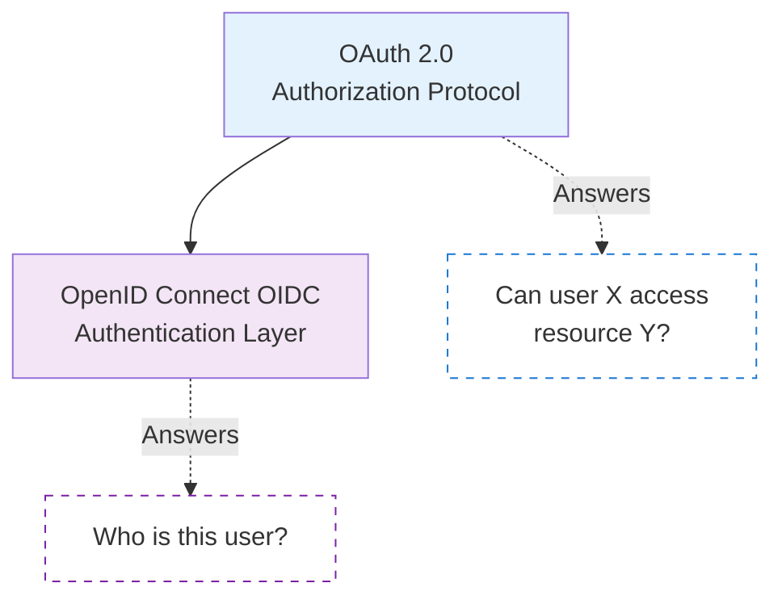
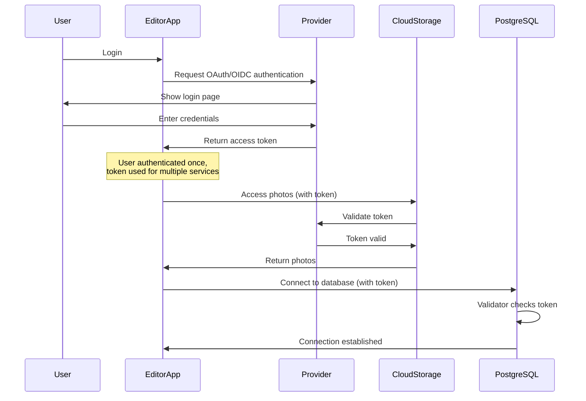

Somebody might tell you, "let's configure PostgreSQL 18 with OIDC, it should be simple, only takes a few minutes!"
And that might be the case if you already have an OIDC provider set up and know all the details about the protocols, configurations, and possible issues.
Or it might take much longer if you just open your favorite search engine and type "What is this OIDC stuff about?"

In this series of blog posts, I'll try to help with this task.
First, by clearing up all the terminology and details in this article.
Later, I'll provide vendor-specific setup instructions for some of the popular providers, using our fully open source `pg_oidc_validator` plugin.

### OAuth 2.0, OIDC, what's even the difference?

From news and other sources you might have heard that PostgreSQL 18 now has support for OIDC.
But if you look at the [PostgreSQL documentation about it](https://www.postgresql.org/docs/current/auth-oauth.html), or the variables/configuration options PostgreSQL provides, it's clear that is about OAuth everywhere.

People often use them interchangeably, because the two are closely related:
OIDC is built on top of OAuth.
However, they serve different purposes.

#### Authorization is not Authentication

The "Auth" in OAuth is about Authorization, not Authentication as people often believe -- and specifically about remote, distributed authorization involving multiple applications.
For example, somebody might store pictures on some cloud storage, and wants to use a photo editing application written and maintained by a different company.
This EditorApp reaches out to the CloudStorage, and says "Can you provide me the pictures please?"
After this question, CloudStorage has to figure out if it is allowed to do so or not.

OAuth was designed to handle situations like this -- managing permissions in a complex online environment.
However, EditorApp might also ask the question, "Hey, I want to display the name of the user I'm working with. Can you tell me who I am working with?"
And now we've leaped into the context of Authentication.
OIDC, or OpenID Connect, is a protocol built on top of OAuth to answer questions like this -- to provide information about who the user is.

### Which of them do we need with PostgreSQL?

The question with PostgreSQL and similar software using OAuth/OIDC is a bit different:
we want to answer, "somebody is trying to log in -- can I allow this login to proceed?"

Is this the right question, or am I oversimplifying things?
Shouldn't we be asking, "who is trying to log in?"
Sometimes we do.
The most common setup will likely ask both: "can this login proceed, and if yes, who is the user?"

But not necessarily always.
It's perfectly valid to configure a server to use this login flow only for administrators, where anybody who is allowed to use it gets associated with an internal admin account.
In this scenario, we don't care about the identity provided by the external provider:
if the user has a valid access token, we treat them as our admin user and proceed accordingly.

To handle this specific workflow, OAuth is enough:
all we have to do is check if the access token is allowed to access the PostgreSQL server, and if yes, the login can proceed as the admin user.
This is however a limited, specific use case, not the generic scenario, where we also want to figure out who is the user on the provider side.

And there are also limitations on the server and client side:

* When using our validator plugin, it supports the more generic scenario. It has to work with user identities from the provider, so it requires OIDC features.
  That's why we called it `pg_oidc_validator` and not `pg_oauth_validator`.
* While the server and wire protocol can work with any OAuth flow, currently the only client that implements a login mechanism using it is `libpq` (and with that, the `psql` command).
  And while the `psql` command also uses parameters with OAuth in their name, internally it relies on a feature called OIDC discovery -- which, as the name suggests, is part of the OIDC standard, not OAuth.

To summarize: in practice, right now anyone who wants to log in to a PostgreSQL server using OAuth and `psql` has to use a provider that also supports the OIDC protocol.
In practice this isn't a restriction, since OIDC is commonly supported.

### Why do we need this validator?

> Why do we need to use a plugin to validate things?
> Many websites and apps implement login with OIDC providers, and they don't need separate validators, so:
> Why can't PostgreSQL do everything internally in the core?

To answer these questions, we have to understand that PostgreSQL in this context isn't an application in itself -- it's a part of a complex infrastructure.
Even `libpq`, mentioned above, isn't strictly part of the picture.
There are completely independent implementations of the PostgreSQL wire protocol, which can all implement the client-side flow completely differently.

This bigger system that happens to use PostgreSQL might also use other services that need authorization.
The EditorApp in our earlier example might use PostgreSQL as its database.
And that means, after authenticating the user, it has to talk to two different services:

* CloudStorage, to access the photos on behalf of the user
* PostgreSQL, to access the database on behalf of the user

Since users like seamless experiences, the developers of EditorApp want to log the user in only once, internally as part of their application, and then forward this information to both CloudStorage and PostgreSQL.

This showcases an important difference compared to "simple" websites and applications:
PostgreSQL doesn't own the entire authentication flow.
It receives information -- what the OAuth standard calls an `access token` -- and needs to use this to complete its internal authentication/authorization flow.
To do this, it has to validate the access token and answer the question:
"was this token really created by the issuer I trust?"

There's nothing new about this question.
Big cloud providers like Google, Microsoft, and many others all do SSO (Single sign-on).
If you log in to their webmail service, you can also open their cloud storage, calendar, or other services, and you'll be similarly authenticated and authorized.

However, there is one very important difference in the above example compared to PostgreSQL:
they all only work with their own users and their own tokens.

You might think this is still an easy problem: OAuth and OIDC are standards, so all we have to do is read the related parts about how validation works and implement our validation flow accordingly.
Except that the standards don't say anything about it.

These standards never define what an access token is.
It can be something completely opaque, only interpretable by the original issuer.
Or it can be something completely transparent -- a proper JSON document with a digital signature that guarantees it was issued by the issuer, usually called a `JWT` (JSON Web Token).

Many OAuth providers implement `JWT` tokens, but not all of them.
And even with `JWT` tokens, there are differences between providers.
Since it's not standardized, the content might differ between vendors.
There's also the question of signature validation, where some providers have differences and require special handling.

And this is where a plugin comes into the picture.
The PostgreSQL maintainers decided they don't want to add vendor-specific code into the core.
Implementing `JWT` access tokens with the most commonly used structures could have been a solution, but that would have meant PostgreSQL had no way to support providers that were completely standards-compliant but implemented access tokens differently.

Even with `JWT` tokens, we have to think about token revocation.
`JWT` tokens have a specified lifetime.
When we validate them strictly based on the digital signature, we also have to check if we're still within the allocated time.
The protocols have a mechanism for refreshing these tokens so that users can stay logged in without repeating the process every time the tokens expire.

But sometimes administrators or the security team might discover a breach -- that somebody got hold of an access token that's still valid for hours or days -- and decide to revoke it.
They can't change the tokens already circulating the network, but they can tell their authorization server to start rejecting the token, even if it's still within its allowed lifetime.

If a validator relies solely on validating the signature of the token, it will still authorize users with these revoked tokens as long as their lifetime allows.
If it performs a request to the server to check if the token is still usable, it might provide a more secure experience at the cost of additional HTTP requests.
Alternatively, some providers allow applications to subscribe to broadcasts where they announce revocations -- so instead of actively querying each token, they can keep a list of which tokens they aren't allowed to authorize, as this list is typically short.

Unfortunately, with these questions we've again arrived at "vendor-specific" territory, where a validator has to work differently for different services.
It's also a user choice:

* On a service where logins are rare but security is a top priority, it might make sense to do explicit queries every time.
* But on a server processing thousands of login requests every second, these additional requests might slow things down too much. Administrators might decide not to do them, or to cache the results for some period instead.

With all these details and choices, it's definitely better to leave the options open so everyone can select a validator suited for their specific needs.

### What does pg_oidc_validator offer?

The Percona validator in its current form focuses on providers working with `JWT` tokens.
We can't guarantee it works with all providers using `JWT` tokens -- as mentioned above, the exact format of these tokens isn't standardized -- but we implemented logic that can handle all the providers we tested, in some cases allowing customization with configuration variables.

In the future, we might add support for providers using opaque tokens or additional optional checks for token revocation, but these weren't in scope for the first version.

If you try it out, and find any issues, or have any suggestions, miss some features, [please provide us feedback on Github](https://github.com/Percona-Lab/pg_oidc_validator/issues)!

### The future

OAuth support in PostgreSQL is new and only implements the bare minimum.
Client and application support is also in its early days -- adoption will take time.
It can already be useful for some use cases, but it might still be too limited for others.

I can't predict how the code will change in the server itself, but there are certainly many improvements that can be made.
I also want to avoid confusion and clear up some things related to my previous examples -- things that aren't currently supported but might be in the future:

* Even if a validator plugin checks for revocation, that check is only done during the login process.
  If a user is already logged in to PostgreSQL and the token is revoked, the user will stay logged in -- the validator can't evict them from the server.
* Similarly, while the protocol has this concept of access token lifetime and how applications using the token can refresh it, this is currently ignored by PostgreSQL.
  Tokens are validated during the login process, and we check the validity, including the lifetime of the token, during that time.
  We don't try to refresh these tokens later, and we don't evict users when the token expires -- currently there's no infrastructure for that.
* In the examples above, CloudStorage was able to decide which photos EditorApp can access.
  OAuth is about authorization, and it could be used for authorization within PostgreSQL -- but this isn't the case currently.
  Validators have to map access tokens to internal users present in the PostgreSQL database. Other than this, the information provided by the OAuth Provider has no interaction with the internal permissions within PostgreSQL (grants).
* In the example above, we described a situation where an application used PostgreSQL together with other services using the same OAuth provider.
  While this is a possible use case, it's also possible that an application only needs an OIDC login flow to access PostgreSQL. In that case, it would be possible to provide better security guarantees by integrating the login flow deeply into PostgreSQL, especially when using more recent OAuth/OIDC extensions such as [PKCE](https://www.rfc-editor.org/rfc/rfc7636.html) (Proof Key for Code Exchange).

Similarly, our `pg_oidc_validator` is a pre-release prototype.
While it already performs `JWT`-based authentication and authorization, it currently doesn't support opaque token providers at all, has no internal caches, and doesn't check for revoked tokens.
Also, some of the features mentioned above would be better with integrated core support, but could technically also be implemented as part of a validator plugin. This would provide the additional benefit that users wouldn't have to wait for newer PostgreSQL versions for the new feature -- it would be enough to upgrade the validator plugin to a newer version.

So there are lots of improvement opportunities for both parts. Stay tuned and follow the changelogs!
