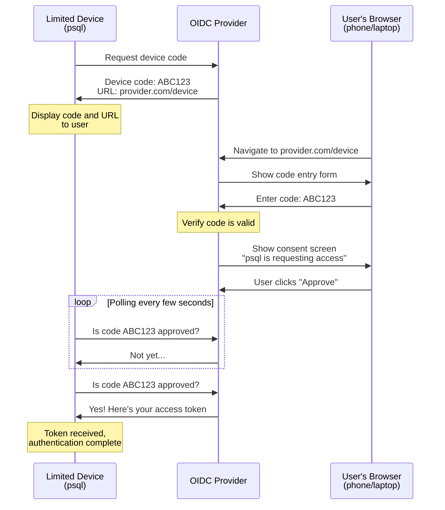
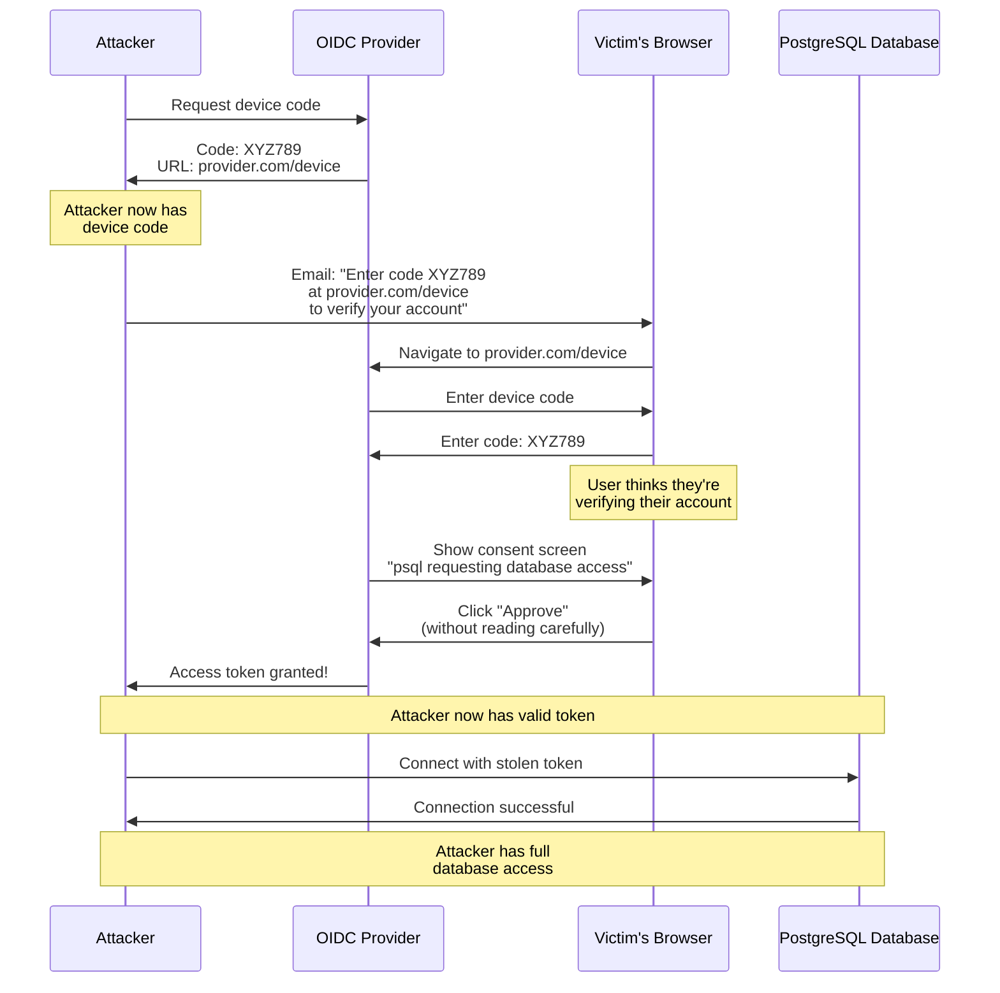
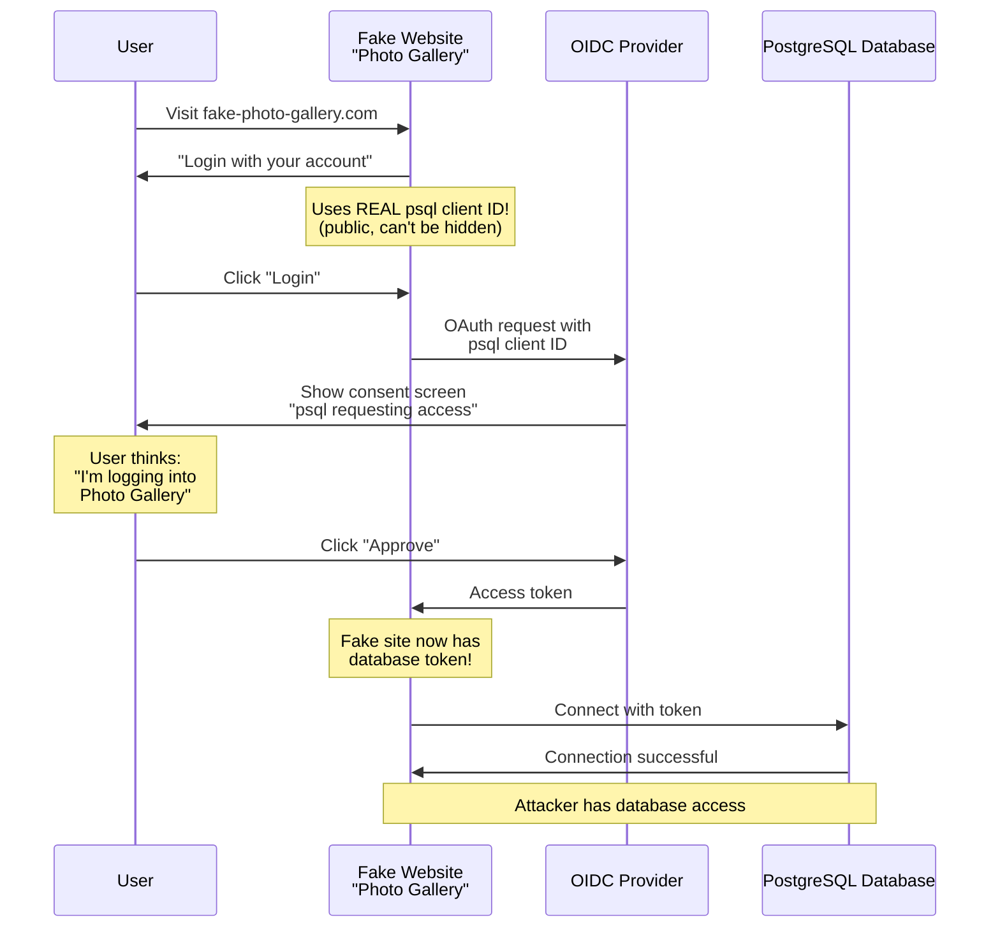

In the previous blog post about the topic, [OAuth, OIDC and validators](/blog/2025/10/28/OAuth-OIDC-validators/), we discussed basic terminologies to understand the differences between the protocols and how they relate to PostgreSQL.

In this second part, we'll go one step further and see how OIDC works exactly in other software and in PostgreSQL, and what OAuthBearer is about. We also focus on the possible attacks and dangers in this flow with some examples to showcase why it's important to use a properly configured secure provider and to teach our users not to just skim through the authorization process.

### Can you keep a secret?

Even the original OAuth RFC was designed to work in many different situations, and later extensions made it even more generic to support more use cases.
However, it also has to acknowledge that different setups have different requirements and limitations and, because of that, might require a different authorization flow.

In one of our previous examples, we used applications such as CloudStorage or EditorApp.
We'll continue to use them for a while for simplicity, but I want to emphasize that this example, even though it uses different names, is relevant and important for understanding how OAuth and OIDC work together with PostgreSQL.

* For CloudStorage, we can safely assume it's a traditional backend-frontend application, since it has to store the data somewhere on a backend.
* For EditorApp, the answer can be different.
  Since it doesn't store photos directly but retrieves/saves them on CloudStorage, and also doesn't store users directly but retrieves them from the Provider using OIDC, it has no requirement for a backend.
  It is easily imaginable as a single page application, completely written in a modern JS framework, or even a downloadable version of it with Electron or a similar framework.

But why is this distinction important for us?
Because we actually have to authenticate and authorize multiple actors here, not just users:

* The applications, CloudStorage and EditorApp, have to trust the Provider to supply them with proper information about their users and their permissions.
* The OAuth Provider has to identify that it's speaking to CloudStorage or EditorApp to tell them what exactly they can do with their users.

OAuth or OIDC providers don't just register users -- they also register client applications, and these applications receive either a randomly generated or user-specified identifier ("username"), depending on the Provider in question.
When we talk about authentication, that usually involves multiple credentials, such as a username and a password, not just a username.
The OAuth standard also recognizes that passwords are good practice and lets client applications use them. This is called a `client secret`.

But are all applications equal in this sense? Can all of them keep secrets?

The answer to this question is, unfortunately, no.
In our example, CloudStorage has a backend -- this means it can keep its secret on the backend, never sending it to the frontend.
This is how we usually treat our passwords, and this is what OAuth calls a **confidential client**.

EditorApp is, however, in a different situation.
It's an application purely implemented in HTML and JavaScript, without any backend code.
Anybody can download its source, open it in a browser, and start using it.
It's not capable of hiding its secret. Even if it has a client secret -- which is optional in OAuth exactly because of this situation -- a user with sufficient knowledge can extract this secret from its code.
And this is true even if it's not a JavaScript application but rather a traditional desktop application written in a compiled language.
As long as it doesn't have a backend, a part hidden from its users, there's no way to completely hide the secret.
This is called a **public client** in OAuth.

### Are you trying to log in to application "X"?

So how can the Provider make sure it's talking to EditorApp and not to something else impersonating EditorApp?
Without a secret, without the client being confidential, it can never be sure about this.

As long as we're talking about web applications, which usually have URLs, it can try to minimize the chance of impersonation.
Providers can make sure that the redirects done during the authorization flow go to URLs configured by the client administrators / owners.
But even this can be circumvented, and in the case of desktop applications, it's not usable.

This is why the Provider uses a different strategy.
Since it can't validate for itself that the thing claiming to be EditorApp is really EditorApp or something else, it informs the user.
When the user clicks on the "Login with &lt;X&gt;" button, instead of silently authorizing the login, it first displays an information screen to the user.
This is called the `consent screen`, and it has to display two things:

* That user &lt;Bob&gt; is trying to log in to application &lt;EditorApp&gt;
* That &lt;EditorApp&gt; is requesting permissions to read and write &lt;CloudStorage&gt;

Along with this information, it has to ask the question:
Is the above information correct? Is &lt;Bob&gt; really trying to log in to &lt;EditorApp&gt;? Is &lt;Bob&gt; okay with granting these permissions to &lt;CloudStorage&gt;?

And only if the user, &lt;Bob&gt; agrees can the request proceed.

### Practical limitations

The above all sounds very nice and secure, but unfortunately we have to discuss some problems with it in practice.

Most importantly, users have a tendency to click "next, next, next" without properly reading, especially if they're completing the same login flow for the 100th time.
Even if a Provider implements the RFCs perfectly in the most secure way possible, it doesn't help if the user just wants to get through the process quickly and doesn't check the details about the application name and permissions properly.

Another issue is that providers don't always properly follow the RFCs.
For some providers, it's configurable -- administrators can choose when the consent screen is displayed.
They can choose to only display it once when the user first logs into an application, to display it every time the user logs in to the application, or to never display it.
Some providers allow these configuration settings for the permissions, for the application name, or both.
Some providers simply never display permissions and always just say something like "be sure to trust this application &lt;EditorApp&gt;".

Unfortunately, during our testing we found providers that in some cases completely skipped the consent screen, even when we tried to explicitly configure that it's always required. Be skeptical about the authorization flow used by the Provider, verify that it's secure enough, and don't hesitate to change providers or report bug reports to the developers if something isn't as it should be!

### Limited devices

Everything we discussed above is nice, but PostgreSQL isn't a website.
Something using it might be one, and in that case, everything we discussed above applies -- but to go back to the only currently supported client, `psql`, that's a console application and can't display a graphical web browser for login.

OAuth also thought about similar clients -- not exactly console applications, but primarily devices that can't display a browser and process a normal login flow to the Provider.
These are called **limited devices** because the primary goal of this extension, [RFC 8628](https://www.rfc-editor.org/rfc/rfc8628.html), was to support specialized hardware where the user either can't or doesn't want to log in.

A typical example is a smart TV.
While it can display a browser and a virtual keyboard, I wouldn't want to type my password and log in to a TV using that.
But these devices can be even more limited. The only requirement for them is that they should be able to display a verification code and instruct the user where (URL) to enter that verification code on another device, which is capable and secure enough to handle the normal password login process or where the user is already logged in.

Other than this indirection, the login process is similar.
The user sees the code, opens the device login webpage on another device, enters the code, and then receives a similar consent screen as before.
This consent screen states that device/application &lt;X&gt; is trying to log in and requests permissions &lt;Something&gt;.
The user then clicks the approve button, while in the background the device periodically checks for approval.
Once approved, the authorization proceeds as normal on the limited device.

While `psql` isn't strictly a limited device, it's in a similar situation.
It's possible that somebody is using it directly on a computer with a UI, with a web browser already logged in to the OIDC provider, but this is an unlikely scenario.
More likely, the user has an SSH session open to another computer, running `psql` in it.
Even if that remote computer has a graphical user interface and browser installed, displaying a login page on it wouldn't help -- the user wouldn't see it.
But it's much more likely that it's a console-only virtual machine / container somewhere, without a proper way to do a graphical login.
In this sense, `psql` together with its environment is a limited device.

### Can we mix login processes?

Before we talk about vulnerabilities and staying secure, it's important to clarify something.
OAuth/OIDC supports many different authentication workflows, including but not limited to the possibilities listed above.
Support for specific flows also varies between vendors -- the supported features and nuances vary from Provider to Provider.

But if a vendor supports a specific flow, that doesn't mean it's automatically usable by all clients.
Every provider we tested so far lets the administrators configure which authorization flows they want to support.
If a specific application only works with confidential clients, the best configuration is to disable anything else.

The PostgreSQL wire protocol (and server) doesn't enforce the use of any specific flow, but a generic validator plugin also can't assume that the server uses some specific configuration.
This isn't something the validator is capable of checking, as it gets executed on the server, after the authorization flow already concluded on the client side.

Strictly speaking, the server doesn't even know the ID of the client (application), only the issuer URL.

And if anyone wants to be able to use the `psql` command, that only supports the limited device flow.

### OAuthBearer

I already mentioned this in the previous blog post, and a few times in this one.
It's important to understand that the PostgreSQL project has multiple different roles in these authorization flows.
The client and the server/validator are two different actors, and the client can be any client, not just `libpq`.
It can be either a well-known third-party implementation of the wire protocol or a completely custom implementation created by an attacker with malicious intent.

From a security standpoint, the server/validator can't trust the client or assume anything about the authentication process done by the client.

This design isn't unique to PostgreSQL.
Support for OAuth over non-HTTP protocols, using the SASL mechanism (which was already supported by PostgreSQL previously), is called OAuthBearer, [RFC 7628](https://www.rfc-editor.org/rfc/rfc7628.html), and it's implemented by PostgreSQL similarly to how other software does it.

The idea of OAuthBearer is that the client using the non-HTTP service (in our case, PostgreSQL) creates an `access token` in some way.
Then this client can use this access token to connect to PostgreSQL and possibly other services.
Even if the client uses multiple services that all authenticate with OIDC, it only has to complete the OAuth flow once.

On the other side, the server doesn't have to do anything else with OAuth other than validating that the token it received is correct and valid.
It doesn't have to deal with multiple flows. On the other hand, it can't assume anything about the flow.

### Can you please enter the code?

Why are the above details important, and why did I repeat the same description multiple times, worded slightly differently?

Because OIDC with public clients, even if implemented properly without mistakes, is vulnerable to the human factor.
And in practice, most of the time, PostgreSQL and OIDC means using public clients.

There are multiple possible attack vectors that were previously used, and are still being used, to gain access to services, and there's no way to fully secure against them.
Both are enabled by the fact that with OAuthBearer, we have no control over the authentication process -- we have to trust that the access token sent to us by the client was indeed created by the user with the intent to log in to this server.

One very simple "attack" against the device authentication flow is to ask the user nicely.
Since the two parts of the process -- requesting and using the `device code`, and verifying the device code -- can happen at two different locations in a completely valid setup, there's not much any software can do programmatically.

In this scenario, the attacker sends an email or calls the victim and comes up with some reason why the user has to go immediately to the device login page and enter the code.
The reason is, of course, usually something completely unrelated, like "this is the code to join the meeting," or "go to the website and enter this code to verify your account," or anything similar.
This is called **device code phishing**, and it's made worse by the fact that some providers don't display detailed enough consent screens during device code authentication, placing even careful users in vulnerable situations.

Unfortunately, this can't be prevented as long as device code flow is enabled.
It can be mitigated to some degree by educating users and making sure that the consent screen is always displayed and is very clear about the request details.

### Client ID spoofing

Another easy OAuth/OIDC attack vector relies on the fact that we're using a public client -- meaning that either there isn't a client secret, or even if there is one, it's not really a secret.
It's easy to create a legitimate-looking website that uses OIDC for something else and starts an authorization flow...
but in the background, it uses the same client credentials as the PostgreSQL client.

This again relies on either a non-securely configured consent screen or a careless user who doesn't read the details about the request.
And compared to the previous example, this doesn't require the device flow -- it can work with other flows too.
In the world of LLMs, it's very easy to create a valid-looking website tailor-made just for this purpose.

Similarly to the previous example, there's not much we can do to prevent this in the plugin.
OAuth has extensions that aim to make the process more secure, such as [PKCE (RFC 7636)](https://www.rfc-editor.org/rfc/rfc7636.html) or [DPoP (RFC 9449)](https://www.rfc-editor.org/rfc/rfc9449.html), preventing specific situations, but none of those help with OAuthBearer.
As the entire authorization process happens on the client side, the validator on the server can't do anything but assume that if the access token is valid, then the user created it intentionally.

### Educate your users!

Once more I'd like to emphasize that while we can't prevent these attack vectors completely, it is possible to minimize the risk by teaching, both your users and administrators.

Teach your users to:

* Never enter device codes unless you initiated the login process yourself
* Always read the consent screen carefully, even if you've seen it before
* Verify the application name matches what you're trying to access
* Be suspicious of unexpected emails or messages asking you to enter codes
* When in doubt, don't approve -- contact your administrator instead

And your administrators to:

* Understand that OIDC Provider selection and configuration isn't just a checkbox item
* If a provider can't be configured in a secure way, it presents a security vulnerability to any client using it
* Always enable and require consent screens for public client flows, for every login, not just for registration
* Make sure the consent screen clearly displays the application name and requested permissions

These attacks aren't theoretical -- they're actively used in the wild.
The combination of OAuthBearer's trust model and the inherent limitations of public clients means that proper provider configuration and user awareness are your primary defenses.

### Next steps

Now that we understand how OIDC works with PostgreSQL and the security considerations involved, it's time to see this in practice.

In the next blog post, we'll walk through setting up Keycloak with PostgreSQL from scratch.
We'll cover both getting Keycloak running and configuring it securely for PostgreSQL authentication, even if you've never worked with Keycloak before.
You'll see exactly how to configure the settings we discussed here and how to test that everything works correctly.

Stay tuned for practical, hands-on setup instructions!
