We spent a long time, [two]() blog [posts]() to be specific, talking about OAuth/OIDC in theory.
Now we'll take a more practical look at the topic:
how can we configure PostgreSQL with a popular open source identity provider, [Keycloak](https://www.keycloak.org/), and our [pg_oidc_validator](https://github.com/percona/pg_oidc_validator) plugin?

We'll not only look at the PostgreSQL configuration part, but also discuss the environment requirements and setting up Keycloak.

### Docker containers

If you are only interested in trying out a working demo installation, we have a ready-to-use Docker Compose configuration available [in our GitHub repo](LINK TODO).
This setup includes a Keycloak instance, a PostgreSQL server, and a utility container that runs `psql`, all running in different containers, simulating different machines.

```mermaid
graph TB
    subgraph Host["Host Machine"]
        User["👤 User"]
        Browser["🌐 Browser"]
    end

    subgraph DockerNetwork["Docker Network"]
        Keycloak["🔐 Keycloak Container"]
        PG["🗄️ PostgreSQL Container"]
        PSQLClient["💻 psql Container"]
    end

    User --- Browser
    User --- PSQLClient
    Browser --- Keycloak
    PSQLClient --- Keycloak
    PSQLClient --- PG
    PG --- Keycloak

    style User fill:#e1f5ff
    style Browser fill:#fff4e6
    style Keycloak fill:#ffe6e6
    style PG fill:#e6ffe6
    style PSQLClient fill:#f0e6ff
    style Host fill:#f5f5f5
    style DockerNetwork fill:#e8f4f8
```



**Warning:**
This is a demo environment, intended only for testing purposes.
Do not use it in production.

Alternatively, if you are only interested in configuring PostgreSQL, you can use this setup to start up Keycloak, and only focus on the [PostgreSQL related sections of this post](#configuring-postgresql).

Also note:
while it is a ready-to-use configuration, with everything set up... it's missing one bit:
because it tries to do everything correctly, including running every service in a different container, we have to use hostnames; we can't just use `localhost` everywhere.
This means that the Keycloak service uses the `keycloak` hostname as its name, and the host OS needs to be able to resolve this to use the device authorization flow.
In most operating systems, this requires editing the hosts file - detailed instructions are shown later.

### Running Keycloak (with HTTPS)

Keycloak itself has a ready-to-use Docker image for trying it out.
Executing it is quite simple, but this default setup results in an unsecure setup, which is not enough for us:

```
docker run -p 8080:8080 -e KC_BOOTSTRAP_ADMIN_USERNAME=admin -e KC_BOOTSTRAP_ADMIN_PASSWORD=admin quay.io/keycloak/keycloak:latest start-dev
```

The above command starts up a container with a freshly initialized provider, with an admin user and admin password, and exposes it on port 8080 (on every interface).
This is a nice way to try out the UI and start discovering Keycloak, but it has some limitations:

Authentication/authorization has to be secure, and that means it has to use secure transport layers.
While the OAuth standard doesn't specify an explicit protocol, [RFC 9700](https://www.rfc-editor.org/rfc/rfc9700), which defines best practices, clearly showcases HTTPS everywhere.

But to use that, we first need certificates for the encrypted connection.

### How do I get certificates?

Depending on the exact demo environment, we have two choices:

* If the demo environment uses a public domain, the proper approach is to use a certificate signed by a trusted third party.
  There are free authorities like [Let's Encrypt](https://letsencrypt.org/) or [ZeroSSL](https://zerossl.com/) for quick setups.
* In the more likely case where the demo environment is private, we have to use self-signed certificates.
  The rest of the blog post will discuss this approach.

Generating a simple self-signed certificate is easy with OpenSSL.
The following is a sample command that can run non-interactively, without asking additional questions - but again it has some environment dependency, the hostname, which we first have to figure out:

```
openssl req -x509 -newkey rsa:4096 -keyout key.pem -out crt.pem -sha256 -days 3650 -nodes -subj "/C=XX/ST=StateName/L=CityName/O=CompanyName/OU=CompanySectionName/CN=<hostname>"
```

It generates a certificate that is valid for 10 years, for `hostname`.
The `hostname` part is important:
to enforce security, PostgreSQL validates the TLS certificate's hostname against the issuer URL.
If the hostname in the OAuth issuer URL and the certificate's Common Name (or Subject Alternative Name) don't match, it won't proceed with the login.

If you plan to run Keycloak in a Docker container but run PostgreSQL directly on the host machine, Docker exposes the 8443 port used by Keycloak on localhost, both the browser used to complete the login process and PostgreSQL can refer to the issuer as `https://localhost:8443/...`, which means the hostname can be `localhost`:

```
openssl req -x509 -newkey rsa:4096 -keyout key.pem -out crt.pem -sha256 -days 3650 -nodes -subj "/C=XX/ST=StateName/L=CityName/O=CompanyName/OU=CompanySectionName/CN=localhost"
```

But if you intend to follow the Docker compose setup, where Keycloak and PostgreSQL are two separate containers, this no longer works:
the port mapping only exposes the Keycloak service for the host, not for the PostgreSQL container.
That container has to refer to it as "https://keycloak:8443/..."

Which means that in this scenario, we have to use `CN=keycloak` instead.
Or alternatively, you can generate a certificate that includes both hostnames, this is what the docker compose example configuration does:

```
openssl req -x509 -newkey rsa:4096 -keyout key.pem -out crt.pem -sha256 -days 3650 -nodes \
  -subj "/C=XX/ST=StateName/L=CityName/O=CompanyName/OU=CompanySectionName/CN=keycloak" \
  -addext "subjectAltName=DNS:keycloak,DNS:localhost,IP:127.0.0.1"
```

### Back to Keycloak

To run Keycloak with HTTPS, we have to use a different port, and specify the certificates

```
docker run -p 127.0.0.1:8443:8443 -e KC_BOOTSTRAP_ADMIN_USERNAME=admin -e KC_BOOTSTRAP_ADMIN_PASSWORD=admin -e KC_HTTPS_CERTIFICATE_FILE=/keys/crt.pem -e KC_HTTPS_CERTIFICATE_KEY_FILE=/keys/key.pem  -v /path/to/the/keys:/keys/ quay.io/keycloak/keycloak:latest start-dev
```

This command specifies two more environment variables, the filenames of the certificate and the private key, and mounts the directory containing them.

**Note:**
Please note that we used `127.0.0.1:8443:8443` instead of simply `8443:8443`
It is a good practice to not expose admin interfaces with default passwords publicly.

#### Trusting the certificates

Now that we have a running Keycloak instance with HTTPS certificates, we need to make sure our systems trust them.

When you open a browser and navigate to a website with a self-signed certificate, you'll get a warning.
After acknowledging the warning you can proceed and use the website normally.

Similarly, software using HTTPS for communications usually defaults to proper certificate verification, but often also allows administrators to either disable the certificate check -- not safe in production, but useful for quick demos like this -- or to manually specify a certificate authority used for verification.

Unfortunately at this point this isn't the case for PostgreSQL, it doesn't provide such options.
The operating system has to trust the certificates on both the server and client host, otherwise it will refuse to complete the OIDC authentication flow.

If you used the approach with a public domain and generally trusted authority, this is not an issue.
But if you generated a self-signed certificate instead, you won't be able to authenticate unless you make the systems running PostgreSQL trust this certificate.

On most Linux systems, this is as simple as copying the certificate (`crt.pem`) to a specific directory, and running a system script that updates the trusted certificates.
For example, on Ubuntu:

```
sudo cp crt.pem /usr/local/share/ca-certificates/keycloak-test.crt
sudo update-ca-certificates
```

Also, we shouldn't forget that we can have up to 4 different systems:

* the Keycloak server
* the PostgreSQL Server
* the system running the psql client
* and another system running the browser which completes the device flow

This is the case with our Docker Compose example - 3 of these are containers, and the browser runs on the host machine.
Browsers usually ignore certificates placed in the above folder.
But that's not an issue, you can acknowledge the warning and still use the website.
The only part where trust matters is the `libcurl` library used by PostgreSQL, and that uses the certificates trusted by the system.

The host system only has to trust the certificate if it is also used to run PostgreSQL.

**Note:**
Please do not add random certificates to your everyday OS, or at least remember to delete them later.

#### Recognizing the Keycloak host

Besides trusting the certificates, there's another hostname-related configuration we need to address.

Even if you run PostgreSQL directly on the host machine, it is still possible to access Keycloak using the 'https://keycloak' URL instead of localhost -- and if you do run the PostgreSQL server in a container, you have to use this form.

For this to work, all 3 systems that need to connect to Keycloak (the PostgreSQL server, the psql client, and the browser) have to recognize this hostname.
When using `docker compose`, this hostname resolution will work directly in the other containers, but not on the host itself.

To make this work on the host, or on any other machine that requires it, you have to edit the hosts file:

**On Linux/Mac:**
```bash
echo "127.0.0.1 keycloak" | sudo tee -a /etc/hosts
```

**On Windows:** Edit `C:\Windows\System32\drivers\etc\hosts` as Administrator and add:
```
127.0.0.1 keycloak
```

#### Can't I just use localhost in the browser instead?

You might be wondering if there's a shortcut here.

Even if the PostgreSQL container has to reference Keycloak as `keycloak`, your host still sees the exposed port as `localhost:8443`.
So can you just use this in the browser instead, and complete the authentication that way, without editing the hosts file?

The answer is unfortunately no.
There are two possible scenarios:

* If Keycloak is configured with strict hostname, it will try to redirect the browser to "https://keycloak..." during the authorization process
* If Keycloak is configured with dynamic hostname, it will complete the process with "https://localhost", but it will also use "localhost" in the generated access tokens instead of "keycloak".
  When our validator checks the token, it will notice this discrepancy and reject the login attempt.

### Configuring your realm

With the Keycloak infrastructure setup out of the way, we can now focus on configuring Keycloak itself.

After you have your Keycloak instance up and running, it is time to open a browser and navigate to `https://keycloak:8443`.
A quick login with "admin" and "admin", and the browser already displays the admin UI with the default master realm.

A complete detailed introduction is out of scope for this blog post -- the [Keycloak documentation](https://www.keycloak.org/documentation) is much better for that -- we will only try to explain the minimum required to set up a relatively simple, but secure configuration for our PostgreSQL instance.
The steps we show here will be similar to what our demo setup also uses.

Let's start by creating a new realm, under the "Manage realms" menu:
realms are the main building blocks of isolation in Keycloak, storing users, clients, and everything, so it's a good practice not to use the default one.
In our example, we named our realm `pgrealm`.
This name is important, as it will be included in the OAuth issuer URL.


After hitting "Create", the new realm is automatically set as current, and we can continue configuring it.

Let's continue by creating our "testuser" under "Users".
Select that the email is verified, fill the requested email, first name and last name fields, and hit create.
If you miss some of these fields, Keycloak will ask you to complete them during the first login.


After the user is created, navigate to the "Credentials" tab on the displayed user admin page, and set a password.
Also remove the checkbox from "Temporary", unless you want to change it during the first login.
In our example setup, we used "asdfasdf".
This is of course only appropriate for a quick demo setup, use a better one for anything else.


After creating our user, let's create a client under "Clients" with the "Create Client" button.
The first screen asks for a client ID -- this will be required for the `psql` command -- and a name and description -- these will be displayed on the authorization page by the browser.


After clicking next, the next screen configures how OIDC should work exactly.

The first toggle, "Client authentication" can be both on and off -- this controls if the client requires a secret, or only an ID.
As we discussed earlier, `psql` is a public client, and while it can use a secret, it's not really a secret.
Adding a secret only adds complexity while not providing more security, as we also have to specify that during the connection call, but it is supported.

For the "authentication flow" we have to check "OAuth 2.0 Device Authorization Grant" to enable the device flow, and we can leave everything else on default.


The final third screen doesn't require any changes -- those are settings for HTTP-based flows, but we are using the device flow.
If you are configuring PostgreSQL OIDC with a web application, of course you should fill these properly.

After creating our client, it's also a good practice to make our user consent more explicit:
as we tried to make this clear in earlier blog posts, this is the only line of defense with OAuth-based logins:
administrators have to be very clear about displaying where the user logs in.

First, if you scroll down on the Client administration page displayed after creation, there's a section about the consent screen.
It's a good practice to make this as explicit as possible, with a nice custom message for the users.


After saving this, we also should add a client scope using the menu item below "Clients".
The name attribute is what we'll have to specify in our PostgreSQL configuration.
The two toggles below are both required: "include in token scope" means that it will be included in the JWT; without that, the validator won't be able to verify the presence of the scope.
"Display on consent screen" means that this is a scope that should be explicitly displayed to the user during login.

(We'll discuss what scopes are and why they matter in the next section.)


And with this, our basic Keycloak configuration is ready!

### What is a scope?

The scope configuration in the previous section might seem confusing:
why did we configure consent screen settings at multiple locations?
What is this scope concept actually about?

To answer this question, we have to remember our earlier examples, where we discussed that PostgreSQL itself is not a client (application), but it is just something used by possibly multiple clients.
In the real world, that client could be "psql", or "EditorApp", or anything else that uses PostgreSQL while not providing more security.

PostgreSQL could use a list of allowed clients for authorization -- but it doesn't do that.
Instead it relies on another OAuth concept, scopes.

The OAuth scope is a mechanism intended to limit what a token is allowed to access.
There are some generic scopes, such as "email" or "profile".
And there are many application specific scopes:
cloud providers like Google or Azure use them to control which services a token is allowed to access.
For example, if you grant something the ability to add entries to your calendar, it won't be allowed to read your emails or location history.

The same way, you can think of scopes with PostgreSQL as "which database the user can access".
Database here could mean both a PostgreSQL instance, or just a single database in it -- as OAuth is configured in pg_hba, it is possible to configure different required scopes for different databases (more about this later).

During the Keycloak configuration we recommended configuring an explicit consent screen for the client, but technically that part is outside of the database configuration.
A database can be accessed by multiple clients, some of those might be created way later in time.

Even if somebody doesn't configure that part, a scope with a required consent screen will be displayed, if the client requests it.
And that is part of the database configuration -- as we can configure PostgreSQL explicitly to require specific scopes in its configuration.

### Configuring PostgreSQL

Now that we have a working, properly configured Keycloak server, it's time to configure the PostgreSQL side of the equation.
While we do have a working Docker example as part of the Docker Compose configuration, this is currently tricky to set up:
there is no Docker image with our pg_oidc_validator.

You can check the [relevant section of the compose configuration](link), but it requires a custom entry point and a short bash script.

In this blog post we'll focus on the actual manual steps instead.

#### Required packages

On the server, we need the PostgreSQL 18 server packages installed, and also the pg_oidc_validator package.
For the validator, we currently have downloadable deb and rpm packages on our [GitHub releases page](https://github.com/percona/pg_oidc_validator/releases), and packages for SUSE can be found in the [official SUSE packages](https://software.opensuse.org/package/pg_oidc_validator).

On the client side, we need the PostgreSQL 18 client along with the OAuth client package -- this is usually a separate package on most distributions and requires separate installation:

* On Ubuntu it's `libpq-oauth`
* On Oracle Linux / Rocky Linux it's TODO
* On SUSE it's TODO

#### Setting up a data directory

Let's just assume that we have a data directory initialized somewhere:

```bash
initdb -D datadir
```

We will have to modify a few configuration files for OIDC to work.

Let's start by enabling the validator in `datadir/postgresql.conf`:

```
oauth_validator_libraries = pg_oidc_validator
pg_oidc_validator.authn_field = email
```

The first line tells PostgreSQL to load the Percona pg_oidc_validator, and the second line is a specific configuration parameter for our validator -- it tells it that we want to map Keycloak users to PostgreSQL users based on the email claim in the access token.
This second line is optional; it defaults to the "sub" (subject) field, which identifies the user in most OIDC providers.
However, Keycloak doesn't allow us to customize the value of this field, and it returns a non-user-friendly identifier in it.
In practice, it is clearer to use a more verbose field for mapping, such as email, so we'll use that in our example.

After modifying this file, we can try to start the server.
If all required packages are installed correctly, and there isn't another PostgreSQL instance running on the default port, it should start without issues:

```
pg_ctl -D datadir start
```

With the server running, let's create a matching PostgreSQL user for our testuser:

```
createuser testuser
```

Next, we have to tell PostgreSQL that we want to use the Keycloak instance we set up previously.
Let's add an entry to `datadir/pg_hba.conf` to reference the OIDC provider.
Add this line to the beginning of the file, before the `trust` sections -- since pg_hba is executed line by line, if the `trust` entries are before the OAuth entry, authentication will never reach that line:

```
host    all             all             0.0.0.0/0            oauth   scope="email pgscope",issuer=https://keycloak:8443/realms/pgrealm,map=kcmap
```

**Warning:**
In a real-world setup, you would have to remove all trust entries.
The `trust` authentication method allows connections without any password verification and should never be used in production.

This entry adds the OAuth option for connections using IPv4.
We specify that we require "pgscope", which is the example scope with the custom consent screen we created earlier in the Keycloak configuration, and the "email" scope, which instructs Keycloak to include the user's email address in the JWT (this will also be presented on the consent screen).

The latter is required because in this example we map our database users to the users on the identity provider using their email address -- this will be configured in more detail in the "kcmap" referenced in the configuration line.

The only required parameter to OAuth is the "issuer"; everything else is optional.
But providing required scopes is a good practice, and it is required for proper security, as we explained earlier.
There are also other parameters not mentioned here, a full list is available in the [PostgreSQL documentation](https://www.postgresql.org/docs/current/auth-oauth.html).

One potentially important parameter is the "validator".
PostgreSQL allows multiple different pg_hba OAuth entries, and it also allows multiple different validators:
the configuration parameter in `postgresql.conf` is called `oauth_validator_libraries`.
If that parameter actually contains multiple libraries, the "validator" parameter becomes required for OAuth entries in pg_hba conf, and has to match an entry in the validator list.
Otherwise, it is assumed that all OAuth entries use the one available validator.

The above means that the map setting is also optional.
There are scenarios where it's not needed, such as if the identity provider has a claim that directly contains user names matching PostgreSQL usernames, we could use that field instead and skip the manual mapping.

Following our example, let's define an entry in `datadir/pg_ident.conf` for the `kcmap`.
We only need a single entry for our testuser:

```
# MAPNAME       SYSTEM-USERNAME         DATABASE-USERNAME
kcmap           testuser@example.com    testuser
```

All that's left is to reload our configuration:

```
pg_ctl -D datadir reload
```

#### Connecting to the database

With all the configuration in place, it's time for the moment of truth:
actually connecting to PostgreSQL using OIDC!

With the server properly configured, we are ready to connect to it using psql.
To do so, we have to use a command similar to the following:

```
bin/psql -h 127.0.0.1 'dbname=postgres oauth_issuer=https://keycloak:8443/realms/pgrealm oauth_client_id=pgclient'
```

Note that we have to repeat the issuer URL here.
It is always required, even if the PostgreSQL configuration only contains one OAuth issuer.
This URL has to match **exactly** the issuer URL in a pg_hba line, and both should **exactly** match the issuer URL in the JWT.
If there's a mismatch anywhere, authentication will fail.
This is why we had to take extra steps previously to make the Keycloak hostname available everywhere.

This is also the only place where we have to mention a client id -- and if we configured an authenticated client in Keycloak, we also have to specify `oauth_client_secret`.
The server can work with multiple clients, but now that we are actually starting up a PostgreSQL client, we can specify which OAuth client will we use to complete the authentication flow.

After we execute this command, psql will display the device authorization instructions, showing us a URL and a device code.

All we have to do is follow the instructions:

1. navigate to the specified URL
2. enter the device code
3. login with our testuser
4. confirm the consent screen

If you are doing all of this in a single session, don't forget to log out of the admin user session before executing these steps, or use a different browser for it.
We want to log in with the testuser, not with the admin -- the admin user doesn't have a mapping in our PostgreSQL configuration.

<!-- TODO: Add consent screen screenshot when available -->

While we go through these steps, the `psql` client periodically polls Keycloak to see if the flow was completed on the OIDC provider side.
Since this is a periodic polling, done every few seconds, we might have to wait a few seconds before we are logged in to an SQL session.

### That's all!

And just like that, we've successfully authenticated to PostgreSQL using OIDC!

With the `psql` command logged in, we've completed the full circle:
from setting up Keycloak with proper certificates, through configuring realms and clients, to establishing a secure OIDC-authenticated PostgreSQL connection.

Hopefully these instructions were clear and everything worked on the first try.
If you encountered issues along the way, don't be discouraged:
OAuth/OIDC is complex, there are many things that could go wrong.
Since this is an important security feature, it has to fail if anything is even slightly wrong.

In our next post, we'll focus on errors and failures:
both to help diagnose possible errors with the OAuth flow in PostgreSQL, but also for reassurance:
in an authentication setup not letting unauthorized people log in is just as important as successfully logging in somebody with the proper permissions.
Stay tuned for our examples showcasing how pg_oidc_validator and PostgreSQL's OAuth support can keep your server safe!

If you find any issues with our validator, or have comments / feature requests, please reach out to us in our [Github page](https://github.com/percona-lab/pg_oidc_validator)!
