PostgreSQL 18 introduced native OAuth 2.0 authentication support, marking an important step towards modern, centralized identity-based access control. However, since every identity provider implements OpenID Connect (OIDC) slightly differently, PostgreSQL delegates token validation to external validator libraries. This is where Percona's [pg_oidc_validator](https://github.com/Percona-Lab/pg_oidc_validator)  extension comes in - it bridges PostgreSQL with any OIDC-compliant Identity Provider.

There are several identity and access management (IAM) solutions available today that enable Single Sign-On (SSO) using OAuth 2.0 and OpenID Connect. In an earlier blog by my colleague, Zsolt [OIDC in PostgreSQL: With Keycloak](https://percona.community/blog/2026/01/19/oidc-in-postgresql-with-keycloak/), demonstrated how PostgreSQL 18 can be integrated with Keycloak using pg_oidc_validator. In this post, we explore the same concept using [Ping Identity](https://www.pingidentity.com/en/platform.html) (PingOne).

Ping Identity is widely used in enterprise environments for identity and access management. If you are in such an environment, integrating PostgreSQL directly with Ping Identity can provide access control.

This blog is intended for PostgreSQL users, DBAs and customers who want to evaluate or deploy OIDC authentication using pg_oidc_validator. The goal is to provide a practical step-by-step walk-through to get a working setup.

We will cover the following topics as part of this blog:

-   Setting up PingOne environment
-   Install PostgreSQL 18 from Packages
-   Configure PostgreSQL for OAuth/OIDC authentication
-   Test login using an OIDC flow

# Setting up PingOne environment

1.  Register a new [account](https://www.pingidentity.com/en/account/register.html)


2.  Fill in the details to complete the profile


3.  Next step is to Sign-In into the Ping Identity [account](https://www.pingidentity.com/en/account/sign-on.html)


4.  Upon successful Sign-in, we will see Ping Identity Administrator Console. In the left navigation panel, click on Environments -> **Environments +** (marked in red).


5.  Provide an environment name and click on Finish


6.  Once the environment is created, click on Manage environment.


7.  In the left navigation panel, click on Applications -> Applications -> click on **Applications +**. Fill the application name, select the application type as **Device Authorization** and click on Save.


8.  Upon successful creation, we will see generated **Client ID** and **Issuer ID**. The Issuer ID can be copied from under the *Connection Details* section. Enable the toggle so that the application is Active.


9. Once the application is successfully created, we should also add a client scope. In the left navigation panel, click on Applications -> Resources -> OpenID Connect. We will see a section called *Scopes* under which we see a **+ Add Scope** button.


10. Upon clicking the Add scope button, we need to fill the *Scope name* and click on Save. In our example, we are creating a scope called *pgscope*


11. Now, let's assign the custom scope we created to our client application. In the left navigation panel, click on Applications -> Applications. Select the application *postgres* which we created previously and click on *Resource Access*


12. From the list of available scopes, select the custom scope we created and click on Save. This will assign the scope to our application.


13.  The next step is to add a new user. In the left navigation panel, click on Directory -> Users and click on **Users +** sign.

     Fill the username field. For our exercise, we are creating a user called **employees.** In some identity providers (IdPs), it is possible to customize tokens and control how certain claims (including the **sub** - subject claim) are generated or mapped. However, it is important to note that while Ping Identity allows customization of the ID token, the access token claims (including sub) for the default OpenID Connect resource cannot be customized. The value of sub in the access token is generated and managed internally by PingOne and cannot be altered, mapped, or derived from another attribute (such as email or username). As a result, PostgreSQL must be configured to work with the sub value exactly as issued in the access token by PingOne.


14. Enable the user by turning the toggle "ON" and set a password.

# Install PostgreSQL 18 from Packages

Since OAuth support is only available starting with PostgreSQL 18, we need a PostgreSQL server of at least this version.In the guide, we will install PostgreSQL 18 using Percona's official packages.

**Note:**

1.  Ensure that the [percona-release](https://docs.percona.com/percona-software-repositories/installing.html) is already installed and configured on your system. You can refer to the official Percona documentation for setup instructions.

2.  For this exercise, the steps are demonstrated on Ubuntu 24.04

## Enable the PostgreSQL 18 repository
```bash
sudo percona-release enable-only ppg-18.2 release
sudo apt update
```

## Install PostgreSQL 18
```bash
sudo apt install -y percona-postgresql-18
```

## Install OAuth Support for libpq
```bash
sudo apt install libpq-oauth
```

# Configure PostgreSQL for OAuth/OIDC authentication

## Install pg_oidc_validator
```bash
sudo apt install percona-pg-oidc-validator18
```
## Setting Up a Sample Use Case for OIDC-Based Access

Imagine the following use case:

- A company regularly generates promotional discount codes and stores them in a table called dcode inside a database named promo
- A new discount code is generated and added to this table every day.
- The company wants all employees to be able to access the latest code whenever needed.
- For simplicity in this demonstration, employees retrieve the code by connecting to the database and querying the table directly.
- To avoid managing individual database accounts for every employee, access is not tied to separate user credentials.
- Instead, authentication to the database is handled through the company's SSO system, allowing employees to connect using their existing corporate identity.

```mermaid
---
config:
  theme: neutral
---
architecture-beta
    group company_network(cloud)[Company Network]

    service employee(user)[Employee] in company_network
    service sso(server)[Company SSO PingIdentity] in company_network
    service promo_db(database)[Promo Database] in company_network
    service code_gen(server)[Daily Code Generator] in company_network

    code_gen:B --> T:promo_db
    employee:R --> L:sso
    sso:R --> L:promo_db
```



**Let's connect to PostgreSQL:**
```bash
sudo -u postgres psql
```

**Create a database:**
```sql
CREATE DATABASE promo;
\c promo
```

**Add a table to store the discount code:**
```sql
CREATE TABLE dcode (code varchar(10), GENERATED_AT TIMESTAMP default now());
INSERT INTO dcode (code) VALUES ('SAVENOW');
```
**Create the access user:**
```sql
CREATE ROLE employees WITH LOGIN;
GRANT SELECT ON dcode TO employees;
```

## Configure OAuth access in PostgreSQL:

In order for users to connect using OAuth and authenticate through the Ping Identity server, we need to create an identity map and add an entry for such access on PostgreSQL's authentication configuration file.

Edit the identity mapping configuration file and add an entry, which we will call *oidc*, mapping connections originated by a system user identified with a sub ID. For this exercise, we allow any string to match
```bash
sudo vim /etc/postgresql/18/main/pg_ident.conf

# MAPNAME	SYSTEM-USERNAME	DATABASE-USERNAME
oidc		/^(.*)$			employees
```
Next, edit the authentication configuration file. The configuration file *pg_hba.conf* acts as a sort of firewall for connections. With the below line, we are instructing PostgreSQL to allow all connections coming from any network that attempt to access the database promo as user employees using the new authentication method *oauth*. We are also indicating that the authentication provider is Ping Identity and the scope is *openid*.

```bash
sudo vim /etc/postgresql/18/main/pg_hba.conf

# TYPE  DATABASE        USER            ADDRESS         METHOD
host    promo           employees       0.0.0.0/0       oauth issuer=https://auth.pingone.com.au/64935f69-5a0a-4b69-a8bd-46967d218303/as scope=pgscope map=oidc
```

**Note:** 
  1. Place this entry after the existing local rules and just before the replication rules in pg_hba.conf. PostgreSQL evaluates pg_hba.conf from top to bottom, and the first matching rule is applied. Putting the OAuth rule earlier ensures that connections to database promo as user employees use OAuth instead of falling back to password authentication.

  2. In production environments, restrict the IP range instead of using *0.0.0.0/0*

  3. The `oauth_issuer` must exactly match the **Issuer ID** from your PingOne environment. The Issuer URL is unique to each PingOne environment and contains your environment UUID. It typically follows this format: `https://auth.pingone.com.au/<ENVIRONMENT_UUID>/as`. Replace `<ENVIRONMENT_UUID>` with the actual value from your PingOne environment. Do not copy the placeholder value directly.

## Enabling the pg_oidc_validation extension

Edit the postgresql.conf and add below lines
```bash
sudo vim /etc/postgresql/18/main/postgresql.conf

oauth_validator_libraries = 'pg_oidc_validator'
```

The validator uses the `sub` claim from the access token by default. Hence, we need not explicitly set `pg_oidc_validator.authn_field=sub`. The sub claim is defined by the OpenID Connect specification as a stable and unique identifier for a user within an identity provider (IdP). It is intended to uniquely represent a user and remain consistent across authentication sessions.

PostgreSQL does not interpret or transform this value. The validator extracts the configured claim and PostgreSQL compares it against a database role or an entry in pg_ident.conf. If the value does not match the expected role or mapping, authentication will fail, even if the token itself is valid.

In this setup with Ping Identity, only the sub claim can be used for authentication with the default OpenID Connect resource.

## Reload the configuration

```bash
sudo -u postgres psql
SELECT pg_reload_conf();
```

## Monitor the server logs
```bash
sudo tail -f /var/log/postgresql/postgresql-18-main.log
```

# Test login using an OIDC flow

**Connecting to the database:**

For this quick connection test, we use psql to connect to the promo database as the employees user, explicitly specifying the host IP along with the **oauth_issuer** and **client_id**.
```bash
psql 'host=127.0.0.1 user=employees dbname=promo oauth_issuer=https://auth.pingone.com.au/64935f69-5a0a-4b69-a8bd-46967d218303/as oauth_client_id=1e892f71-09d7-4ed6-a534-0dc888d39c7c'
```
By connecting via the host IP address rather than the local socket, PostgreSQL treats this as a host-based connection, ensuring that the OAuth configuration in pg_hba.conf is applied. The authentication is handled by PostgreSQL's authentication framework, which uses OIDC with Ping Identity as the identity provider to validate the token.

We will see a prompt on the console with the URL and activation code.You will notice an activation code **XXXX-XXX.** Example shown below:
```text
Visit https://auth.pingone.com.au/64935f69-5a0a-4b69-a8bd-46967d218303/device and enter the code: 7KK7-88DK
```
Upon clicking the URL, it will prompt you to log in with the **employee\'s** user, which we created during the PingOne environment setup.


Next, it will prompt you to enter the activation code.


Approve access for the application, and that's it! The user has now been successfully authenticated via OIDC.


Return to the PostgreSQL prompt and you should see that the login to the promo database is successful. You can now query the *dcode* table to fetch the discount code.

```bash
psql 'host=127.0.0.1 user=employees dbname=promo oauth_issuer=https://auth.pingone.com.au/64935f69-5a0a-4b69-a8bd-46967d218303/as oauth_client_id=1e892f71-09d7-4ed6-a534-0dc888d39c7c'
Visit https://auth.pingone.com.au/64935f69-5a0a-4b69-a8bd-46967d218303/device and enter the code: 7KK7-88DK
psql (18.2 - Percona Server for PostgreSQL 18.2.1)
SSL connection (protocol: TLSv1.3, cipher: TLS_AES_256_GCM_SHA384, compression: off, ALPN: postgresql)
Type "help" for help.

promo=> select * from dcode;
  code   |        generated_at
---------+----------------------------
 SAVENOW | 2026-02-13 09:40:13.109801
(1 row)
```

With the steps shown in this guide, we now have a working end-to-end setup using OIDC authentication and device flow login. From here, the same model can be extended to real-world enterprise environments with tighter network restrictions and role mapping.

If you run into issues while setting up pg_oidc_validator or integrating PostgreSQL with Ping Identity, check the [community forums](https://forums.percona.com/) first, chances are someone in the community may already have encountered a similar issue. If not, feel free to open a [discussion](https://github.com/Percona-Lab/pg_oidc_validator/issues) or raise a request for help.
