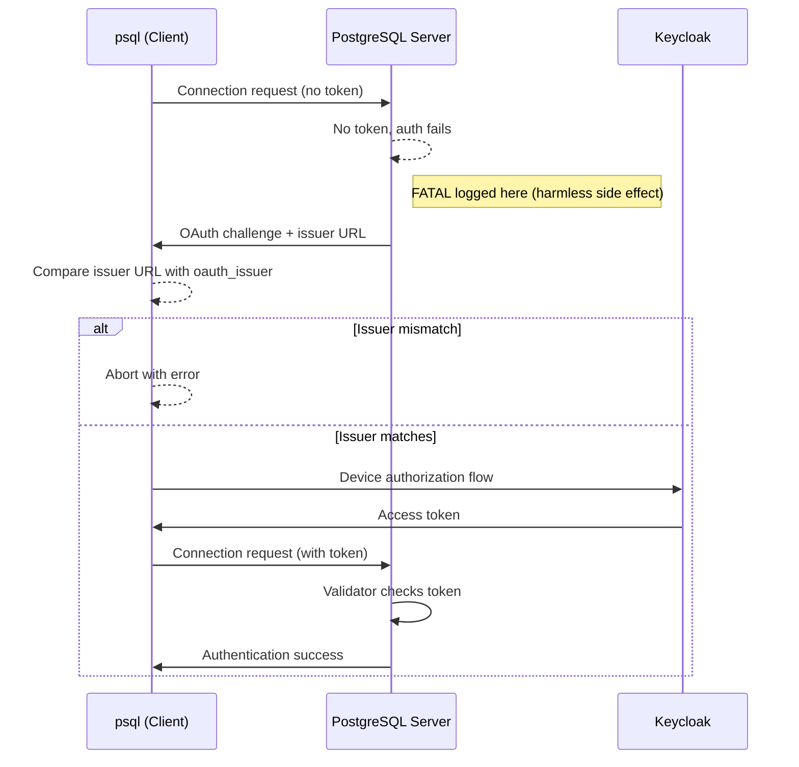
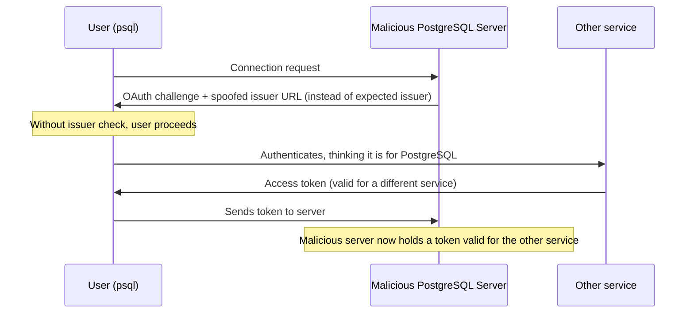

Last time, in [OIDC in PostgreSQL: With Keycloak](/blog/2026/01/19/oidc-in-postgresql-with-keycloak/), we created a working demo setup that was able to successfully authenticate a user using OIDC.

In this blog post we follow the same example, but instead of the success story, we explore how OAuth keeps our PostgreSQL servers secure.

We won't focus on complex attack vectors, like the examples in the [second blog post](/blog/2025/11/17/oidc-in-postgresql-how-it-works-and-staying-secure/) in the OIDC series.
Instead of social engineering, we'll look at practical errors, misconfigurations, honest mistakes: understanding the error messages and fixing problems.

### Improved test setup

Along with the step by step tutorial, previously we also linked a [docker/podman compose configuration](https://github.com/Percona-Lab/pg_oidc_validator/tree/main/examples/keycloak).
This is still available, and we even improved it for testing the error scenarios.

If you want to update the configuration manually instead, this is what changed: we duplicated everything!

* Instead of a single testuser, we have two: `testuser` and `testuser2`, both using the same `asdfasdf` password
* Instead of one client, we have two: `pgtest` and `pgtest2`
* Instead of one scope, we have two: `pgscope`, `pgscope2`
* Instead of one realm, we have two - containing exactly the same setup: `pgrealm` and `wrongrealm`

We also have a role now, simply called `pgrole`.
`pgrole` is required for the `pgtest2` client, and it is also required for the `pgscope2` scope.
Only `testuser2` has this role, `testuser` doesn't.

The following table summarizes the access matrix:

|             | pgtest | pgtest2 | pgscope | pgscope2 |
|-------------|--------|---------|---------|----------|
| testuser    |   OK   | denied  |   OK    | denied   |
| testuser2   |   OK   |   OK    |   OK    |   OK     |

### We succeeded with a FATAL error?

However, before we start using all these additional items, let's go back to the end of the keycloak story, where in the end we succeeded with logging in.
Or did we?
While `psql` logged us in, if anybody checked the server error log, we could see the following there:

```
FATAL: OAuth bearer authentication failed for user "testuser"
```

But if somebody is observant enough, this message is logged before we even went to the device authentication website of Keycloak, and entered the authentication code.
This isn't a real error, it's just a side effect of how OAuth is implemented internally, and will most likely be fixed in PostgreSQL 19 -- meaning everything will stay as is, without this FATAL error.

As for PostgreSQL 18, unfortunately, we have to live with this.
This also means that we can't rely on simply looking for OAuth authentication errors in the server log, because all OAuth authentication failures will result in exactly the same message, no matter if they are logged because of this harmless situation or because of a real authentication issue.

A workaround is to rely on the validators instead: since the server is unaware of the exact error situation anyway -- it delegates validation to the validator -- these plugins will print out much more detailed *log messages*.
We'll see some examples later with pg_oidc_validator, as we explore the error scenarios.

However, keep in mind that the sentence above says *log messages*, and not *errors* or *fatal errors*.
Validators are not allowed to print out ERROR and FATAL messages for authentication failures, so users have to look for WARNING or LOG level messages for the details.
In practice, PostgreSQL will still print the same generic FATAL error message about OAuth bearer authentication failing -- but it will appear after the validator-specific WARNING or LOG messages that contain the actual diagnostic information.

### Why does it happen?

Earlier we already established that PostgreSQL validates that the client and the server use the same issuer, but didn't go into more detail than this.

Usually when a service validates user input, it does so on the server.
The main reason for this is that developers can trust the backend, controlled by administrators, while they can't trust the frontend, potentially used by malicious users.

But are we validating user input in this case?
Why does the user even have to specify the issuer, since the server already knows it, it's in there in the HBA configuration?

Because this check isn't the server validating the user, it's the opposite:
the user validating the server.

1. The client sends an empty connection request to the server.
2. The server confirms that we are using OAuth, and sends back its issuer URL.
3. The client checks whether the issuer it is planning to use -- or has already used, if it already has a valid token -- matches the one sent by the server.
    * If not, it aborts the login attempt and prints an error.
    * If it matches, it continues with a real authentication attempt.



The FATAL error in the server log is a side effect of the first empty authentication attempt, that wasn't fixed in time before the PG18 release.

### Why do we need this check?

With the improved configuration, we can test what happens when we specify the wrong issuer:

```
bin/psql -h 127.0.0.1 'dbname=postgres oauth_issuer=https://keycloak:8443/realms/wrongrealm oauth_client_id=pgtest'
psql: error: connection to server at "127.0.0.1", port 5432 failed: server's discovery document at https://keycloak:8443/realms/pgrealm/.well-known/openid-configuration (issuer "https://keycloak:8443/realms/pgrealm") is incompatible with oauth_issuer (https://keycloak:8443/realms/wrongrealm)
```

Notice that compared to the correct command, which had the pgrealm, we are using the other Keycloak realm.
And if we check the server log, we can see that there are no additional log messages there -- we see a single OAuth FATAL error, which is not a real error, just the side effect we are investigating.
This error is entirely on the client side.

And that brings us back to the question:
why do we need this?

On one hand, it helps us prevent honest mistakes early.
In our example, wrongrealm and pgrealm are exactly the same -- they have users with the same name, scopes with the same names, clients with the same names.
If there's a misconfiguration, and the server and the client use different realms in a similar setup, everything would seem to work -- the user trying to log in would be able to log in, get a token, psql would send it to the server...
and then on the server the validator would reject it -- assuming that it is a good validator, like pg_oidc_validator.
No harm done -- other than disclosing a token to the server that shouldn't have been sent there --, but figuring out what's the problem could take a while.

On the other hand: what if we aren't dealing with a malicious user, but a malicious server?

In the previous attack vectors we showcased, the attacker was always a third party:
somebody who wanted to steal access to the database server.

But we don't necessarily need a different unknown adversary, it could be the server we are using:
do we absolutely know and trust its administrators?
Sometimes yes, sometimes no.

Those administrators might be aware that we are also using OAuth for something else, and might plot to gain access to it.
So instead of sending us the issuer we expect, the server sends us something else -- for example a spoofed site, tricking us to complete login into a different service.

Remember the earlier situation where the Fake Photo Gallery Website used Client ID spoofing to gain access to the PostgreSQL Database?
This situation is basically the same -- the only difference is that this time PostgreSQL Database is trying to gain access to Photo Gallery.



The client-side issuer check prevents this: psql compares the issuer URL from the server against the `oauth_issuer` it was configured with, and aborts if they don't match.

So while this redundancy, the client having to specify the issuer URL might seem just an annoying extra step, it is there to protect us.

### Can we verify the validator?

If we specify an incorrect issuer, the client rejects it before completing the OAuth flow -- that's great, but this means the validator isn't part of the picture.
Can we even test that a validator handles this situation correctly, to verify that it properly rejects an attempt with an incorrect issuer?
Security-aware users might want to double check that somebody using a modified psql is also properly rejected.

This is possible: in our next blog post, we'll see how to implement custom clients outside psql, possibly using other OAuth flows.
In that scenario, we'll be able to send custom tokens to the server, which has many uses -- one of which is internal testing of OAuth validators.

Rest assured, pg_oidc_validator handles this correctly -- and we'll show you how to verify it yourself in the next post.
If you are using a different validator, stay tuned to see how you can verify it!

With pg_oidc_validator, you will see something like this in the server log:

```
WARNING:  OAuth validation failed with exception: claim value does not match expected value
FATAL:  OAuth bearer authentication failed for user "testuser"
DETAIL:  Connection matched file "<datadir>/pg_hba.conf" line 119: "host    all             all             127.0.0.1/32            oauth issuer=https://keycloak:8443/realms/pgrealm,scope="pgscope email",map=kcmap"
```

Here "claim value does not match expected value" means that a field (claim) in the JWT doesn't match our expectation.
While this might seem generic, currently pg_oidc_validator only validates exactly one field in this way: the issuer.

On the client side, you can see the following generic error message:

```
Connection error: connection to server at "127.0.0.1", port 5432 failed: retrying connection with new bearer token
connection to server at "127.0.0.1", port 5432 failed: FATAL:  OAuth bearer authentication failed for user "testuser"
```

Which is generally true for most OAuth errors -- validators are expected not to provide detailed information about why they reject a connection back to the client, to limit the information available to potential attackers.

### Signature failure

For some it might be surprising that we are getting an error about the issuer, and not about the token.
Why is that?

The reason we use JWTs for access tokens is because they are cryptographically signed tokens.
While they contain the payload in clear text, the token ends with a signature, a proof that it was generated by the issuer we trust.

This means that if the token was generated by a different issuer, it is signed by a different key.

However, the order of operations inside the validator is different:
first we validate the fields in the cleartext data we have strong expectations about -- in this case the issuer.
Then, after that's valid, we also verify that the signature matches the public key of the issuer.

Since in the above situation the issuer is different, we never get to the point of signature validation.

To do that, somebody has to tamper with the token.
For example an attacker realizes that we require a specific scope, and since JWTs contain everything in clear text, decides to edit the `scp` claim and insert `pgscope` into it.
In that situation, the issuer matches, the validator verifies the signature, and we end up with a different error:

```
WARNING:  OAuth validation failed with exception: failed to verify signature: VerifyFinal failed
FATAL:  OAuth bearer authentication failed for user "testuser"
DETAIL:  Connection matched file "<datadir>/pg_hba.conf" line 119: "host    all             all             127.0.0.1/32            oauth issuer=https://keycloak:8443/realms/pgrealm,scope="pgscope email",map=kcmap"
```

The client side error message didn't change with this -- this is clearly an attack attempt, we do not have to provide nice error messages for malicious users.

### What about expired tokens?

Another interesting scenario you might wonder about is token lifetime:
in OAuth, tokens have a limited period in which they are valid.

PostgreSQL currently has no facilities to enforce token lifetime when a connection is active -- once somebody is logged in, they stay logged in until they disconnect for some reason --, but validators are expected to validate that tokens are still valid at least during authentication.

Similarly to the previous situation, testing this without a custom client isn't possible, as psql always asks for a new token during the connection attempt, there is no way to send an earlier token with it.

So as with the previous blog post, please accept that pg_oidc_validator will reject this scenario with the following message in the server log:

```
WARNING:  OAuth validation failed with exception: token expired
FATAL:  OAuth bearer authentication failed for user "testuser"
DETAIL:  Connection matched file "<datadir>/pg_hba.conf" line 119: "host    all             all             127.0.0.1/32            oauth issuer=https://keycloak:8443/realms/pgrealm,scope="pgscope email",map=kcmap"
```

Which should be self explanatory.

On the client side, you can only see the same generic error message as before.

While this doesn't seem too user friendly, keep in mind that both of these errors can only happen with faulty clients.
Clients can, and should verify both the issuer and the expiration time before connecting to the server, and they should be able to provide nice error messages to the users based on that.

### Scope mismatch

After the previous two situations, which are untestable with `psql`, let's move to the realm of errors which don't require custom code.

In the first and second blog posts we tried to emphasize how important scopes are in OAuth, how they can help prevent accidents.
Obviously, validators have to make sure that all the scopes the server asked for are present in the received token.
Having more scopes isn't an issue -- sometimes clients use the same token for multiple services --, but missing a required scope should be an error.

To verify what happens in this situation, we can simply modify the pg_hba line to include a scope that doesn't exist on the server, for example adding `fooscope`:

```
host    all             all             127.0.0.1/32            oauth issuer=https://keycloak:8443/realms/pgrealm,scope="pgscope email fooscope",map=kcmap
```

And then we can connect with psql as before:

```
bin/psql -h 127.0.0.1 'dbname=postgres oauth_issuer=https://keycloak:8443/realms/pgrealm oauth_client_id=pgtest'
```

Which should result in the following detailed error message in the server log:

```
LOG:  Authorization failed because of scope mismatch. Required scopes: email, fooscope, pgscope. Received scopes: email, pgscope, profile
LOG:  OAuth bearer authentication failed for user "testuser"
DETAIL:  Validator failed to authorize the provided token.
FATAL:  OAuth bearer authentication failed for user "testuser"
DETAIL:  Connection matched file "<datadir>/pg_hba.conf" line 119: "host    all             all             127.0.0.1/32            oauth issuer=https://keycloak:8443/realms/pgrealm,scope="pgscope email fooscope",map=kcmap"
```

Similarly to the previous scenarios, this is completely validator specific, we can only showcase our validator.

This scenario also depends on the OAuth flow used and the identity provider.
**Note:** Keycloak, for example, permits unknown scopes for the device flow -- it simply ignores them and returns the scopes it can.
However, it doesn't do that for other flows -- the Token Endpoint rejects unknown scopes with an error and doesn't provide an access token.

On the client side, the error is the same as before -- no details about what's missing.
Which is clearly fine in this situation, as this is clearly a configuration error, something the administrators have to figure out and fix.

Now let's see the error slightly differently:
the above example worked with the unmodified keycloak setup, described in the previous blog, but we have an improved test setup for this one.
Instead of using a non existent foo scope, let's change our requirement to `pgscope2`, which requires `pgrole`:

```
host    all             all             127.0.0.1/32            oauth issuer=https://keycloak:8443/realms/pgrealm,scope="pgscope2 email",map=kcmap
```

And similarly add `testuser2` to pg_ident, so both can log in:

```
# MAPNAME       SYSTEM-USERNAME         DATABASE-USERNAME
kcmap           testuser@example.com    testuser
kcmap           testuser2@example.com    testuser2
```

In this new setup, we transformed the configuration problem to a permission issue:
testuser2 will be able to log in, testuser won't.

The error message on the client side is unchanged, it still doesn't say "permission denied" or "scope mismatch", or anything like that.
At this point this can be debatable, but it is still mainly a task for administrators, and not the user:
somebody will have to investigate the permission setup on keycloak, and fix it, if testuser also needs access to the server.

### Unknown user

Another common error source is a problem with the user mapping.
In our example we are using a pg_ident file with an email, but it would be similar with other configurations.

Regardless of the setup, there are many reasons why we can't properly look up a username:

* using an incorrect field for `authn_field`
* missing an entry from `pg_ident`
* having a typo in the name either in `pg_ident` or in keycloak
* and so on

In all situations, the error message for this case won't be generated in the validator, but in the PostgreSQL user mapping code instead.
For example, if you previously added `testuser2` to the ident file, comment it out and try to log in with it again:

```
LOG:  no match in usermap "kcmap" for user "testuser" authenticated as "testuser2@example.com"
FATAL:  OAuth bearer authentication failed for user "testuser"
DETAIL:  Connection matched file "<datadir>/pg_hba.conf" line 119: "host    all             all             127.0.0.1/32            oauth issuer=https://keycloak:8443/realms/pgrealm,scope="pgscope email",map=kcmap"
```

In an alternative configuration -- which is not part of the sample keycloak configuration -- it is possible to create a custom claim "postgres_username" on keycloak, and skip the map file completely.
In this situation, a mismatched username would result in a slightly different error message:

```
LOG:  provided user name (testuser) and authenticated user name (testuser2) do not match
FATAL:  OAuth bearer authentication failed for user "testuser"
DETAIL:  Connection matched file "<datadir>/pg_hba.conf" line 119: "host    all             all             127.0.0.1/32            oauth issuer=https://keycloak:8443/realms/pgrealm,scope="pgscope email""
```

### Connection problems

While it usually isn't a configuration or permission problem, it is possible that we have a network issue:
either a localized routing error, where the client can connect to the identity provider but the server can't, or a situation where the identity provider / network crashed between obtaining the access token and verifying it on the server.

The client executable has an access token and sends it to the server, which then has to validate it without being able to communicate with the identity provider.
This is another situation which is difficult to validate with `psql`, but it is relatively easy with a custom client.

Our OIDC validator has to connect to the identity provider for two reasons:

* One, to retrieve the discovery document which contains the URL of the JWKS endpoint -- which stores the public keys of the issuer
* Two, to retrieve the public keys using that JWKS endpoint

The validator also follows HTTP Cache headers:
for example, if the server allows caching the keys for 4 days, the validator only retrieves them for the first attempt, and then keeps using them for that time.
After it passes, it connects to the server one more time, and if it again receives a 4 day window, it will keep using the keys for 4 more days.
This means that with a proper provider setup, the validator might not even notice a short service loss.

Fortunately for our testing, but not so fortunately for production use, keycloak doesn't support JWKS caching at all.

An inaccessible OIDC server will result in logs similar to:

```
WARNING:  OAuth validation failed with exception: HTTP request failed: Could not connect to server
FATAL:  OAuth bearer authentication failed for user "testuser"
DETAIL:  Connection matched file "<datadir>/pg_hba.conf" line 119: "host    all             all             127.0.0.1/32            oauth issuer=https://keycloak:8443/realms/pgrealm,scope="pgscope email",map=kcmap"
```

Where the exact error message depends on the situation -- a timeout, internal server error, etc, all would result in slightly different error messages, while a timeout would also slow down the response time of the authentication attempt.

### Let's run without errors!

We hope these examples will be useful for everybody. To avoid errors, to diagnose problems, and to simply understand the security model and guarantees given by OAuth and validators.

While this is not an all-inclusive list, as we can't possibly cover every error scenario in a setup involving several components, it covers the most common scenarios, and should address all possible security problems.

In our next part, we'll focus on a practical, minimal development example:
while currently only the provided command line tools support OAuth, `libpq` already has the infrastructure in it to implement custom OAuth logic, allowing users to integrate it into their applications - we'll provide examples how it is doable.
