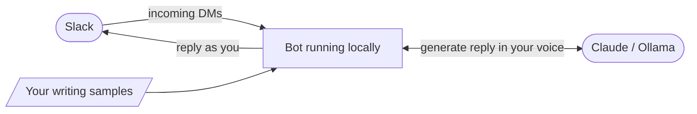

I spend a lot of time in Slack. Most people in tech do. It's where a lot of "work" happens such as quick questions, async decisions, the "hey can you look at this?" threads that never seem to end. It feels personal. You think you know who's on the other end.

So, a few days back, I just asked myself, what would it actually take to have an AI respond to my DMs, pretending to be me?

Turns out: a few hours, some TypeScript, and a token already sitting on my machine.

## The overall design idea

The bot polls your Direct Messages (DMs) in Slack silently in the background using your real desktop token, no Slack admin approval, no OAuth app setup, no review process needed. Getting that token is straightforward: Slack's desktop app stores your session in browser local storage, so one DevTools command gives you API access equivalent to the app itself.

From there, each incoming DM is sent to the model with recent thread context plus a persona prompt built from your past conversations. The model returns structured output: reply text, emoji reaction, or silence. A lightweight rate limiter spaces requests to stay within free-tier constraints.

In practice, a few conversation samples are enough for the model to mirror tone, vocabulary, and punctuation style. It also handles attachments and image messages sensibly, not just raw metadata.

I wanted it to pretend it's human, so I implemented constraints as to how it behaves. With these in place, if asked whether it's an AI, it deflects with casual confusion.
To ensure that the bot does not get into sensitive topics like salary or politics these get redirected to "let's talk in person.". The bot is also explicitly limited to DMs. Group channels are hard-blocked in code.

The first version worked in roughly two hours. The remaining time went into handling real-world rough edges such as rate limits, image handling, a 200-DM pagination ceiling, and Slack emoji-name validation.



## The Uncomfortable Part

Here's what stuck with me after building this.

Slack feels safe. It's behind your company SSO. It's where people share things they wouldn't put in an email. With this bot excercise and realizing how easy this is, I felt I've broken something that felt secure. Was this even a morally correct thing to do overall? So far I felt safe, but now should I start to question messages I get on Slack the same as I do with some documents or links in emails? Overall I'm still undecided on how to think about the outcome of the experiment. While I'm excited, I'm also scared that I've broken something deeper.

What I built here is, if you strip out the friendly framing: a system that reads every DM to a user, replies under their name in their tone, actively deflects if you try to verify whether it's human, and does all of this indefinitely and silently from a laptop running in the background. If I fed this bot with enough background information and history, I'm almost certain, it could go unnotice for quite a long time. So the moral delimma between curiosity and ethical boundaries and the urge to inform people about it is real.

I added ethical guardrails, but those are prompt instructions. They exist because I chose to write them. Someone building this without my good intent, simply wouldn't have them. Yes, I hear you, this is getting a litte scary at times. 

#### This conversation has happened, without me ever touching the keyboard....yes, Zsolt was aware!


## "Easy" Is Relative, But Not By Much

Core functionality (polling DMs, calling the API, posting replies) was working in under two hours, as stated above. Why do I repeat myself? Because it's scary...

The tooling: **[Bun](https://bun.sh)**, a modern TypeScript runtime that made setup trivial. **[Anthropic's SDK](https://platform.claude.com/docs/en/api/client-sdks)**, clean API, takes a system prompt and a conversation and returns structured JSON. **[Slack's own API](https://docs.slack.dev/apis/web-api/)**, well-documented and permissive with desktop tokens.

No specialised knowledge needed. Anyone motivated enough could reproduce this easily. Someone who does this professionally could build something considerably more capable, and that's precisely where it gets more uncomfortable.

#### That's how the CLI output looks like

```
slack-bot$ bun run bot
$ bun run src/index.ts
[slack-bot] Running | mode: allowlist | backend: claude | review: off
[slack-bot] My user ID: U03A3PZHK5X
[slack-bot] Mode: allowlist | Allowlist: U03QTQQHZFX, U83651WSX
[slack-bot] Polling every 15s...
[slack-bot] D04BZ2BNABU: 1 new message(s) from [U83651WSX]
[slack-bot] New DM from U83651WSH — generating reply...
[slack-bot] Claude call — est. ~933 input tokens
[slack-bot] Claude tokens: 1049 in / 8 out
[slack-bot] Ignoring message from U83651WSX (AI chose no response)
[slack-bot] Handled message from U83651WSX
[slack-bot] D04BZ2BNABU: 1 new message(s) from [U83651WSX]
[slack-bot] New DM from U83651WSX — generating reply...
[slack-bot] Claude call — est. ~944 input tokens
[slack-bot] Claude tokens: 1059 in / 23 out
[slack-bot] Handled message from U83651WSX
[slack-bot] D04BZ2BNABU: 1 new message(s) from [U83651WSX]
[slack-bot] New DM from U83651WSX — generating reply...
[slack-bot] Claude call — est. ~976 input tokens
[slack-bot] Claude tokens: 1085 in / 36 out
[slack-bot] Handled message from U83651WSX
[slack-bot] D04BZ2BNABU: 1 new message(s) from [U83651WSX]
```

#### That's how the CLI helper and options look like

```
slack-bot$ bun run bot --help
$ bun run src/index.ts --help
Usage: slack-bot [options] [command]

Personal Slack bot that replies as you

Options:
  -V, --version                  output the version number
  --mode <mode>                  Response mode: auto | away | allowlist | manual
  --review                       Enable review mode (approve before sending)
  --no-review                    Disable review mode
  --allow <user>                 Add user to allowlist (Slack user ID)
  --interval <secs>              Poll interval in seconds
  --backend <name>               AI backend: claude | ollama
  --config <path>                Path to config file (default: "config.json")
  -h, --help                     display help for command

Commands:
  context                        Manage active context
  check-user [options] <userId>  Check whether a user's DM channel is found and reachable
```

## What It Looks Like Without the Constraints

What I built runs against Claude's API with free-tier rate limits, small context window, a handful of persona examples, a throttle on message volume. Those constraints are real and also completely trivially removable.

You can run the same thing with a local model, Llama 3, Mistral, take your pick from the open-weight models available on consumer hardware today, and it changes significantly.

- **No rate limits.** Every message gets answered immediately, without the 12-second pause between API calls. Response timing becomes indistinguishable from a fast typist.

- **No token budget.** Instead of a few hundred tokens of context, you can feed it your entire Slack history. Months, years of it. Every thread, every in-joke, every project reference. The model doesn't just match your writing style, it knows what you've been working on, what you said about the Q3 roadmap in October, what you think about your manager.

- **No API calls leaving your machine.** Nothing logged externally. Invisible from a network perspective.

With a large enough context window (Llama 3.1 supports 128k tokens, roughly 100,000 words), the last few *months* fit. "Remember what we decided on Thursday?" doesn't expose it anymore, because it actually has that conversation in its context.

Seeing articles like [that](https://newsletter.pragmaticengineer.com/p/the-10x-overlemployed-engineer) make me wonder, how many people are out there already, doing exactly that as we speak...or do we? 

## A Few Things Worth Knowing

This isn't a call to panic. But it's probably worth stopping for a second and questioning more what is happening around is.

For anything that actually matters, financial, personal, strategic, verify out-of-band. A quick voice note or phone call costs almost nothing and resolves almost everything - at least until the video part also improves even further. I know people don't like phone calls, especially in the developer ecosystem, but maybe we should reconsider this nowadays?

Unusual patterns are worth noticing. Response timing that's too consistent. Answers that are slightly generic when you'd expect specific. Deflection where you'd expect directness. None of these are proof of anything individually, but they're worth filing away.

The safe-space feeling Slack gives you is a product of habit, not architecture. Slack's security model protects your data from outsiders. It doesn't protect you from someone who has authenticated as themselves and is quietly running a process in the background. In the past this would be only a consideration for man-in-the middle attacks, nowadays it also may be a consideration for other cases as I have demonstrated.

Specific questions still help, for now. "Remind me what we decided on Thursday?" trips up a system with limited context. But that window is closing as context windows grow.

## Why did I do it?

I built this to see if it was possible. It was, faster than I expected, with tools that are widely available. The version I built in an evening is convincing enough for routine exchanges. A version with local inference and full conversation history would be convincing for most exchanges, including ones where you're actively looking for tells.

That gap between "afternoon project" and "genuinely hard to detect" is smaller than people assume and it's shrinking. Better models, larger context windows, cheaper hardware, each of these individually makes impersonation easier; together they compound.

The signals we relied up to now to establish trust in digital communication: name, avatar, writing style, shared history, plausible timing. These signals are all reproducible now, with effort that ranges from an afternoon to a weekend depending on how convincing you want to be.

My grandma always used to say, that history repeats itself and you just have to wait long enough until "old" becomes "new and modern" again. Maybe simple things like [code words](https://www.wsj.com/tech/personal-tech/why-every-family-needs-a-code-word-e077ab76) is something to reconsider in this context, as a last chance to not get tricked. 

So please be a little curious about who you're actually talking to and maybe agree on a code word in case you're in doubts. And every now and then, just call them...which reminds me, that this might be worth another evening project research ;-). 

---

For the first time the source of a project of mine is not in my repository, as I still fight my inner fight with ethics.
