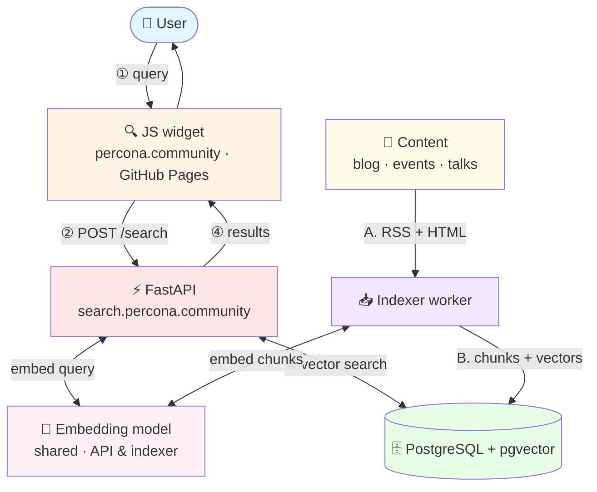

Type "zero downtime database migration" into the site’s search bar—and get articles and presentations about database migration with minimal downtime, even if those words aren’t in the titles or content. This is **semantic search** on **PostgreSQL** and **[pgvector](https://github.com/pgvector/pgvector)**—without paid embedding APIs or a separate vector database. In this series, I’ll explain exactly how it works and why I chose this stack.

I’ll explain how and why I developed the search for a community site—blog, events, talks, profiles. This article will be useful if you want to replicate this approach or are looking for a practical case study using simple components. If you’ve already done something similar, I’d love to hear your feedback.

## Context: Website, Search, and Task

The Community team has a website built on **Hugo**—an open-source static site generator—which is hosted for free on **GitHub Pages**. The site features articles, events, talks, videos, and a wealth of other information.

> If you’re thinking of starting your own, I recommend checking out these examples:
> - [blog.koehntopp.info](https://blog.koehntopp.info/)
> - [openeverest.io](https://openeverest.io/)
> - [perconalive.com](https://perconalive.com/)
> - [oursqlfoundation.org](https://oursqlfoundation.org/)

But a Hugo site is just a collection of HTML files without a backend. Search or filters can only be implemented using frontend JS or external services. For a very long time, our site simply didn’t have a search function. Then **Kai Wagner** contributed and added a JS-based search for the blog that worked on exact word matches ([percona.community/blog](https://percona.community/blog))

Recently, our beloved community lead **Laura Czajkowski** set a goal: the site needs to have a smart AI search. We tried several off-the-shelf solutions, but they were all either too expensive or unsuitable for various reasons. For example, we want the search to include not only site content, but also videos from other sources, the forum, and our GitHub repositories—and possibly documentation in the future.

So I suggested building this search feature ourselves—modern AI assistants are actually quite good at handling prototypes of this kind. I’ll discuss which tech stack to use as a foundation below.

## What We'll Do

The website will remain static on Hugo and GitHub Pages. We'll set up the search service **separately**—that's the only sensible approach for this kind of architecture. The goal is simple: a user types in a query using natural language and receives a list of results that are semantically relevant.

Kai’s keyword-based search was already a step forward, but it doesn’t capture **meaning**. Type “postgresql” and you get pages where that word appears. But an article about slow queries or replication might not show up in the results if it uses different wording. **Semantic search** works differently: the query and documents are converted into **vectors**—sets of numbers that reflect the meaning of the text (**embedding**). Phrases with similar meanings end up close together in this space, even if the words don’t match. A query like “how to speed up slow queries in MySQL” might find content about tuning and optimization, even if those words aren’t in the titles or content.

Why not other solutions? A solid open-source option is **[OpenSearch](https://opensearch.org/)**: full-text search, vector search, and a mature ecosystem. Among similar engines, I also looked at **[Manticore Search](https://manticoresearch.com/)**. Both work, but for **semantics**, you still need a separate embedding pipeline—a model during indexing and for each query. That means yet another service on top of the model: to set up, configure, and monitor.

Honestly: I wanted to build **my own** solution on **Postgres** and see what it’s capable of when paired with pgvector—a practical experiment, not a race for the perfect search engine. **PostgreSQL with [pgvector](https://github.com/pgvector/pgvector)** stores page metadata, chunks, vectors, and query history all in a single database—without a separate vector DB. In **[Percona Distribution for PostgreSQL 18](https://docs.percona.com/postgresql/18/index.html)**, pgvector is already included in the distribution: `CREATE EXTENSION vector` — and you’re ready to go.

Technically, the plan is as follows—four parts:

1. **Widget** on the website — search field and results display (standard JS; we don’t touch Hugo).
2. **API** — receives a request, computes a vector using the same model as during indexing, searches the database, and returns JSON with links.
3. **Indexer** — a background worker: reads the site’s RSS and HTML, splits it into chunks, computes vectors, and writes to the database.
4. **PostgreSQL + pgvector** — a single database for page metadata, chunks, vectors, and search history.

Hugo remains static; all the “smart” parts are in a separate service. Without a separate vector database, without paid embedding APIs, and without RAG chat—just link delivery.

The diagram shows two flows: **search** (when a user enters a query) and **indexing** (when we update the database—on demand or on a schedule). Let’s start with the user:

The diagram omits an important rule: **the indexer and the API must use the same embedding model**. The query vector and the vectors in the database must reside in the same space—otherwise, the search is meaningless. For example, you cannot mix Nomic for indexing and OpenAI for the query. The model is loaded both in the API (for each search) and in the indexer (for each chunk); the widget is unaware of it—it only passes the query text.

On paper, everything looks straightforward. In practice, I redesigned the database schema **three times** and tweaked the results to ensure blog posts didn’t crowd out events and talks. It was also surprising how much the **similarity threshold** affects the results—just one parameter, yet the output changes drastically. But the plan worked overall: within a few days, we had a working beta on the live site. Below is what we ended up with.

## The Result (Spoiler)

It took about **three leisurely days** and roughly **$20 worth of Cursor tokens** to build, debug, and deploy. You can try it out right now at **[percona.community](https://percona.community)**—use the search icon in the header or go to **[percona.community/search/](https://percona.community/search/)**.

For now, the index includes the site’s own content: the blog, events, talks, and member profiles. Videos from other platforms, the forum, and GitHub are in the works; the architecture is designed to allow for connecting new sources without changing the stack.

This is currently a **beta**: the data on the site is public, and the search isn’t mission-critical—but I’m keeping a close eye on stability and security.

### Website Widget

In the header, there is a search icon: clicking it opens an input field, with a popup below it displaying a list of results, a **similarity score** (indicating how closely the result matches the query in meaning, on a scale from 0 to 1), and the API response time. The website remains static—the widget simply sends a request to `search.percona.community` and displays the response. The “All results” link leads to the full page `/search/`.

Try the widget on [percona.community](https://percona.community)—for example, search for `slow queries mysql tuning` or `kubernetes operator database`. If you find it useful, please leave a comment below letting us know what you liked and what you would change.

### Full Results Page

A separate page at `/search/` with detailed results : filters by content type, cards, and links to resources.

[Example](https://percona.community/search/?q=Postgres+backup+solutions&type=blog)

### API

**FastAPI** service at `https://search.percona.community`. It accepts a request, computes the embedding, queries Postgres, and returns JSON: links, similarity score, and timings—how much time was spent on the model and how much on the database. 

The service is deployed on **AWS EC2** using Docker Compose: API, indexer, Postgres.

### Demo Dashboard

Since the AI agent in Cursor handled the routine tasks well, I also put together a **development dashboard** (`/demo`): to test search, run indexing, view statuses, query history, and what’s in the database. It’s not needed for production—it’s just my personal sandbox—but debugging would have taken significantly longer without it.

Demo Dashboard

Search history: making search better

Indexing status, to see when search data was last updated

Indexed documents with the ability to view data and chunks.

### What I Used

In short—**why** I chose this particular stack. We’ll cover comparisons with alternatives and configuration details in **part two**.

- **[PostgreSQL](https://www.postgresql.org/)** + **[pgvector](https://github.com/pgvector/pgvector)** — vectors and metadata in a single database, without a separate vector DB. Cosine similarity and the HNSW index handle semantic search at the scale of a community site. ([pgvector documentation on Percona](https://docs.percona.com/postgresql/18/enable-extensions.html#pgvector))

- **[Percona Distribution for PostgreSQL 18](https://docs.percona.com/postgresql/18/index.html)** — the same Postgres, but with pgvector already included in the distribution and a ready-to-use Docker image. Regular PostgreSQL will also work if you install the extension manually; I chose Percona because I work at Percona and wanted to test the combination of “their Postgres + pgvector” in production.

- **[Python](https://www.python.org/)** + **[FastAPI](https://fastapi.tiangolo.com/)** — a quick way to set up an API with OpenAPI out of the box. An ecosystem for crawling, embeddings, and working with Postgres without unnecessary boilerplate; for a prototype, this was more important than choosing the “perfect” framework.

- **[nomic-embed-text-v1](https://huggingface.co/nomic-ai/nomic-embed-text-v1)** + **[sentence-transformers](https://www.sbert.net/)** — an open-source model with 768 dimensions that runs locally on the CPU. No need for a paid embedding API or per-chunk billing with full indexing. For search, it’s important that the index and the query are processed by **the same** model — Nomic is suitable for this. Other models are also possible; later I want to compare results for certain queries.

- **[Hugo](https://gohugo.io/)** + **JavaScript** — the site is already on Hugo; the widget is a thin layer of JS on top of the static content. I didn’t have to change the engine: search lives in a separate service; Hugo just serves HTML and calls the API.

- **[Docker](https://www.docker.com/)** / **Docker Compose** — the same Compose file locally and on the server: Postgres, API, indexer. Fewer surprises when moving from a laptop to EC2.

- **[AWS EC2](https://aws.amazon.com/ec2/)** + **nginx** — a separate host for search: HTTPS on the `search.percona.community` subdomain, CORS for the static site on GitHub Pages. A simple VPS without Kubernetes — sufficient for beta.

- **[Cursor](https://cursor.com/)** — the main development tool: the developer wrote boilerplate code, integrated the API with the demo, and fixed Docker errors. Without it, the same amount of work would have taken weeks, not days.

### How long did it take?

To be honest, in terms of time:

- **~6 hours** of hands-on work with Cursor—enough to get the first working prototype up and running: crawl, API, Docker, basic demo;
- another **~2 days** of leisurely iterations — database schema, content-type-based output, embed/page widget, search history, dashboard, fixing the indexer worker, deployment to EC2;
- **~$20** — Cursor tokens for the entire cycle.

Without AI, the same amount of work would have taken me weeks. With the agent, I mostly formulated the task, checked the results, and tweaked the details.

### About the code and repository

I’m not **posting** the code yet—not on principle, but because it’s currently tightly tailored to **percona.community**: specific RSS feeds, content types (blog, event, talk, contributor), a widget for our Hugo template, and deployment to our EC2. This is a working internal prototype, not a universal library.

If you’re here for a ready-made repository—let’s be honest: breaking down someone else’s monolith to fit your site often takes longer than building it from scratch using a clear blueprint. In the second part, I’ll provide the architecture, database schema, and stack details—that’s enough for your Cursor agent (or another AI assistant) to build something similar tailored to **your** feeds, fields, and frontend.

If you’re interested in a **universal open-source solution** or a **search service for any website**—let me know in the comments. I have some ideas on this, and your feedback will help me decide whether it makes sense to spin this off into a separate project.

### What's Next

Try searching on [percona.community](https://percona.community) and let us know in the comments what you find—we're especially interested in seeing where the semantic search succeeded where the old substring search fell short.

In the **second part**, I’ll break down the inner workings: the database schema (with those three modifications), chunking, the HNSW index, why results are filtered by content type—and a step-by-step guide to running it locally with Docker Compose.

