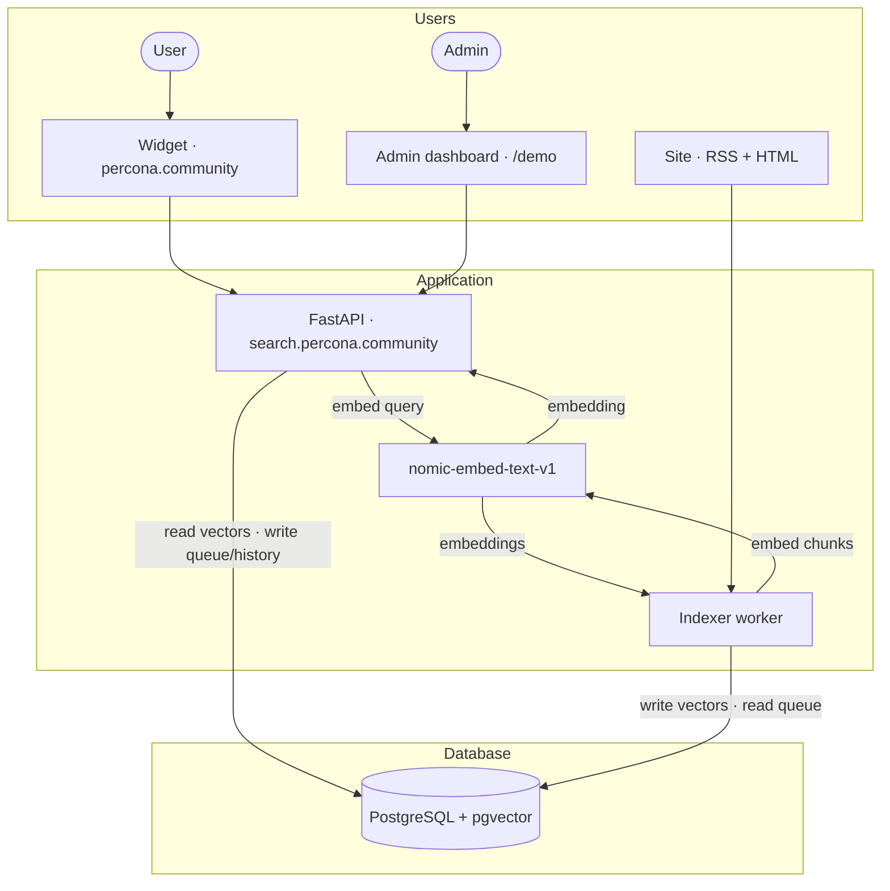

I’ll explain how I built the **Postgres layer** for semantic vector search on the Percona Community website: pgvector, chunks, two table modifications, the database schema, how the indexer populates Postgres, and **what the SELECT statement looks like during a search**.

> [Part 1](/blog/2026/05/29/semantic-search-on-postgresql-part-1/): why semantic search, what’s already working on the site, the widget, and an overview of the stack.


## Architecture

Search runs separately from the website at **search.percona.community**: FastAPI, a background indexer, and PostgreSQL with pgvector are all in a single Docker Compose file. [percona.community](https://percona.community) remains static on Hugo and GitHub Pages—it doesn’t write directly to the database.



### Search

A visitor enters a query into the widget. The widget sends a `POST /search` request to FastAPI. The service computes the query embedding with nomic with the prefix `search_query:` and searches for the nearest vectors in Postgres. The widget knows nothing about pgvector—it only receives JSON with links.

### Admin dashboard

On the same FastAPI service I run an admin dashboard at `/demo`: test queries, search history, a database summary, viewing documents and chunks. The dashboard does not talk to Postgres directly—it only calls the API; the API reads and writes Postgres (`search_history`, `index_queue`, search results).


### Indexing

To refresh the index, I click **Start Indexing** in the dashboard—that hits `POST /index/start`. The same endpoint can be called from outside: a GitHub webhook after a push to the site repo, cron, or curl while debugging. FastAPI enqueues the job in `index_queue`. A worker in the indexer container picks it up, downloads RSS and HTML from the site, splits text into chunks, computes vectors with nomic (`search_document:`), and writes to `pages`, `community_nomic`, and `indexer_runs`. The crawl runs in the background and does not block HTTP.


Important limitation: the indexer and the API must use the same embedding model. The query vector and the vectors in the database must be from the same space—otherwise, cosine similarity doesn’t make sense.

## pgvector in Postgres

For semantic search, you don’t need an LLM, but rather an **embedding model**: a string as input, a vector as output. I chose **nomic-embed-text-v1**—768-dimensional, running via `sentence-transformers` on the CPU, without a paid API.

I’m using **[Percona Distribution for PostgreSQL 18](https://docs.percona.com/postgresql/18/index.html)** — pgvector is already included in the distribution; `CREATE EXTENSION vector` — and you’re done ([documentation](https://docs.percona.com/postgresql/18/enable-extensions.html#pgvector)).

The basic structure is a column with **fixed dimensions** for the model:

```sql
CREATE EXTENSION IF NOT EXISTS vector;

CREATE TABLE chunks (
    id         SERIAL PRIMARY KEY,
    chunk_text TEXT,
    embedding  vector(768)   -- exactly 768 under nomic
);
```

In the project, the table is named `community_nomic`: the prefix `community_` (site) + the model key `nomic`. I’m setting up a comparison of embedding models: **each** model has **its own** vector table (`community_<model>`), because the dimensions and embedding spaces are different, so they can’t be mixed in a single table. Currently, there is one model in the project—**nomic-embed-text-v1**, 768 dimensions; later, I can add a second table `community_<model_key>` and switch the index/API via `EMBEDDING_MODEL_KEY`.

pgvector compares vectors with several **distance operators**. I search with **cosine distance** (the `<=>` operator in SQL): the smaller the distance, the closer the match. In the widget and API I show **similarity**, not the raw distance — `similarity = 1 - distance`, so a higher score means a better hit. The operators:


| Operator | When useful        |
| -------- | ------------------ |
| `<->`    | L2 (Euclidean)     |
| `<#>`    | inner product      |
| `<=>`    | **cosine** — my choice for nomic |


Simplified search for “nearest chunks”:

```sql
SELECT slug, chunk_text,
       1 - (embedding <=> $query_vector) AS score
FROM community_nomic
ORDER BY embedding <=> $query_vector
LIMIT 20;
```

The threshold in the API is `min_score` (my default is **0.52**): anything lower is discarded. During the beta phase, I spent a long time fine-tuning this specific number—the results changed noticeably depending on this single parameter.

To avoid scanning the entire table as the index grows, I set up an **HNSW** index (approximate nearest neighbor search):

```sql
CREATE INDEX ON community_nomic
  USING hnsw (embedding vector_cosine_ops);
```

At this scale, a separate vector database wasn’t necessary—a single Postgres instance handles metadata, vectors, and search.

## Postgres in Docker: `docker-compose`

I set up the stack using **Docker Compose**—Postgres, the API, and the indexer are all in containers, with the same setup locally and in production. Production — **EC2 on AWS** (`search.percona.community`), an ARM instance, using the same `docker-compose`.

In `docker-compose.yml`, Postgres on Percona looks like this (on Mac ARM):

```yaml
postgres:
  image: percona/percona-distribution-postgresql:18.1-3-arm64
  environment:
    POSTGRES_USER: postgres
    POSTGRES_PASSWORD: postgres
    POSTGRES_DB: community_search
  ports:
    - "5433:5432"
  volumes:
    - pgdata:/var/lib/postgresql/data
    - ./init:/docker-entrypoint-initdb.d
```

In `init/01-enable-pgvector.sql`, include only `CREATE EXTENSION IF NOT EXISTS vector`. If you’re developing on **x86**, **use** amd64 in the image tag instead of `arm64` — see the options in the [Percona documentation](https://docs.percona.com/postgresql/18/index.html). I left **arm64** on both Mac and EC2: the configuration is the same.

I view the tables and data in **pgAdmin**. The `pages`, `community_nomic`, and service tables themselves are created when the API and indexer start using `ensure_*` functions in the code: these are `CREATE TABLE IF NOT EXISTS` and `CREATE INDEX IF NOT EXISTS`, not a separate migration directory.

## Indexing and Chunking

The site doesn’t write directly to the database—the database is populated by an **indexer**: a worker fetches RSS and HTML from [percona.community](https://percona.community), splits the text into chunks, computes embeddings, and writes the rows to `community_nomic` and `pages`. The widget and API only read what has already been written during searches.

### Why Chunks

At first, I tried **a single vector for the entire article**. I quickly ran into three problems:

- Long text takes longer to encode and consumes more memory;
- The model has an input length limit;
- a single vector for long text **blurs** the meaning—a query about a specific paragraph doesn’t map well to the “averaged” embedding of the entire article.

I settled on a **400-word** window with a **50**-word overlap (`chunker.py`). Each chunk is a separate line with its own `embedding`.

The first version of the chunker sliced **only the body** of the article—without the title, author, date, or tags. For queries like “articles by a certain author,” the results were off: the model saw the text but not the document’s context. I added **metadata to each chunk**—a `Title / Author / Date / Tags / Type` block at the beginning of each fragment before calculating the vector.


When searching, the API finds the closest chunks, but the card shows **the best chunk for the document** (one `slug` — one card). Without this, a long article would clutter the results with multiple lines.


## Database Schema: Two Revisions of the Chunk Tables

I revised the chunk storage schema **twice**—and separately added utility tables for background indexing and search logs.

### Version 1: Everything in a Single Table

The first working schema was **a single table for all chunks and document information**: each row represented a single article fragment, and it also contained duplicated page metadata (**url, title, author, date, tags, content_type**) along with `chunk_text` and `embedding`.

Pros: one `INSERT`, one `SELECT`, no joins.

Cons I encountered:

- one article — dozens of identical copies of title and author;
- when updating a page, it’s easy to get out of sync (one title in chunk #0, another in chunk #3);
- fetching the image and description for the card from `chunk_text` was unreliable.

Conclusion: A **vector layer** and a **card in the UI** serve different purposes.

The code still includes `_migrate_chunks_table`: when the API and indexer start up (inside `ensure_content_table`), it drops any extra columns from the chunk table if they are left over from the old prototype.

### Version 2: `pages` + `community_nomic`

I split the data into two tables:

- **`pages`** — one row per document: url, title, type, author, date, tags, images, description.
- **`community_nomic`** — only chunks: slug, chunk_index, chunk_text, embedding.

They are linked by `slug` (stable key from the URL). Search: find the nearest chunks in `community_nomic`, assemble the card from `pages`.

In the admin dashboard I can open any indexed document and see what landed in `pages` (metadata, image, description) and what text was split into chunks.


HNSW on `community_nomic`:

```sql
CREATE INDEX ... ON community_nomic
  USING hnsw (embedding vector_cosine_ops);
```


That’s why, when switching models, I don’t reuse `community_nomic`; instead, I create a new table and re-index it. A single search query involves vectors from **only one** model—both during indexing and in the API.

## Indexer: RSS, HTTP, and Queue

The indexer is a separate container that crawls [percona.community](https://percona.community) and populates the database. It starts with **RSS**—four feeds:

- [blog/index.xml](https://percona.community/blog/index.xml)
- [events/index.xml](https://percona.community/events/index.xml)
- [talks/index.xml](https://percona.community/talks/index.xml)
- [contributors/index.xml](https://percona.community/contributors/index.xml)

RSS feeds contain a title, link, date, author, tags, and often a short description—but **not the full text of the article**. Therefore, for each entry, I perform an **HTTP GET** on the HTML page and extract the main content (in `crawler.py`). If the HTML is empty, I fall back to the description from the RSS feed.

The **Index** and **Status** tabs in the dashboard — without them, debugging the crawl and embedding would have been a guessing game.


## Table Schema

All tables are created when the API and indexer start (`ensure_*` in code — `CREATE TABLE IF NOT EXISTS`, `CREATE INDEX IF NOT EXISTS`). There is no separate migrations folder. I deliberately avoid foreign keys between search and utility tables: reindexing deletes and re-inserts rows by `slug`, and the queue tables are only loosely linked.

### Search data

**`pages`** and **`community_nomic`** are linked by `slug` (no FK). The indexer writes both; the API reads them on `POST /search`.

#### pages

One row per document.

| Column | Type | Purpose |
| ------ | ---- | ------- |
| `slug` | TEXT | primary key, stable key from the URL |
| `url` | TEXT | canonical link (UNIQUE) |
| `content_type` | TEXT | blog, event, talk, contributor |
| `title` | TEXT | card title |
| `date` | TEXT | publication date from RSS/HTML |
| `author` | TEXT | author name |
| `tags` | TEXT[] | tags for search and chunk metadata |
| `image_url` | TEXT | full image from the site |
| `image_thumb_url` | TEXT | smaller image for the widget popup |
| `description` | TEXT | short description for the card |
| `updated_at` | TIMESTAMPTZ | last time the row was indexed |

#### community_nomic

Chunks and vectors (table name = site + model key).

| Column | Type | Purpose |
| ------ | ---- | ------- |
| `id` | SERIAL | primary key |
| `slug` | TEXT | link to `pages` |
| `chunk_index` | INT | chunk position in the document (UNIQUE with `slug`) |
| `chunk_text` | TEXT | text passed to the embedding model |
| `embedding` | vector(768) | nomic vector for cosine search |

### Utility

Three small tables for indexing and debugging.

#### index_queue

Pending jobs. Written by the API.

| Column | Type | Purpose |
| ------ | ---- | ------- |
| `id` | SERIAL | primary key |
| `created_at` | TIMESTAMPTZ | when the job was queued |
| `status` | TEXT | pending, running, done, cancelled |
| `model` | TEXT | embedding model key (`nomic`) |
| `feeds` | TEXT | RSS feed URLs (comma-separated) |
| `crawl_delay` | FLOAT | pause between HTTP requests (seconds) |
| `limit_per_type` | INT | cap per content type (partial reindex) |
| `run_id` | INT | `indexer_runs.id` once the worker starts |
| `cancel_requested` | BOOLEAN | cancel flag from the dashboard |

#### indexer_runs

Crawl progress. Written by the indexer worker.

| Column | Type | Purpose |
| ------ | ---- | ------- |
| `id` | SERIAL | primary key |
| `started_at` | TIMESTAMPTZ | run start |
| `finished_at` | TIMESTAMPTZ | run end |
| `status` | TEXT | running, done, error, cancelled |
| `model` | TEXT | embedding model key |
| `total_docs` | INT | documents processed |
| `total_chunks` | INT | chunks written |
| `current_url` | TEXT | page being crawled |
| `current_doc_num` | INT | document counter |
| `errors` | INT | error count |
| `message` | TEXT | status or error text |

#### search_history

Search log. Written by the API on each `POST /search`.

| Column | Type | Purpose |
| ------ | ---- | ------- |
| `id` | SERIAL | primary key |
| `created_at` | TIMESTAMPTZ | query time |
| `query` | TEXT | user query |
| `content_type` | TEXT | filter: all or one type |
| `limit_requested` | INT | requested result limit |
| `results_count` | INT | rows returned |
| `chunks_in_index` | INT | snapshot: chunk count at query time |
| `by_type` | JSONB | hit counts per content type |
| `prepare_ms` | REAL | API timing breakdown |
| `model_load_ms` | REAL | model load time |
| `embed_ms` | REAL | embedding time |
| `db_ms` | REAL | Postgres search time |
| `format_ms` | REAL | JSON formatting time |
| `total_ms` | REAL | end-to-end time |
| `model` | TEXT | embedding model key |

### Indexes

Created in the same `ensure_*` functions as the tables. Besides primary keys and `UNIQUE` on `pages.url` and `(slug, chunk_index)` in `community_nomic`:

- **`pages_content_type_idx`** on `content_type` — filter by blog / event / talk / contributor in search;
- **`community_nomic_embedding_idx`** — **HNSW** on `embedding` (`vector_cosine_ops`); without it, nearest-neighbor search would scan the whole table as chunks grow;
- **`community_nomic_slug_idx`** on `slug` — delete all chunks for one document on reindex;
- **`search_history_created_at_idx`** — recent queries first in the dashboard History tab.

`index_queue` and `indexer_runs` only have a serial primary key — few rows, a full scan is fine.

## How Postgres Responds to a Search Query

The API receives the query text, computes a vector with nomic (`search_query:` + text), and runs SQL that finds the nearest chunks and joins row metadata from `pages`.

### The First Query Was Naive

At first, I did what the pgvector tutorials suggest—“find the 20 closest vectors”:

```sql
SELECT slug, chunk_index, chunk_text,
       1 - (embedding <=> $query_vector) AS score
FROM community_nomic
ORDER BY embedding <=> $query_vector
LIMIT 20;
```

The query **worked**, but the results were incorrect from a UI perspective. It returns **20 chunks**, not **20 documents**. A long article with fifteen chunks could take up **half the list** with a single `slug`; a short post with one good paragraph didn’t make it to the top. The user sees **pages** (cards with links), but we search the database by **chunks**—this gap needs to be bridged in SQL.

### What I do now

1. **Join** `community_nomic` + `pages` by `slug`.
2. `ROW_NUMBER() PARTITION BY slug` — I keep **one** best chunk per document.
3. `WHERE score >= min_score` (default **0.52**).
4. `ORDER BY score DESC LIMIT N`.

Simplified version of the final query:

```sql
WITH ranked AS (
    SELECT
        p.url, p.title, p.content_type, c.slug,
        1 - (c.embedding <=> $query_vector) AS score,
        ROW_NUMBER() OVER (
            PARTITION BY c.slug
            ORDER BY c.embedding <=> $query_vector
        ) AS rn
    FROM community_nomic c
    INNER JOIN pages p ON p.slug = c.slug
    -- AND p.content_type = 'blog'   -- optional: filter by type
),
best_per_page AS (
    SELECT * FROM ranked WHERE rn = 1
)
SELECT url, title, content_type, slug, score
FROM best_per_page
WHERE score >= 0.52
ORDER BY score DESC
LIMIT 20;
```

### Filtering by content type

The site has blog, event, talk, and contributor—in the widget and on `/search/`, you can search for **all at once** or a single type. In the API, this is the `content_type` field in `POST /search`; in SQL, `AND p.content_type = %s` is added when a single type is selected.

### Sort order in the widget

In SQL, results are ranked by similarity (`ORDER BY score DESC`) — “what matches the query best?”

On a community site, **recent material often matters as much as the top semantic match**. An older article might score 0.71 while a newer post on the same topic scores 0.66. I still build the shortlist in SQL (one best chunk per document, `min_score` threshold), but the API then **re-sorts blog, event, and talk by publication date** — newest first. Contributors and rows without a date stay at the bottom.

The widget still shows the **similarity score** on each card so you can see why the page was included:


## Summary

**Postgres layer**: I set this up without a separate vector DB—using pgvector in Percona, two table modifications for chunking, auxiliary tables for background indexing, HNSW, and SQL with “best-fit chunk per document.” The indexer processes RSS and HTML; I manage the database in pgAdmin.

Currently, the search index has about **803** documents and **1,656** vectors—thousands of rows, not billions. This is a community-scale setup: a single Postgres instance on EC2, embedding on the CPU, HNSW on all chunks—the solutions above were chosen with this in mind. When I add videos, GitHub issues, and the forum, the volume will grow—then I’ll re-evaluate the indexing time and hardware.

### Note from the author

About **six months ago**, I already tried to set up something similar to Postgres + vectors using AI agents. Back then, I kept running into the same issues: a clunky **startup** of the environment, the **schema** and its **modifications**, **initializing Percona Distribution for PostgreSQL**, and pgvector—the agent would either skip a step or suggest incompatible configuration snippets.

This time, with [percona.community](https://percona.community), things went **much more smoothly**: the agent set up Compose, `ensure_*`, search SQL, and the admin dashboard—without that series of failures at startup. More time was spent on the logic (chunks, `min_score`, result ordering) rather than on “why the database won’t start.”

If you try this setup yourself or notice any inaccuracies, please leave a comment.
