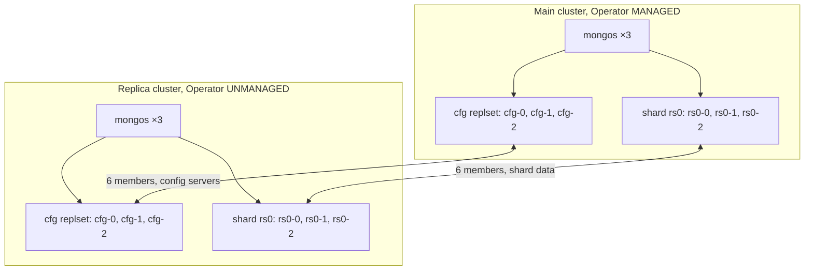
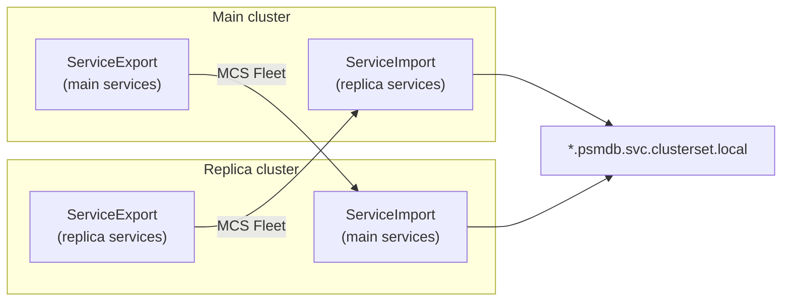

# Multi-Cluster MongoDB on GKE with MCS Guide

Deploying the Percona Operator for MongoDB across two GKE clusters using Multi-Cluster Services (MCS)

This guide walks through deploying a highly available MongoDB replica set that spans two GKE clusters using the [Percona Operator for MongoDB](https://github.com/percona/percona-server-mongodb-operator) and [GKE Multi-Cluster Services (MCS)](https://cloud.google.com/kubernetes-engine/docs/concepts/multi-cluster-services).


## Architecture Overview

Both clusters belong to the same **GKE Fleet**. MCS gives each cluster DNS names for the
other cluster's services (`*.psmdb.svc.clusterset.local`). **`externalNodes`** in the
Percona CR tells MongoDB to use those names as replica-set members. MCS provides
cross-cluster DNS; `externalNodes` wires MongoDB to use it.

### What runs on each cluster

Each site runs a **sharded** MongoDB cluster (not a single 6-node replset):



Once interconnected, each replset has **6 members** (3 on main + 3 on replica). One
PRIMARY per replset; the rest are SECONDARY.

### MCS is bidirectional

Both clusters **export** their own services and **import** the other cluster's services:



Each cluster sees **18 ServiceImports**, 9 from main + 9 from replica.


## Prerequisites

- `gcloud` CLI installed and authenticated
- `kubectl` installed
- `yq` installed (`brew install yq` on macOS or `apt install yq` on Linux)
- A GCP project with billing enabled
- Owner or Editor role on the project


If you want to see all the command in a Readmefile, see the Github repository [here](https://github.com/edithturn/psmdb-operator-multicluster-demo/blob/main/README.md).

## File Layout

After completing this guide you will have:

**Kubeconfigs** (in `~/.kube/psmdb-demo/`, outside this repo):
```
~/.kube/psmdb-demo/gcp-main_config                  # kubeconfig for main cluster
~/.kube/psmdb-demo/gcp-replica_config               # kubeconfig for replica cluster
```

**Manifests and exports** (in this working directory):

```
cr-main.yaml                                        # Main cluster initial config
cr-main-after.yaml                                  # Main cluster config with externalNodes
cr-replica.yaml                                     # Replica cluster config
cr-replica-after.yaml                               # Replica cluster config with externalNodes
```

The following files are local only, created during the guide, listed in `.gitignore`, **do not commit** (contain passwords, TLS keys, and encryption keys):
```
my-cluster-secrets.yml                              # exported from main (do not apply directly)
main-cluster-ssl.yml                                # exported from main (do not apply directly)
main-cluster-ssl-internal.yml                       # exported from main (do not apply directly)
my-cluster-name-mongodb-encryption-key.yml          # exported from main (do not apply directly)
my-cluster-secrets-replica.yaml                     # modified for replica, apply this
replica-cluster-ssl.yml                             # modified for replica, apply this
replica-cluster-ssl-internal.yml                    # modified for replica, apply this
my-cluster-name-mongodb-encryption-key-replica.yml  # modified for replica, apply this
```

> **Why two versions of cr-main.yaml?**
> The initial `cr-main.yaml` deploys the cluster without knowing the replica node addresses.
> After the replica cluster is running and ServiceImports are confirmed, `cr-main-after.yaml`
> adds `externalNodes` to interconnect the two clusters. This avoids DNS failures during
> initial deployment.


## Step 1: Set your project ID

```bash
export PROJECT_ID=your_project_id
```

Verify:
```bash
echo $PROJECT_ID
```


## Step 2: Enable required GCP APIs

These APIs are required for MCS, Fleet, and Workload Identity to work.

```bash
gcloud services enable \
  multiclusterservicediscovery.googleapis.com \
  gkehub.googleapis.com \
  cloudresourcemanager.googleapis.com \
  trafficdirector.googleapis.com \
  dns.googleapis.com \
  --project $PROJECT_ID
```

Expected output: each API shows `Enabling API...` then `Operation finished successfully`.


## Step 3: Create two GKE clusters

Both clusters must be created with `--workload-metadata=GKE_METADATA` and `--workload-pool`
to enable Workload Identity Federation, which is required by the MCS importer.

```bash
# Main cluster
gcloud container clusters create main-cluster \
  --zone us-central1-a \
  --machine-type n1-standard-4 \
  --num-nodes=3 \
  --workload-metadata=GKE_METADATA \
  --workload-pool=$PROJECT_ID.svc.id.goog

# Replica cluster
gcloud container clusters create replica-cluster \
  --zone us-central1-a \
  --machine-type n1-standard-4 \
  --num-nodes=3 \
  --workload-metadata=GKE_METADATA \
  --workload-pool=$PROJECT_ID.svc.id.goog
```

> Both clusters use `us-central1-a` here for simplicity. In a production setup,
> use different zones or regions (e.g. `us-east1-b`) for the replica to achieve
> true regional isolation.


## Step 4: Enable MCS and register clusters to the Fleet

GKE uses a Fleet to group clusters. There is exactly one Fleet per GCP project,
automatically named after the project ID. MCS works across all clusters in the same Fleet.

```bash
# Enable MCS at the Fleet level
gcloud container fleet multi-cluster-services enable --project $PROJECT_ID

# Register main cluster to the Fleet
gcloud container fleet memberships register main-cluster \
  --gke-cluster us-central1-a/main-cluster \
  --enable-workload-identity

# Register replica cluster to the Fleet
gcloud container fleet memberships register replica-cluster \
  --gke-cluster us-central1-a/replica-cluster \
  --enable-workload-identity
```


## Step 5: Grant IAM permissions to the MCS Importer

The MCS Importer is a GKE-managed pod in the `gke-mcs` namespace on each cluster.
Its job is to watch for `ServiceExport` resources and create `ServiceImport` objects
on other clusters. It needs read access to your VPC network configuration to do this.

```bash
# Get the numeric project number (different from the project ID string)
PROJECT_NUMBER=$(gcloud projects describe $PROJECT_ID \
  --format="value(projectNumber)")

# Grant compute.networkViewer to the MCS importer service account
gcloud projects add-iam-policy-binding $PROJECT_ID \
  --member "principal://iam.googleapis.com/projects/$PROJECT_NUMBER/locations/global/workloadIdentityPools/$PROJECT_ID.svc.id.goog/subject/ns/gke-mcs/sa/gke-mcs-importer" \
  --role "roles/compute.networkViewer"
```


## Step 6: Verify MCS is active on both clusters

```bash
gcloud container fleet multi-cluster-services describe --project $PROJECT_ID
```

Expected output, both clusters must show `code: OK`:
```yaml
membershipStates:
  projects/XXXXXXX/locations/us-central1/memberships/main-cluster:
    state:
      code: OK
      description: Firewall successfully updated
  projects/XXXXXXX/locations/us-central1/memberships/replica-cluster:
    state:
      code: OK
      description: Firewall successfully updated
resourceState:
  state: ACTIVE
```

> If you see `code: PENDING` wait 2–3 minutes and re-run. If you see errors,
> check that both clusters were created with `--workload-pool` and the IAM
> binding in Step 5 was applied successfully.


## Step 7: Generate kubeconfig files

> **Security:** Kubeconfig files contain credentials that grant access to your clusters.
> Keep both files in `~/.kube/psmdb-demo` only, do not copy them elsewhere, commit them
> to version control, or share them with anyone.

Store kubeconfig files in a dedicated directory outside this project:

```bash
mkdir -p ~/.kube/psmdb-demo
chmod 700 ~/.kube/psmdb-demo
```


```bash
# Generate kubeconfig for main cluster
KUBECONFIG=~/.kube/psmdb-demo/gcp-main_config gcloud container clusters \
  get-credentials main-cluster --zone us-central1-a

# Generate kubeconfig for replica cluster
KUBECONFIG=~/.kube/psmdb-demo/gcp-replica_config gcloud container clusters \
  get-credentials replica-cluster --zone us-central1-a

chmod 600 ~/.kube/psmdb-demo/gcp-main_config ~/.kube/psmdb-demo/gcp-replica_config
```

Verify both files were created:
```bash
ls -la ~/.kube/psmdb-demo/gcp-main_config ~/.kube/psmdb-demo/gcp-replica_config
```

Verify each connects to the correct cluster:
```bash
kubectl --kubeconfig ~/.kube/psmdb-demo/gcp-main_config get nodes
kubectl --kubeconfig ~/.kube/psmdb-demo/gcp-replica_config get nodes
```

> **Two terminals, set up once:** Open **two terminal windows** for the rest of this
> guide. Run each export **once** when you open the terminal, you do not need to repeat
> it in later steps unless you open a new window:
>
> | Terminal | Cluster | Run once when opening the terminal |
> |----------|---------|-------------------------------------|
> | **Terminal 1** | Main | `export KUBECONFIG=~/.kube/psmdb-demo/gcp-main_config` |
> | **Terminal 2** | Replica | `export KUBECONFIG=~/.kube/psmdb-demo/gcp-replica_config` |
>
> Verify:
> ```bash
> kubectl get nodes
> ```
>
> From Step 8 onward, every `kubectl` block is labeled **Terminal 1** or **Terminal 2**
> only. Run the command in the matching terminal.
> Re-export only if you open a **new** terminal window.

Example: This is how the cluster looks like:

**Terminal 1 · main cluster**

```bash
$ kubectl get nodes
NAME                                          STATUS   ROLES    AGE   VERSION
gke-main-cluster-default-pool-9c0082b4-19wj   Ready    <none>   68m   v1.35.3-gke.2190000
gke-main-cluster-default-pool-9c0082b4-q78p   Ready    <none>   68m   v1.35.3-gke.2190000
gke-main-cluster-default-pool-9c0082b4-rb6r   Ready    <none>   68m   v1.35.3-gke.2190000

```

**Terminal 2 · replica cluster**
```bash
$ kubectl get nodes
NAME                                             STATUS   ROLES    AGE   VERSION
gke-replica-cluster-default-pool-3f3e6f2b-1qkb   Ready    <none>   56m   v1.35.3-gke.2190000
gke-replica-cluster-default-pool-3f3e6f2b-gl5j   Ready    <none>   56m   v1.35.3-gke.2190000
gke-replica-cluster-default-pool-3f3e6f2b-h6hk   Ready    <none>   56m   v1.35.3-gke.2190000

```


## Step 8: Grant cluster-admin permissions to your account

GCP project access and Kubernetes permissions inside each cluster are separate,
Step 7's kubeconfig lets you authenticate, but from Step 9 onward you need
cluster-wide rights to install the operator and deploy MongoDB. Main and replica are
independent clusters with their own RBAC, so run the same command on each; a binding
on one does not apply to the other.

**Terminal 1:**
```bash
kubectl create clusterrolebinding cluster-admin-binding \
  --clusterrole cluster-admin \
  --user $(gcloud config get-value core/account)
```

**Terminal 2:**
```bash
kubectl create clusterrolebinding cluster-admin-binding \
  --clusterrole cluster-admin \
  --user $(gcloud config get-value core/account)
```

> If you see `AlreadyExists` on either cluster, the binding was already created in a
> previous session. This is not an error; continue to the next step.

Verify on both clusters, each should return `yes`:
```bash
kubectl auth can-i '*' '*' --all-namespaces   # Terminal 1
kubectl auth can-i '*' '*' --all-namespaces   # Terminal 2
```

---

## Step 9: Create namespace and install the Operator on both clusters

The namespace **must be identical on both clusters**. The MCS DNS name includes
the namespace (e.g. `rs0.psmdb.svc.clusterset.local`). If the namespaces differ,
nodes cannot find each other.

**Terminal 1 (main cluster):**
```bash
kubectl create namespace psmdb
kubectl config set-context --current --namespace=psmdb
kubectl apply --server-side \
  -f https://raw.githubusercontent.com/percona/percona-server-mongodb-operator/v1.20.1/deploy/bundle.yaml \
  -n psmdb
```

**Terminal 2 (replica cluster):**
```bash
kubectl create namespace psmdb
kubectl config set-context --current --namespace=psmdb
kubectl apply --server-side \
  -f https://raw.githubusercontent.com/percona/percona-server-mongodb-operator/v1.20.1/deploy/bundle.yaml \
  -n psmdb
```

Verify the Operator is running on each cluster:
```bash
# Terminal 1
kubectl get pods
NAME                                               READY   STATUS    RESTARTS   AGE
percona-server-mongodb-operator-6877fcf797-stv4s   1/1     Running   0          33s
 
# Terminal 2
kubectl get pods
NAME                                               READY   STATUS    RESTARTS   AGE
percona-server-mongodb-operator-6877fcf797-gslpz   1/1     Running   0          9s

```

## Step 10: Create the Main cluster

Run all commands in **Terminal 1** (main cluster).

Create `cr-main.yaml`:

> **Important notes:**
> - `type: ClusterIP` is **required** for MCS, LoadBalancer will not work
> - `multiCluster.DNSSuffix: svc.clusterset.local` enables cross-cluster DNS
> - `crVersion: 1.20.1`, use a released version only. The Operator derives the
>   init container image tag from `crVersion`.

```bash
cat > cr-main.yaml << 'EOF'
apiVersion: psmdb.percona.com/v1
kind: PerconaServerMongoDB
metadata:
  name: main-cluster
spec:
  crVersion: 1.20.1
  image: percona/percona-server-mongodb:7.0.14-8-multi
  updateStrategy: SmartUpdate
  multiCluster:
    enabled: true
    DNSSuffix: svc.clusterset.local
  upgradeOptions:
    apply: disabled
    schedule: "0 2 * * *"
  secrets:
    users: my-cluster-name-secrets
    encryptionKey: my-cluster-name-mongodb-encryption-key
  replsets:
  - name: rs0
    size: 3
    expose:
      enabled: true
      type: ClusterIP
    volumeSpec:
      persistentVolumeClaim:
        resources:
          requests:
            storage: 3Gi
  sharding:
    enabled: true
    configsvrReplSet:
      size: 3
      expose:
        enabled: true
        type: ClusterIP
      volumeSpec:
        persistentVolumeClaim:
          resources:
            requests:
              storage: 3Gi
    mongos:
      size: 3
      expose:
        type: ClusterIP
EOF
```

Apply it:
```bash
kubectl apply -f cr-main.yaml -n psmdb
```

Watch until status is `ready` (takes 3–5 minutes):
```bash
kubectl get psmdb -n psmdb -w
```

Expected output:
```
kubectl get psmdb -n psmdb
NAME           ENDPOINT                                            STATUS   AGE
main-cluster   main-cluster-mongos.psmdb.svc.cluster.local:27017   ready    13m

```

Verify ServiceExport resources were created (takes up to 5 minutes after ready):
```bash
kubectl get serviceexport -n psmdb
```

Expected output:
```
NAME                  AGE
main-cluster-cfg      27m
main-cluster-cfg-0    27m
main-cluster-cfg-1    27m
main-cluster-cfg-2    26m
main-cluster-mongos   27m
main-cluster-rs0      27m
main-cluster-rs0-0    27m
main-cluster-rs0-1    27m
main-cluster-rs0-2    26m

```


## Step 11: Export secrets from the Main cluster

Run all commands in **Terminal 1** (main cluster).

The Replica cluster runs in `unmanaged: true` mode and cannot generate its own
TLS certificates or credentials. It must receive exact copies of the Main cluster secrets:
- Without TLS secrets → pods never start
- Without user credentials → pods start but fail liveness checks and restart continuously

```bash
kubectl get secret my-cluster-name-secrets -n psmdb -o yaml > my-cluster-secrets.yml

kubectl get secret main-cluster-ssl -n psmdb -o yaml > main-cluster-ssl.yml

kubectl get secret main-cluster-ssl-internal -n psmdb -o yaml > main-cluster-ssl-internal.yml

kubectl get secret my-cluster-name-mongodb-encryption-key -n psmdb -o yaml > \
my-cluster-name-mongodb-encryption-key.yml
```


## Step 12: Modify secrets for the Replica cluster

The exported secrets contain cluster-specific metadata that must be removed before
applying to another cluster. The `resourceVersion` and `uid` fields are unique to the
Main cluster and cause a conflict error if reused unchanged.

The secret **data** (passwords, TLS certificates, encryption key) is copied as-is,
the replica must use the same credentials to join the same MongoDB deployment. The
Kubernetes secret **names** for user credentials and the encryption key stay the same
(`my-cluster-name-secrets`, `my-cluster-name-mongodb-encryption-key`) because
`cr-replica.yaml` references those exact names. Only the TLS secrets are renamed
(`main-cluster-ssl` → `replica-cluster-ssl`) via `sed`; the `yq` step strips stale
metadata, it does not rename those two secrets.

> **Linux vs macOS:**  `sed -i ''` is macOS-only syntax.
> On Linux, use `sed -i` without the empty string argument.

**Terminal 1 (main cluster)**, modify the exported files locally:

```bash
# Secret 1, user credentials
yq eval 'del(.metadata.ownerReferences, .metadata.annotations,
  .metadata.creationTimestamp, .metadata.resourceVersion,
  .metadata.selfLink, .metadata.uid)' \
  my-cluster-secrets.yml > my-cluster-secrets-replica.yaml
sed -i 's/main-cluster/replica-cluster/g' my-cluster-secrets-replica.yaml

# Secret 2, SSL client certificates
yq eval 'del(.metadata.ownerReferences, .metadata.annotations,
  .metadata.creationTimestamp, .metadata.resourceVersion,
  .metadata.selfLink, .metadata.uid)' \
  main-cluster-ssl.yml > replica-cluster-ssl.yml
sed -i 's/main-cluster/replica-cluster/g' replica-cluster-ssl.yml

# Secret 3, SSL internal replication certificates
yq eval 'del(.metadata.ownerReferences, .metadata.annotations,
  .metadata.creationTimestamp, .metadata.resourceVersion,
  .metadata.selfLink, .metadata.uid)' \
  main-cluster-ssl-internal.yml > replica-cluster-ssl-internal.yml
sed -i 's/main-cluster/replica-cluster/g' replica-cluster-ssl-internal.yml

# Secret 4, encryption key
yq eval 'del(.metadata.ownerReferences, .metadata.annotations,
  .metadata.creationTimestamp, .metadata.resourceVersion,
  .metadata.selfLink, .metadata.uid)' \
  my-cluster-name-mongodb-encryption-key.yml > \
  my-cluster-name-mongodb-encryption-key-replica.yml
sed -i 's/main-cluster/replica-cluster/g' \
  my-cluster-name-mongodb-encryption-key-replica.yml
```

> **Important:** If you delete and recreate the Main cluster, re-export all four
> secrets before applying to the Replica. The `resourceVersion` and `uid` change
> on every cluster recreation, stale values cause a conflict error.

**Terminal 2 (replica cluster)**, apply and verify:

```bash
kubectl apply -f my-cluster-secrets-replica.yaml -n psmdb
kubectl apply -f replica-cluster-ssl.yml -n psmdb
kubectl apply -f replica-cluster-ssl-internal.yml -n psmdb
kubectl apply -f my-cluster-name-mongodb-encryption-key-replica.yml -n psmdb

kubectl get secrets -n psmdb
```

Expected output should include:
```
NAME                                     TYPE                DATA   AGE
my-cluster-name-mongodb-encryption-key   Opaque              1      8s
my-cluster-name-secrets                  Opaque              10     33s
replica-cluster-ssl                      kubernetes.io/tls   3      24s
replica-cluster-ssl-internal             kubernetes.io/tls   3      16s
```


## Step 13: Create the Replica cluster

Run all commands in **Terminal 2** (replica cluster).

Create `cr-replica.yaml`:

> **Key differences from cr-main.yaml:**
> - `unmanaged: true` prevents the Operator from initializing a new replica set,
>   avoiding split-brain with the Main cluster's Operator
> - `updateStrategy: RollingUpdate`, SmartUpdate is not supported on unmanaged clusters
> - SSL secrets are explicitly referenced because the Operator does not generate them here

```bash
cat > cr-replica.yaml << 'EOF'
apiVersion: psmdb.percona.com/v1
kind: PerconaServerMongoDB
metadata:
  name: replica-cluster
spec:
  unmanaged: true
  crVersion: 1.20.1
  image: percona/percona-server-mongodb:7.0.14-8-multi
  updateStrategy: RollingUpdate
  multiCluster:
    enabled: true
    DNSSuffix: svc.clusterset.local
  upgradeOptions:
    apply: disabled
    schedule: "0 2 * * *"
  secrets:
    users: my-cluster-name-secrets
    encryptionKey: my-cluster-name-mongodb-encryption-key
    ssl: replica-cluster-ssl
    sslInternal: replica-cluster-ssl-internal
  replsets:
  - name: rs0
    size: 3
    expose:
      enabled: true
      type: ClusterIP
    volumeSpec:
      persistentVolumeClaim:
        resources:
          requests:
            storage: 3Gi
  sharding:
    enabled: true
    configsvrReplSet:
      size: 3
      expose:
        enabled: true
        type: ClusterIP
      volumeSpec:
        persistentVolumeClaim:
          resources:
            requests:
              storage: 3Gi
    mongos:
      size: 3
      expose:
        type: ClusterIP
EOF
```

Apply it:
```bash
kubectl apply -f cr-replica.yaml -n psmdb
```

Watch until status is `ready`:
```bash
kubectl get psmdb -n psmdb -w
```

Expected output:
```bash
kubectl get pods
NAME                                               READY   STATUS    RESTARTS         AGE
percona-server-mongodb-operator-6877fcf797-gslpz   1/1     Running   0                119m
replica-cluster-cfg-0                              1/1     Running   11 (25s ago)     43m
replica-cluster-cfg-1                              1/1     Running   10 (7m49s ago)   43m
replica-cluster-cfg-2                              1/1     Running   10 (7m25s ago)   42m
replica-cluster-mongos-0                           0/1     Running   10 (6m46s ago)   42m
replica-cluster-rs0-0                              1/1     Running   11 (22s ago)     43m
replica-cluster-rs0-1                              1/1     Running   10 (7m17s ago)   43m
replica-cluster-rs0-2                              1/1     Running   10 (7m21s ago)   42m
```

```bash
kubectl get pods
NAME                                               READY   STATUS             RESTARTS       AGE
percona-server-mongodb-operator-6877fcf797-gslpz   1/1     Running            0              113m
replica-cluster-cfg-0                              0/1     CrashLoopBackOff   9 (108s ago)   37m
replica-cluster-cfg-1                              0/1     CrashLoopBackOff   9 (72s ago)    36m
replica-cluster-cfg-2                              0/1     CrashLoopBackOff   9 (48s ago)    36m
replica-cluster-mongos-0                           0/1     CrashLoopBackOff   9 (9s ago)     36m
replica-cluster-rs0-0                              0/1     CrashLoopBackOff   9 (104s ago)   37m
replica-cluster-rs0-1                              0/1     CrashLoopBackOff   9 (40s ago)    36m
replica-cluster-rs0-2                              0/1     CrashLoopBackOff   9 (44s ago)    36m
```

> **Expected behavior before interconnect (Step 15):** The replica cluster runs with
> `unmanaged: true`, so the Operator starts mongoc pods but does **not** initialize a
> separate replica set, that happens on the main cluster after you add `externalNodes`
> in Step 15. While waiting, replica pods may show `CrashLoopBackOff` with many
> restarts. This is usually the liveness probe timing out, not mongoc crashing. It is
> common for `cfg` and `rs0` pods to settle to `1/1 Running` before interconnect;
> `mongos` often stays `0/1` the longest. `kubectl get psmdb` may not show `ready`
> yet, that is expected. Continue to Steps 14 and 15.
> If pods keep restarting **after** Step 15, re-check the secrets from Steps 11–12.

Verify ServiceExport resources were created (takes up to 5 minutes after ready):
```bash
kubectl get serviceexport -n psmdb
```

Expected output:
```bash
NAME                     AGE
replica-cluster-cfg      59m
replica-cluster-cfg-0    59m
replica-cluster-cfg-1    58m
replica-cluster-cfg-2    58m
replica-cluster-mongos   59m
replica-cluster-rs0      59m
replica-cluster-rs0-0    59m
replica-cluster-rs0-1    58m
replica-cluster-rs0-2    57m

```

## Step 14: Verify ServiceImports on both clusters

After both clusters are running, the MCS controller creates `ServiceImport` objects
automatically. This takes approximately 5 minutes after the ServiceExports appear.

**Terminal 1 (main cluster):**
```bash
kubectl get serviceimport -n psmdb
```

**Terminal 2 (replica cluster):**
```bash
kubectl get serviceimport -n psmdb
```

Each cluster should show **18 total ServiceImports**, 9 for each cluster.
Example output on the replica cluster:

```
NAME                     TYPE           IP                   AGE
main-cluster-cfg         Headless                            127m
main-cluster-cfg-0       ClusterSetIP   ["34.118.239.158"]   127m
main-cluster-cfg-1       ClusterSetIP   ["34.118.230.45"]    125m
main-cluster-cfg-2       ClusterSetIP   ["34.118.237.3"]     123m
main-cluster-mongos      ClusterSetIP   ["34.118.230.127"]   127m
main-cluster-rs0         Headless                            127m
main-cluster-rs0-0       ClusterSetIP   ["34.118.237.28"]    127m
main-cluster-rs0-1       ClusterSetIP   ["34.118.230.37"]    125m
main-cluster-rs0-2       ClusterSetIP   ["34.118.226.30"]    123m
replica-cluster-cfg      Headless                            62m
replica-cluster-cfg-0    ClusterSetIP   ["34.118.231.166"]   62m
replica-cluster-cfg-1    ClusterSetIP   ["34.118.234.146"]   59m
replica-cluster-cfg-2    ClusterSetIP   ["34.118.225.208"]   59m
replica-cluster-mongos   ClusterSetIP   ["34.118.239.237"]   62m
replica-cluster-rs0      Headless                            62m
replica-cluster-rs0-0    ClusterSetIP   ["34.118.228.53"]    62m
replica-cluster-rs0-1    ClusterSetIP   ["34.118.238.50"]    59m
replica-cluster-rs0-2    ClusterSetIP   ["34.118.232.241"]   59m
```

If any are missing, check the MCS importer logs on the affected cluster:
```bash
kubectl logs -n gke-mcs -l k8s-app=gke-mcs-importer --tail=30   # run in Terminal 1 or 2
```


## Step 15: Interconnect the clusters (add externalNodes)

`ServiceImport` objects give each cluster a way to resolve DNS names for services
in other clusters. `externalNodes` tells MongoDB to actually use those addresses
as replica set members. Both are needed, ServiceImport is the phone book,
externalNodes is the instruction to call.

**Why two voting and one non-voting external node?**
Adding two voting nodes (`votes: 1`) and one non-voting node (`votes: 0`) from the
other site prevents split-brain. If the network between sites is severed, neither
side can accidentally promote a new Primary using only its external nodes.

### 15a: Add Replica nodes to Main cluster

Run in **Terminal 1** (main cluster).

Copy `cr-main.yaml` to `cr-main-after.yaml` and add an **`externalNodes`** block under
`replsets.rs0` and under `sharding.configsvrReplSet`, everything else stays the same.

Create `cr-main-after.yaml`:

```bash
cat > cr-main-after.yaml << 'EOF'
apiVersion: psmdb.percona.com/v1
kind: PerconaServerMongoDB
metadata:
  name: main-cluster
spec:
  crVersion: 1.20.1
  image: percona/percona-server-mongodb:7.0.14-8-multi
  updateStrategy: SmartUpdate
  multiCluster:
    enabled: true
    DNSSuffix: svc.clusterset.local
  upgradeOptions:
    apply: disabled
    schedule: "0 2 * * *"
  secrets:
    users: my-cluster-name-secrets
    encryptionKey: my-cluster-name-mongodb-encryption-key
  replsets:
  - name: rs0
    size: 3
    externalNodes:
    - host: replica-cluster-rs0-0.psmdb.svc.clusterset.local
      votes: 1
      priority: 1
    - host: replica-cluster-rs0-1.psmdb.svc.clusterset.local
      votes: 1
      priority: 1
    - host: replica-cluster-rs0-2.psmdb.svc.clusterset.local
      votes: 0
      priority: 0
    expose:
      enabled: true
      type: ClusterIP
    volumeSpec:
      persistentVolumeClaim:
        resources:
          requests:
            storage: 3Gi
  sharding:
    enabled: true
    configsvrReplSet:
      size: 3
      externalNodes:
      - host: replica-cluster-cfg-0.psmdb.svc.clusterset.local
        votes: 1
        priority: 1
      - host: replica-cluster-cfg-1.psmdb.svc.clusterset.local
        votes: 1
        priority: 1
      - host: replica-cluster-cfg-2.psmdb.svc.clusterset.local
        votes: 0
        priority: 0
      expose:
        enabled: true
        type: ClusterIP
      volumeSpec:
        persistentVolumeClaim:
          resources:
            requests:
              storage: 3Gi
    mongos:
      size: 3
      expose:
        type: ClusterIP
EOF
```

Apply:
```bash
kubectl apply -f cr-main-after.yaml -n psmdb
```

### 15b: Add Main nodes to Replica cluster

Run in **Terminal 2** (replica cluster).

Copy `cr-replica.yaml` to `cr-replica-after.yaml` and add an **`externalNodes`** block under
`replsets.rs0` and under `sharding.configsvrReplSet`, everything else stays the same.

Create `cr-replica-after.yaml`:

```bash
cat > cr-replica-after.yaml << 'EOF'
apiVersion: psmdb.percona.com/v1
kind: PerconaServerMongoDB
metadata:
  name: replica-cluster
spec:
  unmanaged: true
  crVersion: 1.20.1
  image: percona/percona-server-mongodb:7.0.14-8-multi
  updateStrategy: RollingUpdate
  multiCluster:
    enabled: true
    DNSSuffix: svc.clusterset.local
  upgradeOptions:
    apply: disabled
    schedule: "0 2 * * *"
  secrets:
    users: my-cluster-name-secrets
    encryptionKey: my-cluster-name-mongodb-encryption-key
    ssl: replica-cluster-ssl
    sslInternal: replica-cluster-ssl-internal
  replsets:
  - name: rs0
    size: 3
    externalNodes:
    - host: main-cluster-rs0-0.psmdb.svc.clusterset.local
      votes: 1
      priority: 1
    - host: main-cluster-rs0-1.psmdb.svc.clusterset.local
      votes: 1
      priority: 1
    - host: main-cluster-rs0-2.psmdb.svc.clusterset.local
      votes: 0
      priority: 0
    expose:
      enabled: true
      type: ClusterIP
    volumeSpec:
      persistentVolumeClaim:
        resources:
          requests:
            storage: 3Gi
  sharding:
    enabled: true
    configsvrReplSet:
      size: 3
      externalNodes:
      - host: main-cluster-cfg-0.psmdb.svc.clusterset.local
        votes: 1
        priority: 1
      - host: main-cluster-cfg-1.psmdb.svc.clusterset.local
        votes: 1
        priority: 1
      - host: main-cluster-cfg-2.psmdb.svc.clusterset.local
        votes: 0
        priority: 0
      expose:
        enabled: true
        type: ClusterIP
      volumeSpec:
        persistentVolumeClaim:
          resources:
            requests:
              storage: 3Gi
    mongos:
      size: 3
      expose:
        type: ClusterIP
EOF
```

Apply:
```bash
kubectl apply -f cr-replica-after.yaml -n psmdb
```

> **After interconnect:** Pods may restart on both clusters while MongoDB reconfigures
> the replica sets, brief `CrashLoopBackOff` on replica is normal. Wait until all
> pods are `1/1 Running` before continuing to Step 16.


## Step 16: Verify cross-cluster replication

Run in **Terminal 1** (main cluster).

Get the clusterAdmin password:
```bash
kubectl get secret my-cluster-name-secrets \
  -n psmdb \
  -o jsonpath="{.data.MONGODB_CLUSTER_ADMIN_PASSWORD}" | base64 --decode
```

Connect to the main cluster config server:
```bash
kubectl exec -it main-cluster-cfg-0 -n psmdb -- /bin/bash
```

Inside the pod:
```bash
mongosh admin -u clusterAdmin -p <password-from-above>
```

Check replica set members:
```javascript
rs.status().members
```

Expected output, 6 members total, all using `svc.clusterset.local` DNS names:
```javascript
cfg [direct: primary] admin> rs.status().members
[
  {
    _id: 0,
    name: 'main-cluster-cfg-0.psmdb.svc.clusterset.local:27017',
    health: 1,
    state: 1,
    stateStr: 'PRIMARY',
    uptime: 17202,
    syncSourceHost: '',
    syncSourceId: -1,
    infoMessage: '',
    electionTime: Timestamp({ t: 1780921358, i: 2 }),
    electionDate: ISODate('2026-06-08T12:22:38.000Z'),
    configVersion: 14,
    configTerm: 1,
    self: true,
    lastHeartbeatMessage: ''
  },
  {
    _id: 1,
    name: 'main-cluster-cfg-1.psmdb.svc.clusterset.local:27017',
    health: 1,
    state: 2,
    stateStr: 'SECONDARY',
    uptime: 17034,
    pingMs: Long('0'),
    lastHeartbeatMessage: '',
    syncSourceHost: 'main-cluster-cfg-0.psmdb.svc.clusterset.local:27017',
    syncSourceId: 0,
    infoMessage: '',
    configVersion: 14,
    configTerm: 1
  },
  {
    _id: 2,
    name: 'main-cluster-cfg-2.psmdb.svc.clusterset.local:27017',
    health: 1,
    state: 2,
    stateStr: 'SECONDARY',
    uptime: 16861,
    pingMs: Long('0'),
    lastHeartbeatMessage: '',
    syncSourceHost: 'main-cluster-cfg-1.psmdb.svc.clusterset.local:27017',
    syncSourceId: 1,
    infoMessage: '',
    configVersion: 14,
    configTerm: 1
  },
  {
    _id: 3,
    name: 'replica-cluster-cfg-0.psmdb.svc.clusterset.local:27017',
    health: 1,
    state: 2,
    stateStr: 'SECONDARY',
    uptime: 3214,
    pingMs: Long('0'),
    lastHeartbeatMessage: '',
    syncSourceHost: 'main-cluster-cfg-0.psmdb.svc.clusterset.local:27017',
    syncSourceId: 0,
    infoMessage: '',
    configVersion: 14,
    configTerm: 1
  },
  {
    _id: 4,
    name: 'replica-cluster-cfg-1.psmdb.svc.clusterset.local:27017',
    health: 1,
    state: 2,
    stateStr: 'SECONDARY',
    uptime: 3181,
    pingMs: Long('0'),
    lastHeartbeatMessage: '',
    syncSourceHost: 'replica-cluster-cfg-0.psmdb.svc.clusterset.local:27017',
    syncSourceId: 3,
    infoMessage: '',
    configVersion: 14,
    configTerm: 1
  },
  {
    _id: 5,
    name: 'replica-cluster-cfg-2.psmdb.svc.clusterset.local:27017',
    health: 1,
    state: 2,
    stateStr: 'SECONDARY',
    uptime: 3164,
    pingMs: Long('0'),
    lastHeartbeatMessage: '',
    syncSourceHost: 'main-cluster-cfg-2.psmdb.svc.clusterset.local:27017',
    syncSourceId: 2,
    infoMessage: '',
    configVersion: 14,
    configTerm: 1
  }
]
```

If all 6 members appear with `health: 1`, cross-cluster replication is working.


## Step 17: Test the switchover process

In a multi-cluster deployment, **only one Operator should actively manage the replica
set at a time**, otherwise both sites could try to reconfigure MongoDB and cause
split-brain.

Until now, the **main** Operator was in charge (`unmanaged` not set, so managed by
default). The **replica** Operator only kept pods running (`unmanaged: true`) and
did not drive failover or replica-set changes.

This step simulates a site failover in two moves:

1. **Main → unmanaged**: main Operator stops managing the replica set.
2. **Replica → managed**: replica Operator takes over and can elect a new PRIMARY.

Apply both changes below, then verify MongoDB elects a new PRIMARY on the replica side.

**Terminal 1 (main cluster)**, release Operator control on main:

Edit `cr-main-after.yaml` under `spec:`, add `unmanaged: true` and change
`updateStrategy` from `SmartUpdate` to `RollingUpdate` (SmartUpdate requires a
managed cluster):

```yaml
  unmanaged: true
  updateStrategy: RollingUpdate
```

Apply:

```bash
kubectl apply -f cr-main-after.yaml -n psmdb
```

**Terminal 2 (replica cluster)**, give Operator control on replica:

Edit `cr-replica-after.yaml` under `spec:`, change `unmanaged: true` to
`unmanaged: false` so the replica Operator can manage failover and replica-set
reconfiguration:

```yaml
  unmanaged: false
```

Apply:

```bash
kubectl apply -f cr-replica-after.yaml -n psmdb
```

Verify a new PRIMARY was elected on the replica side (**Terminal 2**):

```bash
kubectl exec -it replica-cluster-cfg-0 -n psmdb -- /bin/bash
```

Inside the pod:

```bash
mongosh admin -u clusterAdmin -p <password-from-step-16>
```

```javascript
rs.status().members
```

Expected: `replica-cluster-cfg-0` is PRIMARY, main-side members are SECONDARY:

```javascript
[
  {
    _id: 0,
    name: 'main-cluster-cfg-0.psmdb.svc.clusterset.local:27017',
    health: 1,
    state: 2,
    stateStr: 'SECONDARY',
    uptime: 19106,
    syncSourceHost: 'replica-cluster-cfg-1.psmdb.svc.clusterset.local:27017',
    syncSourceId: 4,
    infoMessage: '',
    configVersion: 20,
    configTerm: 2,
    self: true,
    lastHeartbeatMessage: ''
  },
  {
    _id: 1,
    name: 'main-cluster-cfg-1.psmdb.svc.clusterset.local:27017',
    health: 1,
    state: 2,
    stateStr: 'SECONDARY',
    uptime: 18938,
    pingMs: Long('0'),
    lastHeartbeatMessage: '',
    syncSourceHost: 'main-cluster-cfg-0.psmdb.svc.clusterset.local:27017',
    syncSourceId: 0,
    infoMessage: '',
    configVersion: 20,
    configTerm: 2
  },
  {
    _id: 2,
    name: 'main-cluster-cfg-2.psmdb.svc.clusterset.local:27017',
    health: 1,
    state: 2,
    stateStr: 'SECONDARY',
    uptime: 18765,
    pingMs: Long('0'),
    lastHeartbeatMessage: '',
    syncSourceHost: 'main-cluster-cfg-1.psmdb.svc.clusterset.local:27017',
    syncSourceId: 1,
    infoMessage: '',
    configVersion: 20,
    configTerm: 2
  },
  {
    _id: 3,
    name: 'replica-cluster-cfg-0.psmdb.svc.clusterset.local:27017',
    health: 1,
    state: 1,
    stateStr: 'PRIMARY',
    uptime: 5118,
    pingMs: Long('0'),
    lastHeartbeatMessage: '',
    syncSourceHost: '',
    syncSourceId: -1,
    infoMessage: '',
    electionTime: Timestamp({ t: 1780940264, i: 1 }),
    electionDate: ISODate('2026-06-08T17:37:44.000Z'),
    configVersion: 20,
    configTerm: 2
  },
  {
    _id: 4,
    name: 'replica-cluster-cfg-1.psmdb.svc.clusterset.local:27017',
    health: 1,
    state: 2,
    stateStr: 'SECONDARY',
    uptime: 5085,
    pingMs: Long('0'),
    lastHeartbeatMessage: '',
    syncSourceHost: 'replica-cluster-cfg-0.psmdb.svc.clusterset.local:27017',
    syncSourceId: 3,
    infoMessage: '',
    configVersion: 20,
    configTerm: 2
  },
  {
    _id: 5,
    name: 'replica-cluster-cfg-2.psmdb.svc.clusterset.local:27017',
    health: 1,
    state: 2,
    stateStr: 'SECONDARY',
    uptime: 5068,
    pingMs: Long('0'),
    lastHeartbeatMessage: '',
    syncSourceHost: 'replica-cluster-cfg-0.psmdb.svc.clusterset.local:27017',
    syncSourceId: 3,
    infoMessage: '',
    configVersion: 20,
    configTerm: 2
  }
]

```


## Step 18: Cleanup

To remove the GKE clusters when you are done:

```bash
gcloud container clusters delete main-cluster \
  --zone us-central1-a \
  --quiet

gcloud container clusters delete replica-cluster \
  --zone us-central1-a \
  --quiet
```


## References

- [Original blog post by Ivan Groenewold](https://www.percona.com/blog/deploying-percona-operator-for-mongodb-across-gke-clusters-with-mcs/) 

- [Percona Operator for MongoDB, Multi-Cluster Services](https://docs.percona.com/percona-operator-for-mongodb/replication-mcs.html)
- [GKE Multi-Cluster Services overview](https://cloud.google.com/kubernetes-engine/docs/concepts/multi-cluster-services)
- [GKE MCS setup, Percona docs](https://docs.percona.com/percona-operator-for-mongodb/replication-mcs-gke.html)
- [MongoDB replica set elections](https://www.mongodb.com/docs/manual/core/replica-set-elections/)
- [Kubernetes MCS API KEP-1645](https://github.com/kubernetes/enhancements/blob/master/keps/sig-multicluster/1645-multi-cluster-services-api/README.md)


