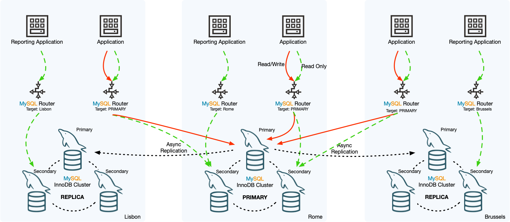

# Cross-site DR with Percona Operator for MySQL

A MySQL InnoDB Cluster provides high availability for a single database cluster using Group Replication. This works well for node failures inside the cluster, but disaster recovery usually requires another cluster in a separate location: another Kubernetes cluster, region, data center, or cloud.

This replica cluster needs to stay in sync with the primary, remain protected from accidental writes, and be ready to take over when you need to move traffic, either as a planned operation or during an outage.

[InnoDB ClusterSet](https://dev.mysql.com/doc/mysql-shell/8.0/en/innodb-clusterset.html) addresses this by linking multiple MySQL clusters into a single disaster-recovery topology. One cluster handles writes, while the others stay synchronized as read-only replicas.

Starting from v1.2.0, the Percona Operator for MySQL adds a new custom resource, `PerconaServerMySQLClusterSet`, which allows managing InnoDB ClusterSets. Creating the ClusterSet, adding replicas, switching the primary, and performing a forced failover are all handled declaratively by updating the Kubernetes spec and letting the operator reconcile the desired state.

This post explains how ClusterSet works, how to set it up with the Percona Operator, and how planned switchovers and emergency failovers work in practice.

## Understanding InnoDB ClusterSet

Any disaster recovery design usually comes down to two important numbers:

- **Recovery Point Objective**, or RPO, is how much data you can afford to lose. For example, an RPO of five seconds means the business can tolerate losing up to five seconds of writes.
- **Recovery Time Objective**, or RTO, is how long the system can be unavailable before service must be restored.

The way you design and operate a ClusterSet directly affects both. To understand why, it helps to first look at the architecture.

An InnoDB ClusterSet is built from two or more InnoDB Clusters. Each InnoDB Cluster is a Group Replication group. In other words, it is the same kind of highly available MySQL cluster that the [Percona Operator for MySQL](https://docs.percona.com/percona-operator-for-mysql/latest/index.html) can already deploy and manage.

A ClusterSet adds another layer on top of those clusters. One cluster is the primary cluster and accepts writes, while the others are replica clusters and remain read-only. The primary sends its changes to each replica using asynchronous replication over a dedicated replication channel.

This gives us two layers of replication, each solving a different problem.

Inside each cluster, Group Replication protects against the loss of individual MySQL nodes. Members are expected to be closer together, usually within the same region or availability zone group. Writes are coordinated by the group, which helps keep the local cluster consistent and highly available.

Between clusters, asynchronous replication protects against the loss of an entire site. Replica clusters can be located in another region, another Kubernetes cluster, or another cloud provider. Because this replication is asynchronous, long-distance network latency does not slow down writes on the primary cluster.

But the tradeoff here is that a replica cluster may be slightly behind the primary. The amount of lag depends on write volume, network latency, and the health of the replication channel. If the primary site is lost, any writes that had not yet reached the replica are lost. That lag is the practical data-loss window during an emergency failover. Any transactions that had not replicated before failover could be lost.

Before building a ClusterSet with the operator, there are a few important requirements to keep in mind:

- Every cluster in the ClusterSet must use the Group Replication topology. The operator also supports asynchronous replication with Orchestrator for standalone clusters, but that topology cannot be part of an InnoDB ClusterSet.
- You need MySQL 8.0.27 or later
- Clusters are linked by network address, not by Kubernetes references. A replica cluster only needs to be reachable and managed by an operator. It does not need to live in the same Kubernetes cluster as the primary.

With the model in place, let’s build a simple cross-site disaster recovery setup.


_Figure 1. InnoDB ClusterSet overview. https://dev.mysql.com/doc/mysql-shell/8.0/en/innodb-clusterset.html_

## Setting up ClusterSet

We’ll create the simplest useful ClusterSet: two Group Replication clusters named `dc1` and `dc2`.

In this example:
`dc1` is the primary cluster.
`dc2` is the read-only replica cluster.

In a real deployment, these would usually run in separate Kubernetes clusters, regions, or cloud environments. The steps are mostly the same. The main requirement is that the endpoints listed in the ClusterSet spec must be routable between sites.

### Creating a primary cluster

The primary cluster `dc1` is a regular Group Replication cluster. There is nothing ClusterSet-specific about it at this stage.

```yaml
apiVersion: ps.percona.com/v1
kind: PerconaServerMySQL
metadata:
  name: dc1
spec:
  mysql:
    clusterType: group-replication
  # ... the rest of a normal cluster spec
```

You can find a complete YAML [here](https://github.com/percona/percona-server-mysql-operator/blob/main/deploy/cr.yaml). Apply it and wait for it to come up the way you normally would, just as you would for any normal Percona Operator-managed MySQL cluster.

### Creating the replica cluster

The replica cluster `dc2` is also a Group Replication cluster, but with one important difference:

```yaml
apiVersion: ps.percona.com/v1
kind: PerconaServerMySQL
metadata:
  name: dc2
spec:
  mysql:
    clusterType: group-replication
    bootstrap:
      mode: manual  # <- set this!
```

Normally, when the operator creates a Group Replication cluster, the first MySQL pod bootstraps the group as soon as it starts. Subsequent pods then join that group.

For a ClusterSet replica, that is not what we want. We do not want `dc2` to form an independent empty cluster. Instead, we want it to receive data from the primary cluster and then join the ClusterSet as a replica.

With `bootstrap.mode: manual`, the first pod starts but does not bootstrap its own Group Replication group. It waits until the ClusterSet process adopts it, clones data from the primary, and then forms the replica cluster. During this stage, the first `dc2` pod may remain in a `NotReady` state until it is a part of the ClusterSet.

### Sharing cluster credentials

The operator automatically creates a `clusterset` MySQL user in every cluster and stores its password in the cluster secret.

The operator uses this user to orchestrate ClusterSet operations, so the password must be the same across all clusters in the ClusterSet. When your clusters are deployed separately, copy the `clusterset` value from the primary cluster secret into the replica cluster secret before linking them.

For example, if `dc1` is the primary, copy the `clusterset` password from the `dc1` secret into the corresponding secret for `dc2`.

### Linking the clusters

Once both clusters are applied, create a `PerconaServerMySQLClusterSet` custom resource.

```yaml
apiVersion: ps.percona.com/v1
kind: PerconaServerMySQLClusterSet
metadata:
  name: my-cluster-set
  finalizers:
   - percona.com/clusterset-dissolve
spec:
  primaryCluster: dc1
  credentialsSecret:
    name: dc1-secrets
    key: clusterset
  sslMode: AUTO
  createReplicaClusterOptions:
    recoveryMethod: clone
  clusters:
    - innodbClusterName: dc1
      endpoints:
        - host: dc1-mysql-primary.default.svc.cluster.local
    - innodbClusterName: dc2
      endpoints:
        - host: dc2-mysql-0.dc2-mysql.default.svc.cluster.local
  mysqlshellRunner:
    image: perconalab/percona-server-mysql-operator:main-psmysql8.4
```

The most important fields are:

- `primaryCluster` defines which cluster currently accepts writes. The value must match one of the entries under clusters.
- `clusters` lists every member of the ClusterSet and the endpoint the operator should use to reach it. These endpoints are plain network addresses, which is what allows members to run in different Kubernetes clusters or regions.
- `credentialsSecret` points to the secret that contains the clusterset user password.
- `recoveryMethod: clone` tells the replica cluster to take a full copy of the primary data when it joins the ClusterSet. The alternative is an incremental recovery method, which uses existing binary logs instead of cloning the full dataset.
- `mysqlshellRunner` defines the helper pod image used by the operator to run MySQL Shell operations.

After you apply this resource, the operator starts a MySQL Shell runner pod and creates the ClusterSet on `dc1`. It then joins `dc2`, which clones the data, starts replication, and brings up the remaining pods in the replica cluster.

At this point, `dc1` serves reads and writes, while `dc2` acts as a live read-only copy.

> **Seeding large replica clusters**
>
> In this example, the replica cluster is created with `recoveryMethod: clone`, so MySQL Shell provisions the first replica member by copying a physical snapshot from an existing ClusterSet member. That is convenient for medium/small datasets, but it can be fragile across WAN links or very large databases.
>
> A full clone can take hours, consume significant bandwidth, add load to the donor, run into network interruptions, and become expensive to retry if the operation fails partway through. It can also not be the best fit when the primary is busy or when cross-region egress cost is a concern.
>
> The operator makes it possible to seed the replica cluster from an existing backup of the primary cluster instead. Create a `PerconaServerMySQLBackup` on the primary, restore that backup into the replica cluster with `PerconaServerMySQLRestore`, and then add the replica to the ClusterSet using `recoveryMethod: incremental`. You can find the exact restore procedure in the [documentation](https://docs.percona.com/percona-operator-for-mysql/latest/backups-restore-to-new-cluster.html).
>
> At that point, the replica already has the primary’s data and GTID history, so ClusterSet only needs to catch it up from the primary’s binary logs instead of transferring the full dataset again.

### Verifying it worked

The simplest way to confirm that the ClusterSet is working is to write data to the primary cluster and read it from the replica.

For example:
- Connect to `dc1`.
- Create a test table or insert a row.
- Connect to `dc2`.
- Confirm that the same data appears there.

If the row appears on `dc2`, the asynchronous replication channel is running and the replica cluster is receiving changes from the primary.

### Planned Switchover

A planned switchover is used when both clusters are healthy and you intentionally want to move writes from one site to another. This is useful for regional maintenance, Kubernetes cluster upgrades, cloud migrations, or controlled DR testing.

To move the primary role from `dc1` to `dc2`, update the primaryCluster field:

```shell
kubectl patch ps-clusterset my-cluster-set --type=merge \
  -p '{"spec":{"primaryCluster":"dc2"}}'
```

The operator notices that the desired primary cluster no longer matches the current primary. It then uses MySQL Shell to perform a clean switchover.

Because both clusters are available, the operator can make sure the replica has caught up before changing roles. After the switchover completes, `dc2` becomes the writable primary and `dc1` becomes a read-only replica.

### Emergency Failover

An emergency failover can be used when the primary cluster is unreachable and a clean handover is no longer possible.

This is the disaster recovery case: the Kubernetes cluster, region, or network path to the primary may be down, and you need to promote a surviving replica so the application can resume writes.

To fail over to `dc2`, update primaryCluster and explicitly set the forced failover flag:

```shell
kubectl patch ps-clusterset my-cluster-set --type=merge \
    -p '{"spec":{"primaryCluster":"dc2","unsafeFlags":{"forcedFailover":true}}}'
```

The operator only follows this path when it can confirm that the current primary cluster is unreachable. It then promotes `dc2`, allowing it to accept writes.

The explicit flag is important because failover can cause data loss. Replication between clusters is asynchronous, so any writes that reached the old primary but had not yet replicated to `dc2` are not present on the new primary. Once `dc2` is promoted, those missing writes become unrecoverable through normal ClusterSet recovery.

The risk of data loss is why the field is named `unsafeFlags.forcedFailover`.

Another important point is that when the old primary comes back, it does not automatically resume as primary. After a forced failover, the recovered cluster must be explicitly reintroduced into the ClusterSet as a replica.

### Adding and removing clusters

Adding or removing clusters follows the same declarative pattern: update the custom resource spec and let the operator reconcile the difference.

To add another replica cluster, add a new entry under clusters:

```yaml
apiVersion: ps.percona.com/v1
kind: PerconaServerMySQLClusterSet
metadata:
  name: my-cluster-set
spec:
  # .. existing spec
  clusters:
  # .. existing clusters
    - innodbClusterName: dc3
      endpoints:
        - host: dc3-mysql-primary.default.svc.cluster.local
```

The operator joins the new cluster in the same way it joined `dc2`: it clones data from the primary, configures replication, and brings the cluster into the ClusterSet as a read-only replica.

To remove a cluster, delete its entry from the clusters list. You can update your manifest and reapply it, or use a JSON patch:

```shell
kubectl patch ps-clusterset my-cluster-set --type=json \
 -p '[{"op":"remove","path":"/spec/clusters/1"}]'
```

If the cluster is healthy, the operator detaches it cleanly and it becomes a normal standalone cluster again.

If the cluster being removed is unreachable, you can force its removal:

```shell
kubectl patch ps-clusterset my-cluster-set --type=json -p '[
 {"op":"remove","path":"/spec/clusters/1"},
 {"op":"add","path":"/spec/unsafeFlags/forcedClusterRemoval","value":true}
]'
```

Like forced failover, forced removal is gated behind an unsafe flag because the operator should not make this decision silently. Removing an unreachable cluster from a ClusterSet is an operational decision with consequences, and it should be made explicitly.

### Wrapping up

The Percona Operator for MySQL allows extending Group Replication beyond a single site by managing InnoDB ClusterSet through a custom resource `PerconaServerMySQLClusterSet`. A primary cluster handles writes, replica clusters stay synchronized, and the operator manages switchovers, failovers, and membership changes declaratively.

For planned maintenance, switchover moves the primary role safely with no data loss. For outages, forced failover promotes a surviving replica, with the expected risk of losing any writes that had not yet replicated. That replication lag is the practical RPO, so it should be monitored and tested as part of the DR plan.

With the Percona Operator for MySQL, disaster recovery becomes repeatable, Kubernetes-native, and easier to operate across regions or clusters.

### Further reading
- [InnoDB ClusterSet docs](https://dev.mysql.com/doc/mysql-shell/8.0/en/innodb-clusterset.html)
- [Cross-site replication in Percona Operator for MySQL](https://docs.percona.com/percona-operator-for-mysql/latest/replication.html)


