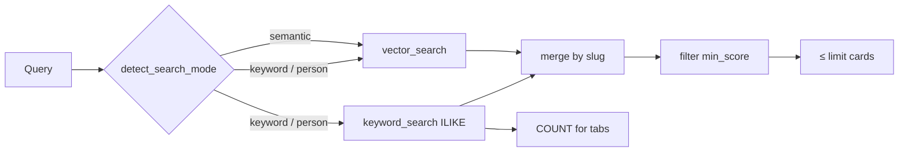

Here I write about what I changed after the first launch: hybrid search, filters and counts on the search page, the widget layout, indexer hardening, and the Percona Blog in the index. People often type short words or names, and pure vector search is weak at that. When I turned search on about a month ago I asked for feedback in Part 1, and most of what follows came from that.

[Part 1](/blog/2026/05/29/semantic-search-on-postgresql-part-1/) is the introduction and stack overview. [Part 2](/blog/2026/05/31/semantic-search-on-postgresql-part-2/) is Postgres, chunks, SQL, and the indexer.


## A month in production

The API and indexer run in Docker on EC2. The engine is PostgreSQL with [pgvector](https://github.com/pgvector/pgvector). On the site there is a search widget in the blog header and a full results page at [percona.community/search/](https://percona.community/search/). Both call the same API. Search has been up since launch. I log queries for debugging and picked up feedback from colleagues, mostly in conversation and from my own tests, not from an analytics dashboard.

I keep `search_history` in Postgres as an engineering log: timings, regressions after hybrid changes, vector vs keyword splits. To be honest, the first month is mostly my smoke tests. Lots of `test`, the same names repeated while I debugged person-search, random widget checks. A "top user queries" chart from that log would look like internal QA, not real audience insight, so I am not publishing one here.

From feedback and from what I tried by hand, three kinds of queries kept showing up.

Short ones are a single product token (`pgbackrest`, `timescaledb`) or a person's name (contributor or Percona Blog author). Long phrases like "zero downtime database migration" or "replication lag troubleshooting" still work fine with vector-only search, as in parts 1 and 2. People also want filters by content type and honest counts on the tabs, so it does not feel broken when the UI shows 30 cards but the tab says 900 matched.

That shaped what I worked on in June. The table below is illustrative, not a leaderboard from production logs.

| Example query | Type | Why it matters |
| ------------- | ---- | -------------- |
| `timescaledb` | keyword | one word, weak vector, needs text |
| `PMM` | keyword | short product name |
| `Peter Zaitsev` | person | contributor profile plus author articles |
| `slow queries mysql` | hybrid | short tech phrase, not pure semantics |
| `zero downtime database migration` | semantic | long query as designed |

In `/demo` under History I left the log and the Word statistics tab for myself. When traffic grows and I filter out test noise, that view will be more useful.

## Widget and the search page

The widget has two modes, the popup in the header and the full `/search/` page (see the screenshot at the top of the post for tabs, counts, and the match quality slider).

From feedback I added filter tabs with multi-select (All, Blog, Percona Blog, Events, Talks, Contributors). The choice goes into the URL as `?type=blog,talk`. Tabs show counts in parentheses. Without a query that is indexed totals from public `GET /health`. After a search it is match counts per type from a separate `COUNT` in the API, without loading every card. There is a "Minimum match quality" slider for `min_score`, saved in `localStorage` and the URL. Search statistics (timings, vector vs keyword, score range) sit behind a compact link instead of taking half the page. Cards on `/search/` have a preview image, type, score, and a shorter excerpt.

I set the search page content width to 960px with tabs and controls centered. Small thing, but it reads better on mobile and desktop.

The next two screenshots use `Peter Zaitsev` as the person-search demo. `-pz-` in the filenames is shorthand for that query.


The popup in the site header uses the same API. Metadata stays compact above the results.


## Why short queries hurt pure vector search

The embedding model is trained on phrases and context. A one-token query like `pgbackrest` or two words without a clear topic like `Peter Zaitsev` gives a short vector with a weak signal. In 768 dimensions many irrelevant chunks still land "not too far away", especially across 18k chunks.

With `Peter Zaitsev`, vector search pulled random old posts that mention the name in the body. The contributor profile and recent author articles were not on top. With `pgbackrest`, semantics blurred and the top hits were "something about backup", not necessarily pgBackRest.

A long query like "how to reduce replication lag on PostgreSQL" is a different story. Query and documents are rich in context and cosine similarity behaves predictably. For that I kept vector-only.

## Hybrid search options

I needed a stronger keyword leg for short queries without breaking semantic search for long ones.

| Option | Pros | Cons / why not now |
| ------ | ---- | ------------------ |
| PostgreSQL FTS (`to_tsvector`, `ts_rank`) | built-in, GIN indexes | dictionaries, stemming for names and brands |
| `pg_trgm` | good for typos | heavier at scale, extra indexes |
| OpenSearch / Elasticsearch | mature BM25 | another cluster, I skipped this in Part 1 |
| ILIKE plus heuristic score | fast to ship, one Postgres, easy to debug | not full BM25, `%pattern%` without GIN slows down at huge scale |

I started with ILIKE as step one. Something to compare against, with a clear upgrade path to FTS, trigram, or RRF. At community scale, about 7k documents, it is acceptable for now.

## How hybrid search works in the API

### Query mode

`detect_search_mode()` in `search_hybrid.py` picks one of three modes.

- `keyword` for one token (`timescaledb`, `audit_log`)
- `person` for 2-4 name-like tokens (`Peter Zaitsev`), with stop words like `percona`, `mysql`
- `semantic` for everything else, vector only

### Two search legs

For `keyword` and `person` I run vector search as before (best chunk per document, `score >= min_score`, `LIMIT N`) and keyword SQL on `pages`, plus a chunk body check when needed:

```sql
WHERE p.author ILIKE '%Peter Zaitsev%' ESCAPE '\'
   OR p.title ILIKE '%Peter Zaitsev%' ESCAPE '\'
   OR p.description ILIKE '%Peter Zaitsev%' ESCAPE '\'
   OR … tags, chunk body …
ORDER BY
  CASE WHEN p.author ILIKE … THEN 0
       WHEN p.title ILIKE … THEN 1
       ELSE 2 END,
  p.date DESC NULLS LAST
```

For `person` I add ILIKE on each name part in author and title. Heuristic score 0.72-0.99 in Python (`score_keyword_row`). Exact author match ranks above a mention in the body.

ILIKE and user input. The SQL above uses literals for readability. In code every pattern is `ILIKE %s ESCAPE '\\'` and psycopg2 binds the value. The query string is never concatenated into SQL, so classic injection like `' OR 1=1 --` does not apply. Parameters alone are not enough for ILIKE because `%` and `_` are wildcards inside the pattern. I escape `\`, `%`, and `_` in Python, wrap the term in `%…%`, and set `ESCAPE '\\'` in SQL so a user cannot widen the match with their own `%`. Chunk body checks use `POSITION(LOWER(%s) IN LOWER(chunk_text))` with the same bound parameter.

### Merge

`merge_search_results()` unions by `slug`. If both legs match the same document, I keep the higher score. Then sort by score, then recency for dated content. For `person`, the matching contributor profile goes first.

The user's `min_score` is applied after merge so weak vector-only hits do not slip through when the threshold is raised.

### Tab counts

For badges like `Percona Blog (905)` the API runs `COUNT(DISTINCT slug) … GROUP BY content_type` with the same keyword conditions, no row `LIMIT`. The UI still shows 30 best cards. The tab number is how many matched in total.

The response includes `stats.search_mode` (`semantic`, `keyword`, or `person`) and timings split into `vector_db_ms` and `keyword_db_ms`.



## The bug that broke person search in production

After I shipped hybrid search, queries like `Peter Zaitsev` returned 500. The widget showed "Oops, sorry - something went wrong on our end." Semantic queries still worked.

API logs:

```text
psycopg2.errors.InternalError_: could not load library "/usr/pgsql-18/lib/llvmjit.so":
undefined symbol: _ZSt21__glibcxx_assert_failPKciS0_S0_
```

Hybrid person search builds a heavy plan with `ILIKE` and `POSITION(LOWER(...) IN chunk_text)` over 18k chunks. PostgreSQL tried to JIT-compile it and failed loading `llvmjit.so`. The same error is described on the [Percona forum](https://forums.percona.com/t/llvmjit-so-fails-to-load-in-percona-postgresql-17-container/40690). I set `jit = off` on every API connection and search worked again.

```sql
SET jit = off;   -- on every API connection
```

For tab `COUNT` in person mode I count on `pages` without scanning chunks. Author and title cover name search. Full keyword search with body still runs with `jit = off`.

On PG 18 with pgvector and text subqueries, test hybrid on person and keyword queries, not only long phrases. The planner behaves differently.

## Percona Blog in one index

The community site already had blog posts, events, talks, and contributors. Without the [official Percona Blog](https://www.percona.com/blog/) search felt incomplete. Talks and community posts link there every day.

### What I had to build

1. New `content_type`: `percona_blog`, its own RSS feed at `https://www.percona.com/blog/feed/`, separate crawler rules.
2. Same pipeline as the rest: RSS, HTML, chunks, embedding, `pages` and `community_nomic`. Same model `nomic-embed-text-v1`, prefixes `search_document:` and `search_query:` unchanged.
3. WordPress and RSS quirks on Percona Blog. Images in Open Graph, author in metadata, full text only on the HTML page. I added `fetch_percona_blog_image()` and a `percona_blog` branch in `crawler.py`.
4. Scale. Roughly 6200+ new documents. The index went from about 800 to about 7000 pages and 18,000 chunks. HNSW on a single Postgres on EC2 still copes, but a full re-index takes hours, not minutes.

### Indexer after crashes

The first full Percona Blog crawl failed several times. Worker OOM, Docker restarts, a long RSS walk. I hardened the indexer:

| Problem | Fix |
| ------- | --- |
| Re-crawl from scratch after a crash | `skip_known`, skip URLs already in `pages` |
| Resume mid-RSS | start feed page near `indexed_count // 10` |
| Cancel did not work | `cancel_requested` checks between RSS pages, before fetch and encode |
| OOM during embedding | `EMBED_BATCH_SIZE=8`, batched `model.encode()` |
| No visibility | `progress_log` on `indexer_runs`, live log in demo |
| Stuck task after kill | on worker startup honour cancel, re-queue resume tasks |

Same worker and `index_queue`, but behavior closer to production ETL than a one-off script.


## What's next

- PostgreSQL FTS instead of bare ILIKE for the keyword leg
- Pagination on `/search/` if I need to go past 30. Nobody needs all 900 author posts on one screen, "load 30 more" is enough
- More sources from the Part 1 roadmap: video, GitHub, forum

## Try it yourself

Popup search is in the [percona.community](https://percona.community) header. Full results are at [percona.community/search/](https://percona.community/search/?q=zero+downtime+database+migration).

Examples to try. These are demos of different modes, not a top from the log.

| Query | Mode | What to check |
| ----- | ---- | ------------- |
| `zero downtime database migration` | semantic | long phrase, vector-only |
| `replication lag troubleshooting` | semantic | same |
| `pgbackrest` | keyword | one-word product, hybrid |
| `Peter Zaitsev` | person | contributor plus author articles |
| `best pizza recipe napoli` | semantic | off-topic, empty above `min_score` |

As in [Part 1](/blog/2026/05/29/semantic-search-on-postgresql-part-1/), I am not publishing the search service code. It is built for percona.community. These posts share observations and ideas you can adapt. Vector search schema and SQL are in [Part 2](/blog/2026/05/31/semantic-search-on-postgresql-part-2/). The database is open-source [Percona Distribution for PostgreSQL](https://docs.percona.com/postgresql/18/index.html).

If you are building something similar or hit an edge case, leave a comment. In Part 1 I asked for feedback and it led to this post.
