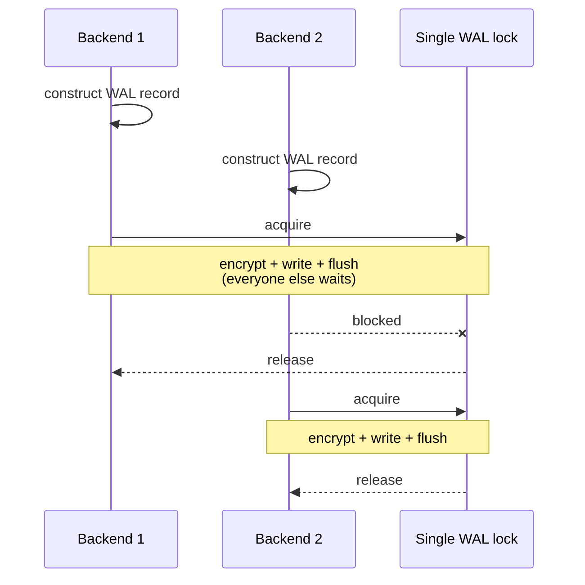
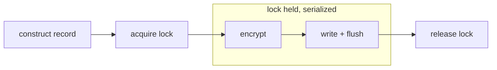
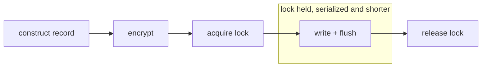

What's the impact of TDE on performance?
People usually quickly throw together a few graphs with basic measurements and treat that as a complete answer, but the question is a bit more complex than that.
In this blog post, I'll try to explain it in a bit more detail: why showcasing a single graph isn't good for anything other than marketing.

## Agenda

Let me start by making something clear: this is a complex topic, and this will be a long blog post.

I decided to simplify several things to the level where it is accurate enough, but still relatively easy to understand.
I also won't go into implementation details, the maths behind statistics, and I won't focus on generic topics like how to do low-noise benchmarking.

I am already planning on writing separate blog posts about some of these details in the future, but if you are interested in some of them, don't hesitate to ask!
Feedback like that helps me figure out what topic to cover next.

As for this blog post, I want to cover the following topics:

* A generic introduction about the cost of encryption on modern CPUs
* A short description of how transparent data-at-rest encryption typically integrates into PostgreSQL
* An explanation of why relation encryption (encrypting the database objects) typically has no cost at all in most workloads, except a few specific operations
* And finally showcasing how the typical way of implementing WAL encryption in TDE solutions can cause performance degradation in high WAL-churn scenarios

## Test setup

Benchmarks heavily depend on the computer used for running them.
All of my tests were performed on an AMD Threadripper 3970X (32 cores), using an Intel Optane P5800X SSD.

While some of the measurements can be reproduced on typical desktop hardware, not all of them can.
Some tests require many parallel workers and high memory bandwidth.
The more interesting tests all measure write performance, which is difficult on typical M.2 SSDs:
while some of them have peak write performance similar to Optane disks, they can only keep up with high write speeds for short bursts, quickly turning an otherwise CPU or memory limited test into an IO limited one.

## Encryption is cheap... in isolation

When talking about encryption performance, technical people usually make one of two assumptions:

* Encryption is complex math we have to compute, so of course it will degrade our performance!
* We are using things like full filesystem encryption (BitLocker, LUKS), swap encryption or TLS all the time, it's barely noticeable -- encryption is cheap!

And both groups are kind of right:
Encryption is complex math, and it will degrade performance on older hardware.
But because it is so common and required for everything, modern hardware has a specialized instruction set (AES-NI) that highly optimizes it for most workloads.

The following table shows some single threaded measurements on my test computer, produced with small C benchmarks:

| What | Bandwidth (GB/s) | Description |
| --- | --- | --- |
| Memory read | 23 | How quickly can we read memory |
| Memory copy  | 11 | How quickly can we copy data in memory from one place to another |
| Disk sequential read | 7.4 | How quickly can we read from disk |
| Disk sequential write | 6.1 | How quickly can we write to disk |
| AES-128-CTR | 8.0 | How quickly can we perform 128 bit AES CTR operations |
| AES-256-CTR | 6.5 | How quickly can we perform 256 bit AES CTR operations |
| AES-128-XTS | 7.3 | How quickly can we perform 128 bit AES XTS operations |
| AES-256-XTS | 5.6 | How quickly can we perform 256 bit AES XTS operations |
| AES-128-GCM | 3.8 | How quickly can we perform 128 bit AES GCM operations |
| AES-256-GCM | 3.6 | How quickly can we perform 256 bit AES GCM operations |

The three encryption modes mentioned above are commonly used in many scenarios:

* XTS is commonly used for full disk encryption, and also by some TDE implementations
* CTR is commonly used by TDE implementations, especially for WAL encryption
* GCM is an authenticated encryption algorithm which can provide both encryption and data integrity validation for TDE and other solutions

While the table doesn't mention it, I also want to point out that all reads and writes are sequential using a 4kB block size.
This is important, because the performance of all of them degrades if we start using them differently: if we start encrypting much smaller blocks at a time, or keep reinitializing the stream with different parameters, the encryption numbers can degrade quickly.

We also have to remember that our goal isn't to encrypt a random stream in memory -- we have to integrate encryption into an existing database system with its own established architecture.
The above numbers showcase our bandwidth to encrypt or decrypt data if a CPU core is only working on that task.
In reality, the CPU will also be doing other things at the same time, and can't spend all the time on encryption.

However, this won't necessarily make things worse.
Most database workloads are not CPU bound, the bottleneck is usually either disk or memory bandwidth.
With AES-NI, encryption operations often don't require additional memory bandwidth, which means that if a workload is already disk or memory limited, but we have free CPU cycles, we might get encryption for free or at little cost.

The real question isn't how quick encryption is, but how optimally we can integrate it into PostgreSQL.

## What are we encrypting exactly?

That means we no longer have a single question.
I can't give a single answer to *how fast is pg_tde, or any other data-at-rest encryption implementation?*

Because a database does many things, reads and writes many different file types, and each of those has to be implemented differently.

In the case of pg_tde, we have two main areas:

* the encryption of database (relation) files
* and the encryption of the write ahead log

Other TDE implementations might encrypt other files too, for example temporary files, but I want to focus on the two areas supported by pg_tde, as these are the most significant from a performance perspective.

So let's look into the details of these separately.

## The relation files

The quick summary for those only interested in the numbers:
the impact for this is very little -- for most operations, in the very difficult to measure category.
The only exception to this is a few single threaded write heavy workloads, such as `CREATE TABLE AS SELECT ...`, `VACUUM FULL`, an `UPDATE` that updates all or most rows, or an `ALTER TABLE` that rewrites the entire table. In these, we can measure a 5-30% performance drop.

For other operations, such as typical sysbench workloads, or even specific tests like single worker sequential reads, that number is 2% or less.
Typical measurements usually have some noise, a few percent even for properly configured setups, and much more for *"let's just quickly execute sysbench"*.
Something in the 1-2% range can only be measured with specific server and hardware configuration, not in real-world setups.

The reason behind this is quite simple:
Relation file reads and writes usually happen in entire blocks, with an 8k default size for PostgreSQL -- it is very similar to OS level file system encryption.

A typical data-at-rest encryption implementation usually operates at the IO level: it encrypts immediately before we write a dirty buffer to disk, and it decrypts immediately after we read something from disk.

Decryption only happens when we actually have to read from disk. If the requested pages are already in the shared buffers, they are already decrypted, so there's no effect there.
Encryption only happens when we are writing to disk. In a workload that isn't very write-heavy, all writes happen in the checkpointer and background writer, and backend processes never perform page writes directly, so encryption won't affect the QPS numbers at all.
Even if a workload is so write-heavy that the server has to move some of the writes to the backend process, most likely the backend isn't CPU-bound, since most database workloads are either memory or IO limited.
Unless we are writing a huge volume of data, such as the examples mentioned above, encryption won't be noticeable at all in these scenarios.

This read-write behavior is similar to full file system encryption, where the OS caches behave similarly, unless we keep calling `fsync` explicitly for writes.

Because the effect of encryption is so little, we have to be really careful how we set up our test environment, even for the heavy write scenarios where we can notice a somewhat larger difference.
It's very easy to get this wrong, and then just measure noise.

For example, let's say that we don't want to spend too much time on initializing the dataset, and we only generate a 20GB dataset.
We also set the shared buffers to 16GB because our test PC has more than enough RAM.
This seems reasonable, but the problem is, once the data is loaded into the shared buffers, it will be permanently decrypted there, and 80% of our dataset fits into the buffers.
Most read operations won't have to go to the disk, they find the requested page in the buffers, so we are not measuring encryption performance for them.

We might decide to keep the small dataset, and just use a small number for shared buffers, but then we are moving away from a production-like setup: is it realistic to run PostgreSQL with 128MB shared buffers in a real environment?
Can the reduced shared buffer size affect the performance in some other ways?

And then we have to think about similar questions for writes.

Regardless of what we do, as I mentioned above, this is basically the same use case as file system encryption, and we already know that that's fast.
If we are testing an encryption implementation, and we can see a significant performance degradation with only data file encryption, we found a bug, and should report it.

### Why is CTAS so slow?

At the beginning of the previous section, I mentioned a few examples where we *can* measure a difference.

In my tests, I see the following worst-case performance degradation with them:

| Command | Encryption Overhead |
| --- | --- |
| `CREATE TABLE AS SELECT` | 30% |
| `ALTER TABLE` performing a full rewrite | 15% |
| `VACUUM FULL` | 10% |
| `UPDATE` all rows | 10% |

These are all *worst case* numbers I was able to produce. This doesn't mean that all full table UPDATE operations will take 10% longer.

Also, in the case of `UPDATE`, the 10% measurement includes the time of the `CHECKPOINT`, as depending on the exact server configuration, some or most of the writes still happen in the checkpointer and background writer.
The actual execution time of the query in the backend process was the same with and without encryption in all of my `UPDATE` measurements, unless I intentionally misconfigure the server.

A CTAS that simply copies a table is the worst performer because it doesn't have to do anything else.
The other operations all have to do something extra with the data, but if we just duplicate one database table, then we normally only perform IO:
read a page, write the page, repeat.

Except in our case, we have to read a page, decrypt the page, encrypt the page, write the page.
We have to call encryption operations twice for every page: with AES-128-CTR at 8 GB/s, decrypting and then encrypting each page halves the effective bandwidth to around 4 GB/s, well below the disk speeds in my test setup.
A CTAS operation is normally IO limited, but because of this doubled encryption work, it becomes encryption limited with TDE, even with the AES-NI instruction set.

I also want to explicitly repeat an important note from the beginning:
this result requires a sustained disk IO that is faster than the CPU's encryption speed.
Consumer grade SSDs can't sustain such speeds for long workloads, only for short bursts.
It is only possible to reproduce this measurement on them with small datasets.
With larger tables, the test will be limited by disk IO, not encryption.

## The write ahead log

This is where things get more interesting.
In my [previous tde related blog post](), I mentioned that we are working on some encryption benchmarking, and that was about WAL performance.
Also, one of the main changes in the upcoming pg_tde 2.2.3 release will be a significant improvement in this area.

To start with a similar summary:

* in my most-performant benchmark prototype, I can't measure a significant degradation even in a **worst-case scenario workload**
* with pg_tde before 2.2.3, the same test results in only 60% throughput, or a 40%+ performance degradation
* with pg_tde 2.2.3, we were able to improve that test to the 80% range, reducing the performance degradation to 20%

The 2.2.3 change (already merged, the release is upcoming) improves our current WAL encryption approach. The complete fix described later in this post is still in development.

This list also needs two important footnotes:

First, this is a "worst-case scenario", not something typically executed in production workloads.
It is a synthetic scenario exactly to stress test WAL bottlenecks.
In a simple OLTP read-write scenario, there's only a few percent measurable difference for all pg_tde versions, less than 10%.

Second, this is a concurrency issue, and reproducing it requires a high core count test PC.
In my test setup, I have 32 cores available.
On different hardware, the results will be different.
With 100+ core monster hardware, and even more threads, the performance degradation is most likely even worse for most implementations of WAL encryption, but I didn't perform tests on such setups.

### Understanding the issue

To understand why this is so different from data file encryption, we have to look into how WAL works:

1. When we perform any WAL logged write, the changes are first written to WAL, that's why it's called a write **ahead** log.
2. Even more specifically, the backend process (the server's handler for the specific client session) first constructs what it wants to write into the log
3. After that, in PostgreSQL we only have a single WAL log, and only one backend can flush it at a time.
   The backend process has to request a lock on the WAL, preventing other processes from interacting with it at the same time.
4. After writing the already constructed data to the in-memory buffer, we have to write it to disk and then immediately flush the buffer to disk, to make sure that it is durable, since this is the log we are using for crash recovery.
5. It can release that lock only after that write/flush was done.
6. After releasing the lock, another backend can take it, repeating the process from (3)

The above information is a bit oversimplified, as WAL writes are more complex than this, but it is already enough to spot the concurrency issue hidden in it:
only one process can write/flush the WAL at a time, so no matter how many cores we have, it won't get faster.
In fact it is the opposite, since higher core count CPUs usually have worse single-thread performance.

Most WAL encryption implementations, including pg_tde, implement it similarly to data file encryption:
we encrypt the WAL data immediately before writing it to disk, at the time when the backend already acquired the WAL lock.
Not only do we do additional computations for the current session, we also prevent other sessions from doing anything during this extra time.

In my test setup with the above numbers, WAL writes were already CPU bound without encryption.
Even if encryption is relatively cheap, if we don't have spare cycles, it will show up.
That's bad enough already with a good implementation, but if we also manage to introduce a performance-hurting bug in this area of the code, we can easily end up with quite bad numbers.

### Is this completely fixable?

As I hinted at the beginning of the WAL section, this issue is fixable.
WAL encryption doesn't inherently require encrypting more data than data file encryption does. In fact, if done correctly, most of the time we'll have to encrypt even less.

The problem is that we have to do it in a more challenging part of the code.

From the above description, it might already be clear:
we should encrypt the data after we constructed it, before taking the WAL lock!

**Current: encrypt inside the lock**

**Fixed: encrypt before the lock**

That solves both the concurrency limitation and another problem hidden there:
imagine that we are writing many small records, one per transaction.
A single WAL record might be less than 100 bytes, but a WAL page is 8kB.

Even if we do it at flush time, we don't have to encrypt the entire page, only what we filled so far, but on average even that results in 4kB data per flush.
With a 100-byte WAL record, we can fit around 80 records into a single WAL page.
We have written 8kB of real data, and encrypted 320kB of WAL to do it.
There are of course some possible optimizations there, for example we completely ignored group commit, which will likely make that 320kB number much smaller, but it still remains significantly more.

While moving the encryption before the lock might seem like an easier choice, it has different challenges.
For example, there's one I already mentioned in the beginning: if we start encrypting small blocks (and also changing the stream configuration, which is also related to this), we get worse encryption performance.

The naive implementation of this approach performs even worse than our earlier pg_tde implementation.
However, if we apply some optimizations to it, it can reach similar "unmeasurable" levels as the data page encryption.

This improvement is not yet included in pg_tde, as it requires a completely different approach to WAL encryption compared to our previous implementations, and we haven't yet finished testing and measuring it.
Mainly, in this blog post I only focused on the performance of *writing* the WAL, but we have to remember that we also have to *read* it in some cases.
While the speed of crash recovery isn't that important in a happy scenario, when something bad happens it does matter how quickly we can get our server running again.

### What's the test scenario?

Similarly to the write bottlenecks above, a normal OLTP read-write workload won't showcase significant degradation because of WAL encryption.
This is exactly why I wrote such a long post: the interesting behavior only shows up in scenarios a quick benchmark never exercises.

We could simply publish a nice graph showing the typical numbers, claiming that our encryption is fast.
We could treat the performance problem we fixed as a small footnote in our changelog, as it doesn't show up at all in that measurement.

But that wouldn't be honest, because the test setup and test scenarios do matter, and when we talk about performance, we should mention worst-case numbers.

To reach these bad numbers, we have to do one thing:
generate a huge amount of WAL across many sessions.
This is doable in many different ways, ours is basically the following:

1. create a few tables, each with a few million rows
2. start executing `UPDATE t SET c=c+1 WHERE id IN (SELECT id FROM t ORDER BY random() LIMIT 100);`
3. run step 2 in many sessions

The query above is a simplified illustration. The actual test used sequential IDs, with the 100 random IDs generated by the benchmark tool and inserted directly into a prepared statement, so selecting the rows stays cheap and the workload is dominated by the WAL writes.

PostgreSQL has an option called [`full_page_writes`](https://wiki.postgresql.org/wiki/Full_page_writes), which is enabled by default.
With it, when we modify any database page for the first time after a checkpoint, it doesn't only WAL log the modified row, instead it logs the entire page, 8kB.
In the above query, for every update, we modify 100 randomly selected rows in a table.
Because they are randomly selected from millions of rows, they have a good chance of being on different pages.
Let's say that with a specific dataset, on average we hit a 10% new page rate -- one update has to do 10 full page writes.
That means every single UPDATE we execute generates more than 80kB of WAL.

This is again an oversimplification, but it is a good enough approximation without going into details too much.

With 15,000 QPS, that's around 1.2 GB/s of WAL.
From the table at the beginning, on my test PC AES-128-CTR has around 8 GB/s single core bandwidth.
1.2 GB/s is 15% of that -- and that assumes no context switching or other losses, meaning no matter how good the integration into the database is, if we do encryption at this volume while holding a global lock, we have to expect at least 15% performance drop with these numbers.
In practice it's a bit more than that.

## Summary

I hope this explanation was more useful than a single graph showcasing how good our performance with pg_tde is.
The worst-case scenarios I described here are corner cases, most servers don't generate sustained gigabytes per second of WAL, even in production.

But I still think this is important to mention, as it is an easily overlooked detail caused by the combination of PostgreSQL's WAL architecture and the simple way most vendors add encryption to it.

I also didn't go into detail on many parts of this post.
If I tried to explain everything in absolute detail, this would be ten times longer, and much harder to follow and understand.
I do plan to touch on some of these subjects in separate blog posts, where we can focus only on those topics in more depth.
If you have questions or suggestions about the topic, don't hesitate to reach out using our [community forums](https://forums.percona.com/)!
