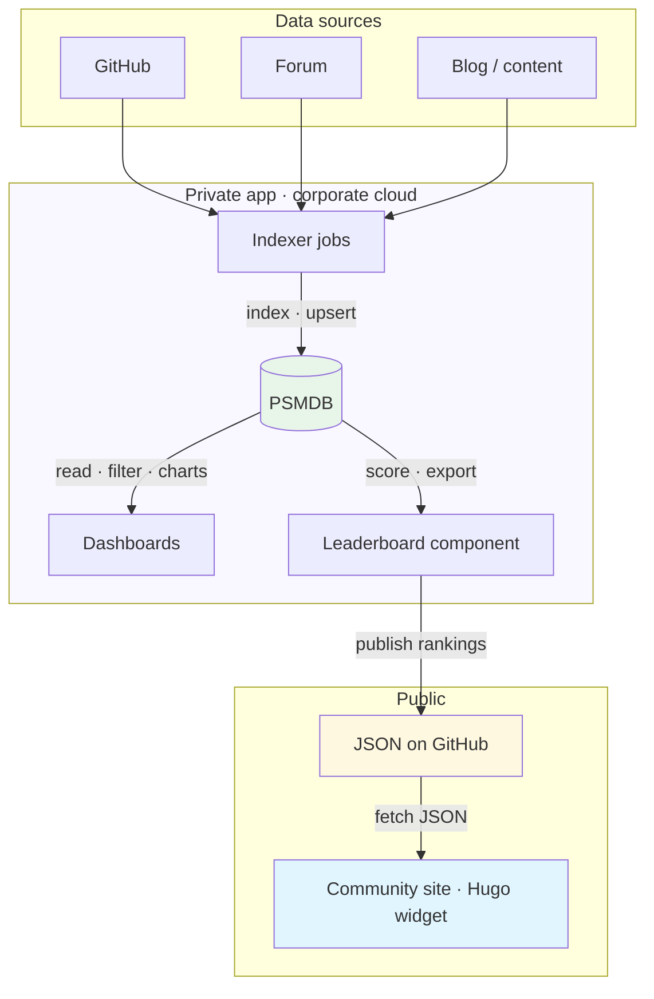

When activity spreads across GitHub, the forum, and content, real contribution is easy to lose in the noise. A community program only works when people trust the numbers behind the thank-you, so the leaderboard has to be accurate and explainable. For our [Community Leaderboard](https://percona.community/ascent/leaderboard/) we built scheduled indexers for those sources, [Percona Server for MongoDB](https://docs.percona.com/percona-server-for-mongodb/8.0/index.html) (PSMDB) as a flexible store for messy multi-source data, private dashboards to verify staff vs community and identity maps, and a daily JSON feed that powers a static Hugo widget. **AI agents** took care of much of the boilerplate: API clients, first-pass field mappings, early widget prototypes. That let us spend the week on rules, trust, and the public experience. The same pattern should transfer if you run a community or like database-shaped side projects.

In July our community lead **Laura Czajkowski** published [Introducing Mountaineers: A Way to Say Thank You](/blog/2026/07/16/introducing-mountaineers/). That program is why we built the board. Laura wanted contribution to stop disappearing into noise: the bug filed late at night, the forum thread that sat unanswered, the PR, the hour telling engineering what's broken. Mountaineers tracks that energy and gives something back: recognition, access, swag. Points, Basecamp, and the reward ladder are in her post and on the [Mountaineers](https://percona.community/ascent/mountaineers/) page. The leaderboard is the public face; my job was to make the numbers trustworthy enough for that program to work.


## Why the board exists

Laura's "what counts" list is what the board has to measure. It isn't only code. GitHub issues, PRs, and merges count. Forum topics, replies, and accepted solutions count. Blog posts and tutorials count, including work through the [Community Writers Program](/blog/2026/05/22/write-for-percona-community/). Direct feedback to engineering counts too. Show up in more than one place in the same month and the climb goes faster. The public [leaderboard](https://percona.community/ascent/leaderboard/) is how that becomes visible outside the team.

A board only helps if the community trusts it. That's where the engineering problem starts. The store holds **600+ Percona GitHub repositories**; in **2026** staff alone were active in **100+** of them (**~150** employee contributors). Staff and community work in the same channels - GitHub and the forum - so without filters you cannot tell whose work you're looking at. Separating community PRs from staff PRs, and spotting forum questions from community members that still have no answer, isn't something you do by scrolling notifications. You need a place where that signal is collected, filtered, and easy to inspect.

That's what the internal dashboards are for. They aren't the public site. They're how the community team finds the work worth recognizing and the threads that still need a human.

In **2026** so far community activity is already substantial. On GitHub: **~750 pull requests and issues** from **270+ contributors**, including **~80 merged PRs**. On the forum: **~290 active community users**, **~400 active topics**, and **~900 community posts**. The public board for that year already has **498** people on it (**257** GitHub, **240** forum, **5** content). Staff also post heavily in the same places, which is why the dashboards filter staff vs community before anything is scored for Mountaineers. Without that step, employee noise would bury the people the program exists to thank.

To turn that activity into a comparable ranking, we use a simple, fixed set of weights:

| GitHub | Content | Forum |
| --- | --- | --- |
| Issue submitted · **10** | Community blog post · **100** | Topic created · **5** |
| PR created · **25** | YouTube video · **75** | Reply · **2** |
| PR merged · **75** | External article · **50** | Solution provided · **50** |

Content is still thin on the board. We only recently launched the [Community Writers Program](/blog/2026/05/22/write-for-percona-community/), so most climbing today is GitHub and forum. That will change as more posts land.


Those numbers and weights are the *why*. The rest of the post is the *how*: private dashboards, a public JSON feed, PSMDB, and a recipe you can reuse.

## Private dashboards, public site

The architecture is a bit unusual on purpose. The dashboards live in our private corporate cloud. They talk to APIs, write to PSMDB, and show rich views for staff. The [community website](https://percona.community/) is a static **Hugo** site on **GitHub Pages**. It has no backend and no path into that cloud.

So we needed a bridge that doesn't couple the two. Once a day the leaderboard job scores the periods we care about (month, quarter, year), writes community-only JSON, and publishes it to a public GitHub repository: [percona/community-leaderboard](https://github.com/percona/community-leaderboard/tree/widget). The Hugo page embeds a JS widget that fetches those files from raw GitHub URLs. No VPN. No private API. If the internal app is offline for maintenance, the last published feed still works.

We call that lifehack **GitHub as a database**. It's a boring, cacheable public artifact. An object store would work the same way. For a static site, a daily JSON dump is often simpler and safer than exposing your analytics database.

The application breaks into a few components. Data sources are polled by indexer jobs and land in PSMDB. The same database feeds internal dashboards (explore, filter staff vs community) and a leaderboard component that builds period reports and publishes JSON to GitHub. The community site only talks to that public feed.



Indexers and the leaderboard component run on a schedule (cron). The diagram above is the data path; the schedule is just when each box wakes up.

On the site, the widget is more than a dumped table. You can switch periods and categories (global, GitHub, forum), open a person and see how they scored, and browse leaders without leaving Hugo. The layout had to feel like part of Community Ascent, not like an admin export pasted into a page. There is also a [Global Summit](https://percona.community/ascent/summit/) view (top 10 on a mountain) for the people who climb furthest.


## Public feed: JSON the widget reads

The Hugo widget does not guess rankings. It loads plain JSON from the public repo. On first paint it fetches `meta.json` for available periods and categories, then `{category}/{period}.json` for the table (for example `global/2026.json`). When you open someone in the modal, it loads `users/{period}/{user_key}.json` for the breakdown.

The layout is simple:

```text
meta.json
global/{period}.json
github/{period}.json
forum/{period}.json
users/{period}/{user_key}.json
```

`meta.json` is the index. The widget uses it to build the period picker:

```json
{
  "generated_at": "2026-08-31T04:11:39+00:00",
  "default_period": "2026",
  "periods": [
    { "key": "2026", "label": "2026", "type": "year" },
    { "key": "2026-Q3", "label": "Q3 2026", "type": "quarter" },
    { "key": "2026-08", "label": "August 2026", "type": "month" }
  ],
  "categories": ["global", "github", "content", "forum"]
}
```

Each ranking file is one period and one category. The table reads `top30`:

```json
{
  "period": "2026",
  "period_type": "year",
  "period_label": "2026",
  "category": "global",
  "top30": [
    {
      "rank": 1,
      "user_key": "gh-example",
      "display_name": "Alex Contributor",
      "avatar_url": "https://avatars.githubusercontent.com/u/12345?v=4",
      "github_login": "alex-contrib",
      "forum_username": null,
      "points_total": 595,
      "points_github": 500,
      "points_forum": 95,
      "issues_created": 2,
      "prs_created": 5,
      "prs_merged": 6,
      "topics_created": 1,
      "replies": 4,
      "solutions": 1
    }
  ]
}
```

The per-user file adds contribution lists for the detail view:

```json
{
  "user_key": "gh-example",
  "display_name": "Alex Contributor",
  "period": "2026",
  "points_total": 595,
  "github_prs": [
    {
      "title": "Fix replication lag in operator",
      "url": "https://github.com/percona/example/pull/42",
      "repo": "percona/example",
      "date": "2026-07-10",
      "merged": true
    }
  ],
  "forum_replies": [
    {
      "title": "Slow queries after upgrade",
      "url": "https://forums.percona.com/t/example/12345",
      "date": "2026-06-15"
    }
  ]
}
```

That is all the static site needs. Live files are in [percona/community-leaderboard](https://github.com/percona/community-leaderboard/tree/widget); the widget base URL is set in the Hugo layout (`window.LB_BASE`).

## What runs every day

Scheduled indexer jobs poll the APIs we care about, one family of sources each, and upsert documents into PSMDB. Another scheduled job builds the rankings and pushes the public feed. The web UI is how we see the store: date ranges, charts, activity tables, and a leaderboard toggle for community, staff, or all. Staff numbers matter internally. Who answered on the forum this week? Which PRs came from outside? Which community questions are still waiting? The public Mountaineers board stays community-only. Same data, different filter.

One person is often three strings in the data. GitHub login, forum username, and a blog byline under a real name rarely match. Without linking, the same Mountaineer shows up as three rows and their points never add up. **Identity mapping** is how we stitch that together. You can link accounts by hand in the dashboard. When a display name or handle lines up across sources, the UI also proposes a merge for approval. That is semi-automatic, not a silent auto-join. Only confirmed maps feed the public ranking.

We develop against [Percona Server for MongoDB](https://docs.percona.com/percona-server-for-mongodb/8.0/index.html) in Docker locally. Same engine shape in production. I run `docker compose up`, connect from the app, and start indexing. For browsing collections I use **MongoDB Compass** on `localhost:27018` (or whatever port you map). It is the fastest way to check that indexers wrote what you expect before you trust a public export.

```yaml
services:
  psmdb:
    image: percona/percona-server-mongodb:8.0
    volumes:
      - ./data:/data/db
    environment:
      MONGO_INITDB_ROOT_USERNAME: root
      MONGO_INITDB_ROOT_PASSWORD: changeme
      MONGO_INITDB_DATABASE: dashboard
    ports:
      - "27018:27017"
```

Pick the image tag for your CPU (`8.0-arm64` on Apple Silicon, `8.0` / amd64 elsewhere). No cloud dependency just to try an idea.

## MongoDB as the use case

If you like databases, this is the interesting middle of the story. We run [Percona Server for MongoDB](https://docs.percona.com/percona-server-for-mongodb/8.0/index.html) (PSMDB), but the fit is the document model. Community activity arrives as heterogeneous JSON. Issues, pull requests, forum posts, user profiles, and blog metadata don't share one neat relational schema. Nested objects are normal, and APIs grow new fields over time. GitHub can suddenly add `reactions`; the forum can expose a new `trust_level` or group list. In MongoDB that usually means new keys on the document, not a migration that blocks indexing.

PSMDB fits that. We keep sources in separate collections and store documents close to what the API returned, then add what reporting needs: stable ids and comparable dates for range queries. Upserts by source id make re-runs safe. Staff signals such as forum groups or trust level can stay on the user document while rules evolve. Indexes on the date fields keep month and quarter scans practical. Open one document and you can explain why an event counted or not.

PSMDB is the system of record for events and profiles. Rankings are derived. The public site never connects to it. That split is useful beyond our case: a rich private store for organizers, a dumb public snapshot for the website.

We looked at paid leaderboard products first. They were rigid on sources, weak on staff versus community, or awkward with a static site. Building around PSMDB let us encode our rules instead of bending the program to a SaaS schema.

A few mistakes we deliberately avoided: exposing a public API that talks to the private database; scoring staff and community in one undifferentiated stream for the public board; asking Hugo to compute rankings at build time. The site only fetches JSON. Everything heavy stays behind the corporate network.

## Building it without hundreds of hours

I could have written this stack myself. I've been in web development for many years and I've built similar pipelines before: cron jobs, API clients, admin UIs, JSON exports, frontend widgets. None of it is magic. I know how long the boring parts take when you do them by hand: wiring indexers, shaping documents, iterating on the Hugo widget layout, debugging JavaScript, mapping fields from noisy API payloads. That is often weeks of calendar time that never shows up in a program announcement.

In about a week we had a working path from APIs to PSMDB to rankings to a public widget. An AI assistant did a lot of that scaffolding for me: boilerplate API clients for GitHub and the forum, first-pass mapping of those payloads into MongoDB collections, and early prototypes of the Preact widget (layout, period picker, loading states). I still owned the architecture and the rules; the agent compressed construction I would otherwise have typed line by line. That difference is real, and I notice it because I'm not new to this work. Judgment stayed with the community team and with Laura's brief: what counts, who is staff, how identities merge, what the public is allowed to see, and how the board should feel on the Ascent pages.

I used a similar approach for [semantic search on this site](/blog/2026/05/29/semantic-search-on-postgresql-part-1/) with Postgres and pgvector. Different store, same idea: know what you want, let the assistant handle the repetitive build.

## If you want something like this

You don't need our private cloud. You need the same separation of concerns.

Ask for scheduled indexer jobs that poll your APIs, upsert into [Percona Server for MongoDB](https://docs.percona.com/percona-server-for-mongodb/8.0/index.html) in Docker, keep documents close to each API's shape, and add stable ids and dates for range queries.

Ask for a private UI over that database with tables, charts, date filters, and an explicit community / staff / all view, behind basic auth or SSO, so you can verify fairness before anything is public. Use it to find outside PRs and unanswered community questions, not only to draw a ranking.

Ask for a scoring job that builds period rankings, publishes community-only JSON to a public feed (GitHub raw files or object storage), and a small JS widget for your site that only reads that feed.

Collect, understand, publish, render. Honest collection, careful filters, a simple public publish path.

If you try it and get stuck, write to me. I'm happy to talk through what worked and what we threw away. To see the result in production, open the [Community Leaderboard](https://percona.community/ascent/leaderboard/). To join the program behind it, start with Laura's [Mountaineers announcement](/blog/2026/07/16/introducing-mountaineers/) or the [program page](https://percona.community/ascent/mountaineers/).
